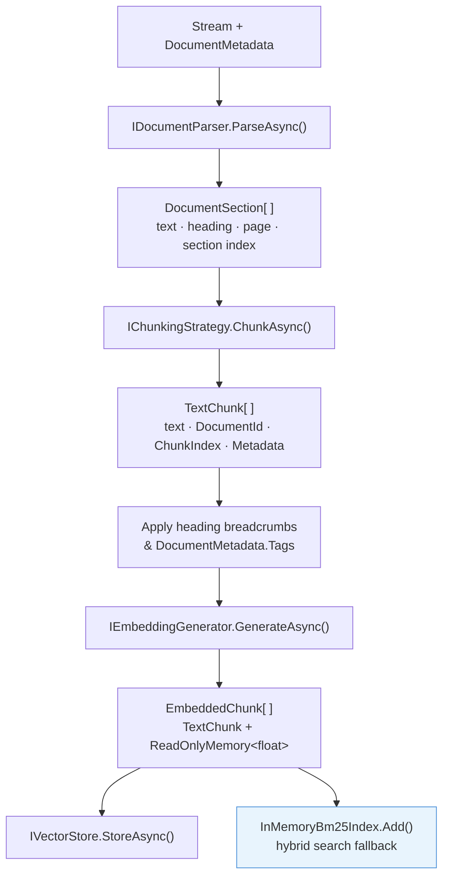
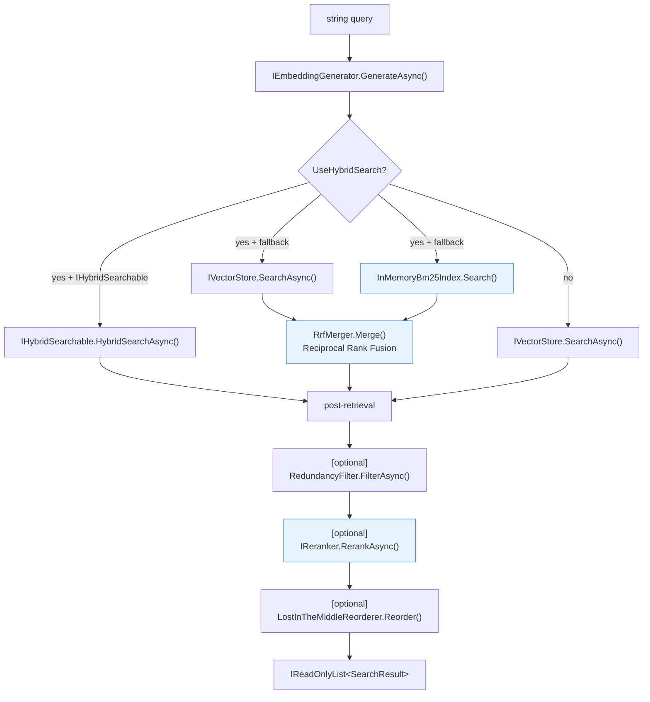
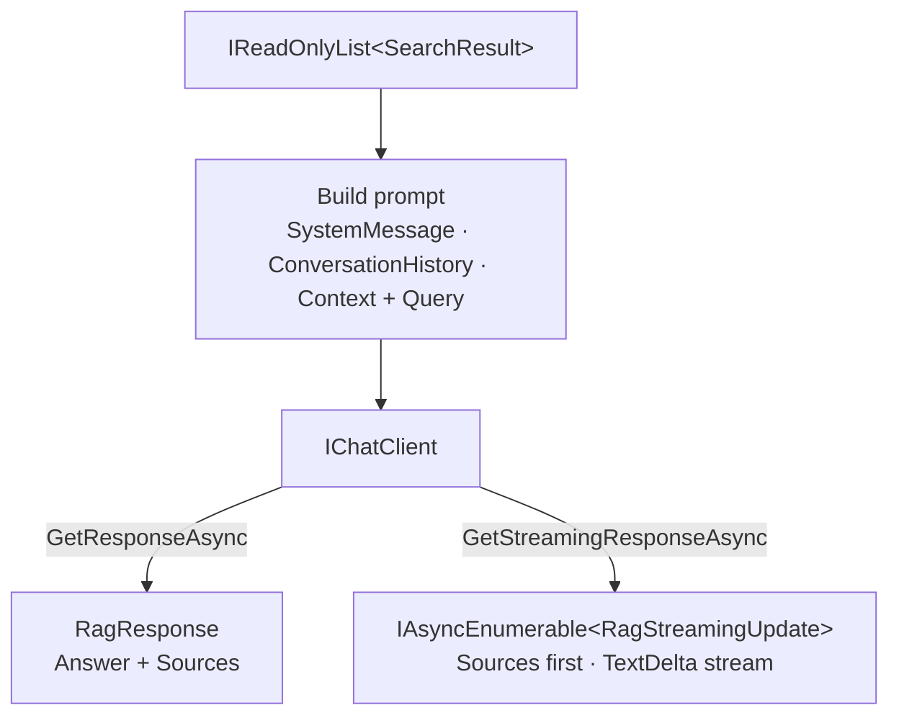

# Architecture

Understanding the internal structure of Rag.NET helps you choose the right extension points and diagnose unexpected behaviour. The library is built around a single concrete class, `RagPipeline`, that composes a set of replaceable abstractions through constructor injection.

## Data flow

### Ingestion path



### Retrieval path



### Ask path



## Core interfaces

### `IRagPipeline`

The single public entry point that application code should depend on.

```csharp
public interface IRagPipeline
{
    Task<IngestionResult> IngestAsync(
        Stream document,
        DocumentMetadata metadata,
        IngestionOptions? options = null,
        IProgress<IngestionProgress>? progress = null,
        CancellationToken cancellationToken = default);

    Task<IReadOnlyList<SearchResult>> RetrieveAsync(
        string query,
        RetrievalOptions? options = null,
        CancellationToken cancellationToken = default);

    Task<RagResponse> AskAsync(
        string query,
        RagOptions? options = null,
        CancellationToken cancellationToken = default);

    IAsyncEnumerable<RagStreamingUpdate> AskStreamingAsync(
        string query,
        RagOptions? options = null,
        CancellationToken cancellationToken = default);

    Task DeleteAsync(string documentId, CancellationToken cancellationToken = default);
}
```

### `IVectorStore`

Implemented by each vector store package. Stores embedded chunks and performs dense ANN search.

```csharp
public interface IVectorStore
{
    Task StoreAsync(IReadOnlyList<EmbeddedChunk> chunks, CancellationToken cancellationToken = default);
    Task<IReadOnlyList<SearchResult>> SearchAsync(
        ReadOnlyMemory<float> queryEmbedding,
        SearchOptions options,
        CancellationToken cancellationToken = default);
    Task DeleteByDocumentIdAsync(string documentId, CancellationToken cancellationToken = default);
}
```

### `IHybridSearchable`

Optional interface that vector stores may implement to provide native hybrid search (e.g., Azure AI Search BM25 + vector). When a store implements both `IVectorStore` and `IHybridSearchable`, the pipeline uses `HybridSearchAsync` directly instead of the in-memory BM25 fallback.

```csharp
public interface IHybridSearchable
{
    Task<IReadOnlyList<SearchResult>> HybridSearchAsync(
        string textQuery,
        ReadOnlyMemory<float> queryEmbedding,
        SearchOptions options,
        CancellationToken cancellationToken = default);
}
```

### `IDocumentParser`

```csharp
public interface IDocumentParser
{
    bool CanParse(string contentType);
    IAsyncEnumerable<DocumentSection> ParseAsync(
        Stream stream,
        DocumentMetadata metadata,
        CancellationToken cancellationToken = default);
}
```

Multiple parsers can be registered. The pipeline calls `CanParse` on each in registration order and uses the first match.

### `IChunkingStrategy`

```csharp
public interface IChunkingStrategy
{
    IAsyncEnumerable<TextChunk> ChunkAsync(
        DocumentSection section,
        ChunkingOptions options,
        CancellationToken cancellationToken = default);
}
```

### `ICollectionManageable`

Optional interface for vector stores that support programmatic index/collection lifecycle management.

```csharp
public interface ICollectionManageable
{
    Task CreateCollectionAsync(string name, int vectorDimensions, CancellationToken cancellationToken = default);
    Task DeleteCollectionAsync(string name, CancellationToken cancellationToken = default);
    Task<bool> CollectionExistsAsync(string name, CancellationToken cancellationToken = default);
}
```

`AzureAISearchVectorStore` implements this interface.

## Core models

| Type | Purpose |
|------|---------|
| `DocumentMetadata` | Input descriptor: `DocumentId`, `FileName`, `ContentType`, `Tags` |
| `DocumentSection` | Parser output: `Text`, `DocumentId`, optional `HeadingLevel`, `Heading`, `PageNumber`, `SectionIndex` |
| `TextChunk` | Chunker output: `Text`, `DocumentId`, `ChunkIndex`, `StartPosition`, `EndPosition`, `Metadata` |
| `EmbeddedChunk` | Internal: `TextChunk` + `ReadOnlyMemory<float>` embedding |
| `SearchResult` | Retrieval output: `TextChunk` + `double Score` |
| `IngestionResult` | `IngestAsync` return: `DocumentId` + `ChunksStored` |
| `RagResponse` | `AskAsync` return: `string Answer` + `IReadOnlyList<SearchResult> Sources` |
| `RerankResult` | Reranker output: `SearchResult` + `double RelevanceScore` |
| `RagStreamingUpdate` | `AskStreamingAsync` yield: `string? TextDelta` + `IReadOnlyList<SearchResult>? Sources` |

## `RagPipeline` constructor

`RagPipeline` is a `sealed` class registered as a singleton by `AddRagNet`. Its constructor parameters are all resolved from DI:

```csharp
public sealed class RagPipeline(
    IEnumerable<IDocumentParser> parsers,
    IChunkingStrategy chunkingStrategy,
    IVectorStore vectorStore,
    IEmbeddingGenerator<string, Embedding<float>> embeddingGenerator,
    IChatClient? chatClient,                    // optional — needed only for AskAsync
    ChunkingOptions chunkingOptions,
    ILogger<RagPipeline>? logger = null,        // optional
    ResiliencePipeline? resiliencePipeline = null,  // optional
    IQueryExpander? queryExpander = null,        // optional — enables multi-query
    MultiQueryOptions? multiQueryOptions = null, // optional
    IReranker? reranker = null)                  // optional — enables cross-encoder reranking
```

`IChatClient` is optional: `RetrieveAsync`, `IngestAsync`, and `DeleteAsync` work without it. `AskAsync` and `AskStreamingAsync` throw `InvalidOperationException` if no `IChatClient` is registered.

## In-memory BM25 index

`RagPipeline` maintains a private `InMemoryBm25Index` instance (BM25 parameters: k1=1.5, b=0.75) that mirrors what is stored in the vector store. Every chunk stored via `IngestAsync` is also added to this index. When `UseHybridSearch = true` and the vector store does not implement `IHybridSearchable`, the pipeline queries both the dense index and the BM25 index concurrently and merges results using Reciprocal Rank Fusion (k=60).

The BM25 index is process-scoped, not persisted. It is rebuilt from scratch each time the application starts. If you need persistence, use a vector store that natively implements `IHybridSearchable`.

## DI wiring

See [Getting Started](getting-started.md) for the call sequence. Internally, `ServiceCollectionExtensions.AddRagNet`:

1. Registers `TextDocumentParser` and `MarkdownDocumentParser` as built-in parsers.
2. Registers `RecursiveChunkingStrategy` as the default `IChunkingStrategy` (unless overridden).
3. Registers default `ChunkingOptions` (MaxChunkSize=512, Overlap=50).
4. Creates the `IRagPipeline` singleton via a factory lambda that resolves all dependencies.
5. Runs the user-supplied `Action<RagBuilder>` for additional configuration.
