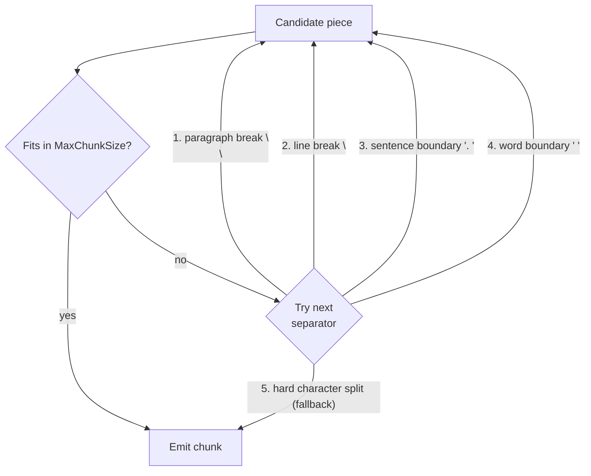

# Chunking

Embedding models have a finite token budget (typically 512–8192 tokens). If a document section exceeds that budget the model silently truncates or errors. Chunking divides each `DocumentSection` into `TextChunk` objects that fit within the budget while preserving enough context for retrieval to work. Choosing the wrong strategy or size is the most common cause of poor RAG quality.

## `ChunkingOptions`

All three built-in strategies share the same options type:

```csharp
public sealed class ChunkingOptions
{
    public int MaxChunkSize { get; set; } = 512;  // characters (Fixed/Recursive) or tokens (TokenAware)
    public int Overlap      { get; set; } = 50;   // same unit as MaxChunkSize
}
```

Configure via the `RagBuilder`:

```csharp
services.AddRagNet(rag => rag
    .UseChunkingStrategy<RecursiveChunkingStrategy>(options =>
    {
        options.MaxChunkSize = 800;
        options.Overlap      = 80;
    })
    .UsePgVector(connectionString));
```

The default strategy when nothing is configured is `RecursiveChunkingStrategy` with `MaxChunkSize = 512, Overlap = 50`.

## Strategy comparison

| | `FixedSizeChunkingStrategy` | `RecursiveChunkingStrategy` | `TokenAwareChunkingStrategy` |
|---|---|---|---|
| Unit | Characters | Characters | Tokens |
| Split logic | Hard cut at word boundary | Hierarchical separators (`\n\n`, `\n`, `. `, ` `) | Tiktoken encode → slice → decode |
| Overlap | Trailing characters prepended | Trailing characters prepended | Token-level sliding window |
| Heading awareness | No | No | No |
| Respects token limits | No — character count ≠ tokens | No | Yes |
| Chunking overhead (50 KB) | ~29 µs | ~94 µs | ~1,750 µs |
| Best for | Homogeneous text, simple pipelines | General prose, markdown, mixed content | Code, URLs, dense technical text where token precision matters |

See [benchmarks](benchmarks.md) for full throughput numbers.

## `FixedSizeChunkingStrategy`

Slices the section text at `MaxChunkSize` character positions, walking backward from each cut point to the nearest space to avoid splitting mid-word. Overlap is applied by advancing the position cursor by `(chunkLength - Overlap)` characters after each chunk.

```csharp
services.AddRagNet(rag => rag
    .UseChunkingStrategy<FixedSizeChunkingStrategy>(options =>
    {
        options.MaxChunkSize = 512;
        options.Overlap      = 50;
    }));
```

**Caveats:**
- Character count does not equal token count. A 512-character chunk can be anywhere from ~100 to ~600 tokens depending on the content. If your embedding model has a strict limit (e.g., 512 tokens), use `TokenAwareChunkingStrategy` instead.
- Breaks on whitespace only; it will split in the middle of a sentence when there is no space near the cut point.

## `RecursiveChunkingStrategy`

Attempts to split on natural text boundaries using a priority list of separators tried in order:



For each candidate piece, if it is still larger than `MaxChunkSize`, the strategy recurses with the next separator in the list. Overlap is prepended from the trailing characters of the previous chunk.

```csharp
services.AddRagNet(rag => rag
    .UseChunkingStrategy<RecursiveChunkingStrategy>(options =>
    {
        options.MaxChunkSize = 512;
        options.Overlap      = 50;
    }));
```

This is the **default strategy** and the right choice for most prose-based documents (PDFs, Word, Markdown, HTML).

## `TokenAwareChunkingStrategy`

Uses the [Microsoft.ML.Tokenizers](https://learn.microsoft.com/dotnet/api/microsoft.ml.tokenizers) `TiktokenTokenizer` to encode the section text into token IDs, then slides a window of `MaxChunkSize` tokens with a step of `MaxChunkSize - Overlap`. `MaxChunkSize` and `Overlap` are interpreted as **token counts**, not character counts.

```csharp
services.AddRagNet(rag => rag
    .UseTokenAwareChunking("gpt-4")   // selects cl100k_base encoding
    .UseChunkingStrategy<RecursiveChunkingStrategy>(options =>
    {
        options.MaxChunkSize = 512;   // tokens
        options.Overlap      = 50;    // tokens
    }));
```

Wait — `UseTokenAwareChunking` registers `TokenAwareChunkingStrategy` as the `IChunkingStrategy`. The subsequent `UseChunkingStrategy<RecursiveChunkingStrategy>` call would replace it. The correct usage when you want token-aware chunking is:

```csharp
services.AddRagNet(rag => rag
    .UseTokenAwareChunking("gpt-4")
    .UsePgVector(connectionString));
// ChunkingOptions.MaxChunkSize = 512, Overlap = 50 are applied as token counts
```

Or with custom limits:

```csharp
services.AddRagNet(rag => rag
    .UseTokenAwareChunking("gpt-4")
    .UsePgVector(connectionString));

// Override ChunkingOptions directly on the service collection:
services.AddSingleton(new ChunkingOptions { MaxChunkSize = 256, Overlap = 25 });
```

**Model names:** Any model name accepted by `TiktokenTokenizer.CreateForModel` works (e.g., `"gpt-4"`, `"gpt-3.5-turbo"`, `"text-embedding-ada-002"`). The default is `"gpt-4"` which uses the `cl100k_base` encoding, compatible with most modern OpenAI embedding models.

**Constraint:** `Overlap` must be strictly less than `MaxChunkSize`; the strategy throws `ArgumentOutOfRangeException` otherwise.

**Overhead:** Tiktoken encoding/decoding adds ~20–60× CPU overhead compared to character-based strategies on 50 KB input (~1,750 µs vs. ~29–94 µs). This is negligible relative to embedding API latency (typically 50–500 ms per batch).

## Implementing a custom strategy

See [Extending](extending.md#implementing-ichunkingstrategy) for the full guide on implementing `IChunkingStrategy`.

## Relationship to ingestion

The chunking strategy is invoked once per `DocumentSection` yielded by the parser. Each `DocumentSection` can produce zero or more `TextChunk` objects. After chunking, the pipeline applies heading metadata (from the parser) and `DocumentMetadata.Tags` to every chunk's `Metadata` dictionary before embedding.

See [Ingestion](ingestion.md) for the full pipeline flow and [Retrieval](retrieval.md) for how chunk metadata is used at query time.
