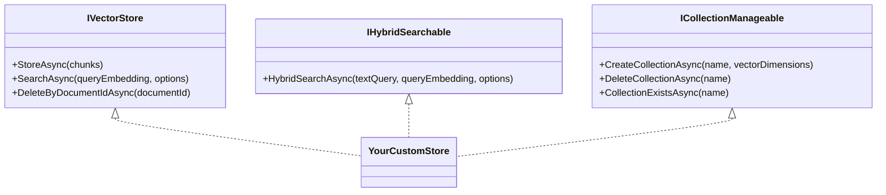

# Extending Rag.NET

Rag.NET is built around three extension points — `IDocumentParser`, `IVectorStore`, and `IChunkingStrategy` — that let you plug in custom implementations without touching pipeline code. Each interface is small and purposeful. This page walks through a concrete implementation of each.

## Implementing `IDocumentParser`

Use this when you need to ingest a file format not covered by the built-in parsers (Text, Markdown, CSV, JSON, PDF, HTML, Word, Excel, PowerPoint).

### Interface

```csharp
public interface IDocumentParser
{
    bool CanParse(string contentType);
    IAsyncEnumerable<DocumentSection> ParseAsync(
        Stream stream,
        DocumentMetadata metadata,
        CancellationToken cancellationToken = default);
}
```

`CanParse` is called for every registered parser in order. The first one returning `true` handles the document. `ParseAsync` yields `DocumentSection` objects — one per logical section of the document.

### `DocumentSection`

```csharp
public sealed record DocumentSection
{
    public required string Text        { get; init; }
    public required string DocumentId  { get; init; }
    public int? HeadingLevel           { get; init; }  // 1–6; null = no heading
    public string? Heading             { get; init; }  // heading text; null = no heading
    public int? PageNumber             { get; init; }  // null for non-paginated formats
    public int SectionIndex            { get; init; }
}
```

Set `HeadingLevel` and `Heading` if the format has structured headings. The pipeline will automatically build breadcrumb metadata (`heading`, `heading_level`, `heading_breadcrumb`) from these values and write them into every `TextChunk.Metadata` produced from the section. See [Ingestion — Heading-aware metadata](ingestion.md#heading-aware-metadata).

### Example: XML parser

```csharp
using System.Runtime.CompilerServices;
using System.Xml.Linq;
using Rag.NET.Abstractions;
using Rag.NET.Models;

public sealed class XmlDocumentParser : IDocumentParser
{
    public bool CanParse(string contentType)
        => string.Equals(contentType, "application/xml", StringComparison.OrdinalIgnoreCase)
        || string.Equals(contentType, "text/xml", StringComparison.OrdinalIgnoreCase);

    public async IAsyncEnumerable<DocumentSection> ParseAsync(
        Stream stream,
        DocumentMetadata metadata,
        [EnumeratorCancellation] CancellationToken cancellationToken = default)
    {
        var doc = await XDocument.LoadAsync(stream, LoadOptions.None, cancellationToken)
            .ConfigureAwait(false);

        int sectionIndex = 0;

        foreach (var element in doc.Descendants("section"))
        {
            cancellationToken.ThrowIfCancellationRequested();

            var text = element.Value.Trim();
            if (string.IsNullOrEmpty(text))
                continue;

            var title = element.Attribute("title")?.Value;

            yield return new DocumentSection
            {
                Text         = text,
                DocumentId   = metadata.DocumentId,
                Heading      = title,
                HeadingLevel = title is not null ? 1 : null,
                SectionIndex = sectionIndex++,
            };
        }
    }
}
```

### Registration

```csharp
services.AddRagNet(rag => rag
    .AddParser<XmlDocumentParser>()
    .UsePgVector(connectionString));
```

Or, if your parser requires constructor arguments that DI cannot resolve automatically:

```csharp
services.AddRagNet(rag =>
{
    rag.Services.AddSingleton<IDocumentParser>(new XmlDocumentParser(myOption));
    rag.UsePgVector(connectionString);
});
```

Parsers are tried in registration order. Built-in parsers (Text, Markdown) are registered before your custom ones. If you need your parser to take priority over a built-in for a given content type, register it first by adding it directly to `services` before calling `AddRagNet`.

---

## Implementing `IVectorStore`

Use this to support a vector store backend not covered by the built-in packages (pgvector, Qdrant, Azure AI Search), or to write a test double.



### Interface

```csharp
public interface IVectorStore
{
    Task StoreAsync(IReadOnlyList<EmbeddedChunk> chunks, CancellationToken cancellationToken = default);

    Task<IReadOnlyList<SearchResult>> SearchAsync(
        ReadOnlyMemory<float> queryEmbedding,
        SearchOptions options,
        CancellationToken cancellationToken = default);

    Task DeleteByDocumentIdAsync(string documentId, CancellationToken cancellationToken = default);
}
```

`SearchOptions`:

```csharp
public sealed class SearchOptions
{
    public int TopK                                    { get; set; } = 5;
    public double MinScore                             { get; set; } = 0.0;
    public IDictionary<string, string>? MetadataFilter { get; set; }
    public bool UseHybridSearch                        { get; set; }
}
```

Your `SearchAsync` should apply `TopK`, `MinScore`, and `MetadataFilter`. Ignore `UseHybridSearch` — the pipeline resolves the hybrid path via `IHybridSearchable` before calling `SearchAsync`.

### Optional: `IHybridSearchable`

If your backend natively supports combined BM25+vector search, implement this interface alongside `IVectorStore`:

```csharp
public interface IHybridSearchable
{
    Task<IReadOnlyList<SearchResult>> HybridSearchAsync(
        string textQuery,
        ReadOnlyMemory<float> queryEmbedding,
        SearchOptions options,
        CancellationToken cancellationToken = default);
}
```

The pipeline will prefer `HybridSearchAsync` over the in-memory BM25 fallback when both interfaces are implemented.

### Optional: `ICollectionManageable`

Implement if your store supports programmatic index lifecycle:

```csharp
public interface ICollectionManageable
{
    Task CreateCollectionAsync(string name, int vectorDimensions, CancellationToken cancellationToken = default);
    Task DeleteCollectionAsync(string name, CancellationToken cancellationToken = default);
    Task<bool> CollectionExistsAsync(string name, CancellationToken cancellationToken = default);
}
```

### Example: in-memory test double

```csharp
using Rag.NET.Abstractions;
using Rag.NET.Models;
using Rag.NET.Models.Options;

public sealed class InMemoryVectorStore : IVectorStore
{
    private readonly List<(EmbeddedChunk Chunk, float[] Embedding)> _store = [];

    public Task StoreAsync(IReadOnlyList<EmbeddedChunk> chunks, CancellationToken cancellationToken = default)
    {
        foreach (var chunk in chunks)
            _store.Add((chunk, chunk.Embedding.ToArray()));
        return Task.CompletedTask;
    }

    public Task<IReadOnlyList<SearchResult>> SearchAsync(
        ReadOnlyMemory<float> queryEmbedding,
        SearchOptions options,
        CancellationToken cancellationToken = default)
    {
        var query = queryEmbedding.Span;

        var results = _store
            .Select(item =>
            {
                double dot = 0, normA = 0, normB = 0;
                var v = item.Embedding.AsSpan();
                for (int i = 0; i < query.Length; i++)
                {
                    dot  += query[i] * v[i];
                    normA += query[i] * query[i];
                    normB += v[i] * v[i];
                }
                double denom = Math.Sqrt(normA) * Math.Sqrt(normB);
                double score = denom == 0 ? 0 : dot / denom;
                return (item.Chunk, Score: score);
            })
            .Where(r => r.Score >= options.MinScore)
            .OrderByDescending(r => r.Score)
            .Take(options.TopK)
            .Select(r => new SearchResult { Chunk = r.Chunk.Chunk, Score = r.Score })
            .ToList();

        return Task.FromResult<IReadOnlyList<SearchResult>>(results);
    }

    public Task DeleteByDocumentIdAsync(string documentId, CancellationToken cancellationToken = default)
    {
        _store.RemoveAll(item => item.Chunk.Chunk.DocumentId == documentId);
        return Task.CompletedTask;
    }
}
```

### Registration

```csharp
services.AddRagNet(rag =>
{
    rag.Services.AddSingleton<IVectorStore, InMemoryVectorStore>();
    // If also implementing IHybridSearchable:
    // rag.Services.AddSingleton<IHybridSearchable>(sp =>
    //     (IHybridSearchable)sp.GetRequiredService<IVectorStore>());
});
```

---

## Implementing `IChunkingStrategy`

Use this to apply domain-specific splitting logic — for example, splitting code files by function boundary, or splitting legal documents by clause number.

### Interface

```csharp
public interface IChunkingStrategy
{
    IAsyncEnumerable<TextChunk> ChunkAsync(
        DocumentSection section,
        ChunkingOptions options,
        CancellationToken cancellationToken = default);
}
```

`ChunkAsync` is called once per `DocumentSection`. It yields `TextChunk` objects. The pipeline applies metadata (heading breadcrumbs, document tags) after chunking — you do not need to populate `Metadata` in your implementation.

### `TextChunk`

```csharp
public sealed record TextChunk
{
    public required string Text        { get; init; }
    public required string DocumentId  { get; init; }
    public required int ChunkIndex     { get; init; }
    public int StartPosition           { get; init; }
    public int EndPosition             { get; init; }
    public IDictionary<string, string> Metadata { get; init; }
        = new Dictionary<string, string>(StringComparer.Ordinal);
}
```

`ChunkIndex` should be monotonically increasing within a document (not just within a section). Maintain a counter across sections if your strategy is stateful.

### Example: sentence-boundary chunker

```csharp
using System.Runtime.CompilerServices;
using Rag.NET.Abstractions;
using Rag.NET.Models;
using Rag.NET.Models.Options;

public sealed class SentenceChunkingStrategy : IChunkingStrategy
{
    public async IAsyncEnumerable<TextChunk> ChunkAsync(
        DocumentSection section,
        ChunkingOptions options,
        [EnumeratorCancellation] CancellationToken cancellationToken = default)
    {
        if (string.IsNullOrWhiteSpace(section.Text))
            yield break;

        // Split on sentence-ending punctuation followed by whitespace
        var sentences = section.Text
            .Split([". ", "! ", "? "], StringSplitOptions.RemoveEmptyEntries);

        var buffer    = new System.Text.StringBuilder();
        int chunkIndex = 0;
        int position   = 0;

        foreach (var sentence in sentences)
        {
            cancellationToken.ThrowIfCancellationRequested();

            if (buffer.Length > 0 && buffer.Length + sentence.Length > options.MaxChunkSize)
            {
                var text = buffer.ToString().Trim();
                if (text.Length > 0)
                {
                    yield return new TextChunk
                    {
                        Text         = text,
                        DocumentId   = section.DocumentId,
                        ChunkIndex   = chunkIndex++,
                        StartPosition = position - text.Length,
                        EndPosition  = position,
                    };
                }
                buffer.Clear();
            }

            buffer.Append(sentence).Append(". ");
            position += sentence.Length + 2;
        }

        if (buffer.Length > 0)
        {
            var text = buffer.ToString().Trim();
            if (text.Length > 0)
            {
                yield return new TextChunk
                {
                    Text         = text,
                    DocumentId   = section.DocumentId,
                    ChunkIndex   = chunkIndex,
                    StartPosition = position - text.Length,
                    EndPosition  = position,
                };
            }
        }

        await Task.CompletedTask.ConfigureAwait(false);
    }
}
```

### Registration

```csharp
services.AddRagNet(rag => rag
    .UseChunkingStrategy<SentenceChunkingStrategy>(options =>
    {
        options.MaxChunkSize = 600;   // approximate character budget per chunk
        options.Overlap      = 0;
    })
    .UsePgVector(connectionString));
```

`UseChunkingStrategy<T>` registers `T` as `IChunkingStrategy` (singleton) and optionally configures `ChunkingOptions`. Any previous `IChunkingStrategy` registration is replaced.

---

## Using `RagBuilder.Services` for advanced cases

`RagBuilder.Services` exposes the underlying `IServiceCollection` for registrations that do not have a dedicated fluent method:

```csharp
services.AddRagNet(rag =>
{
    // Replace the default RecursiveChunkingStrategy with a custom one
    // that needs a factory-resolved dependency
    rag.Services.AddSingleton<IChunkingStrategy>(sp =>
    {
        var config = sp.GetRequiredService<IConfiguration>();
        return new MyCustomChunkingStrategy(config["ChunkDelimiter"]!);
    });

    rag.UsePgVector(connectionString);
});
```
