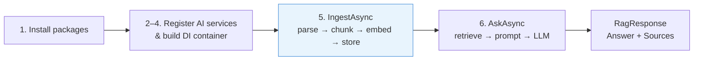

# Getting Started

This page walks through a complete end-to-end setup: installing packages, wiring up DI, ingesting a document, and running your first question-answer call. All code assumes .NET 10 and the `Microsoft.Extensions.AI` ecosystem.



## 1. Install packages

```bash
dotnet add package Rag.NET
dotnet add package Rag.NET.PgVector          # or Rag.NET.Qdrant / Rag.NET.AzureAISearch
dotnet add package Rag.NET.Parsers.Pdf       # add as many format parsers as you need
```

## 2. Register AI services

Rag.NET consumes two standard `Microsoft.Extensions.AI` abstractions. Register them before calling `AddRagNet`:

```csharp
using Microsoft.Extensions.DependencyInjection;
using Microsoft.Extensions.AI;

var services = new ServiceCollection();

// Example using the OpenAI provider (Microsoft.Extensions.AI.OpenAI)
services.AddChatClient(new OpenAIClient("sk-...").AsChatClient("gpt-4o"));
services.AddEmbeddingGenerator(
    new OpenAIClient("sk-...").AsEmbeddingGenerator("text-embedding-3-small"));
```

Any provider that implements `IChatClient` and `IEmbeddingGenerator<string, Embedding<float>>` works — Ollama, Azure OpenAI, and others are drop-in replacements.

## 3. Configure Rag.NET

```csharp
using Rag.NET.DependencyInjection;
using Rag.NET.PgVector;
using Rag.NET.Parsers.Pdf;

services.AddRagNet(rag => rag
    .UsePgVector("Host=localhost;Database=ragdb;Username=postgres;Password=secret",
                 vectorDimensions: 1536)
    .AddPdfParser()
    .AddParser<MyCustomParser>());   // optional — add any IDocumentParser
```

`AddRagNet` registers:
- `IRagPipeline` (the main entry point)
- `IChunkingStrategy` defaulting to `RecursiveChunkingStrategy`
- Built-in Text and Markdown parsers (always available in `Rag.NET` core)

The `configure` delegate gives you a `RagBuilder` for fluent additional configuration. All settings are optional — sensible defaults are applied.

## 4. Build the service provider

```csharp
var provider = services.BuildServiceProvider();
var pipeline = provider.GetRequiredService<IRagPipeline>();
```

## 5. Ingest a document

`IngestAsync` parses, chunks, embeds, and stores a document in one call:

```csharp
using Rag.NET.Models;

var metadata = new DocumentMetadata
{
    DocumentId = "report-2024-q4",   // your stable identifier — used for updates/deletes
    FileName   = "report.pdf",
    ContentType = "application/pdf",
    Tags = new Dictionary<string, string>
    {
        ["department"] = "finance",
        ["year"]       = "2024",
    },
};

using var stream = File.OpenRead("report.pdf");
var result = await pipeline.IngestAsync(stream, metadata);
Console.WriteLine($"Stored {result.ChunksStored} chunks for {result.DocumentId}");
```

The `ContentType` value drives parser selection. Omitting it defaults to `text/plain`. Tags are propagated into every chunk's `Metadata` dictionary and can be used for [metadata filtering](retrieval.md#metadata-filtering) at query time.

### Re-ingesting a document

To replace an existing document without accumulating stale chunks, set `Overwrite = true`:

```csharp
using Rag.NET.Models.Options;

await pipeline.IngestAsync(stream, metadata,
    options: new IngestionOptions { Overwrite = true });
```

This deletes all previously stored chunks for `metadata.DocumentId` before storing the new ones.

## 6. Ask a question

```csharp
using Rag.NET.Models.Options;

var response = await pipeline.AskAsync("What are the key findings in the Q4 report?");
Console.WriteLine(response.Answer);

foreach (var source in response.Sources)
    Console.WriteLine($"  [{source.Score:F2}] {source.Chunk.Text[..80]}...");
```

`AskAsync` embeds the query, retrieves the top-K most relevant chunks, builds a grounded prompt, calls `IChatClient`, and returns a `RagResponse` containing both the answer text and the source chunks used.

### Streaming responses

For a better interactive experience use `AskStreamingAsync`, which yields text deltas as the model produces them:

```csharp
await foreach (var update in pipeline.AskStreamingAsync("Summarize the report"))
{
    if (update.Sources is { Count: > 0 })
        Console.WriteLine($"[Found {update.Sources.Count} source(s)]");

    if (update.TextDelta is not null)
        Console.Write(update.TextDelta);
}
```

The first `RagStreamingUpdate` always contains `Sources` and a null `TextDelta`. Subsequent updates contain only `TextDelta`.

## 7. Retrieve without chat

If you want to drive your own LLM call or just inspect the retrieved passages:

```csharp
var results = await pipeline.RetrieveAsync("key findings", new RetrievalOptions
{
    TopK    = 10,
    MinScore = 0.6,
});

foreach (var r in results)
    Console.WriteLine($"[{r.Score:F2}] {r.Chunk.Text}");
```

## 8. Delete a document

```csharp
await pipeline.DeleteAsync("report-2024-q4");
```

Removes all stored chunks associated with the given document ID from both the vector store and the in-memory BM25 index.

## Next steps

- [Architecture](architecture.md) — understand how the pipeline works internally
- [Chunking](chunking.md) — choose the right strategy for your content type
- [Retrieval](retrieval.md) — enable hybrid search, metadata filtering, and score thresholds
- [Post-Retrieval](post-retrieval.md) — improve answer quality with reordering and redundancy filtering
- [Observability](observability.md) — add logging, tracing, and resilience
