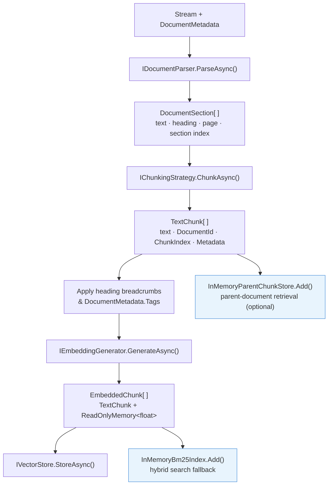
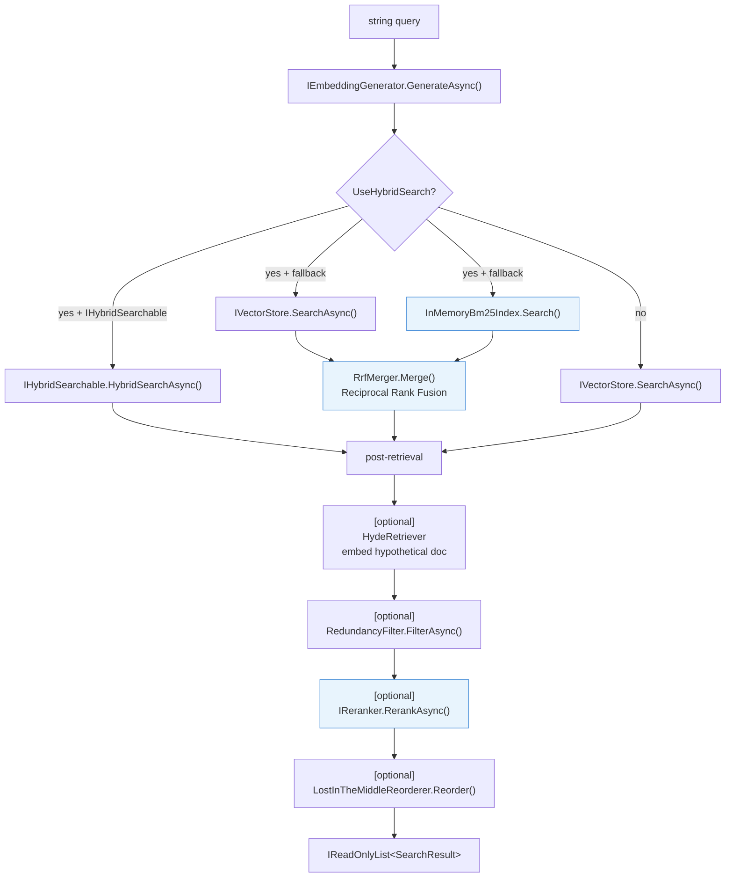
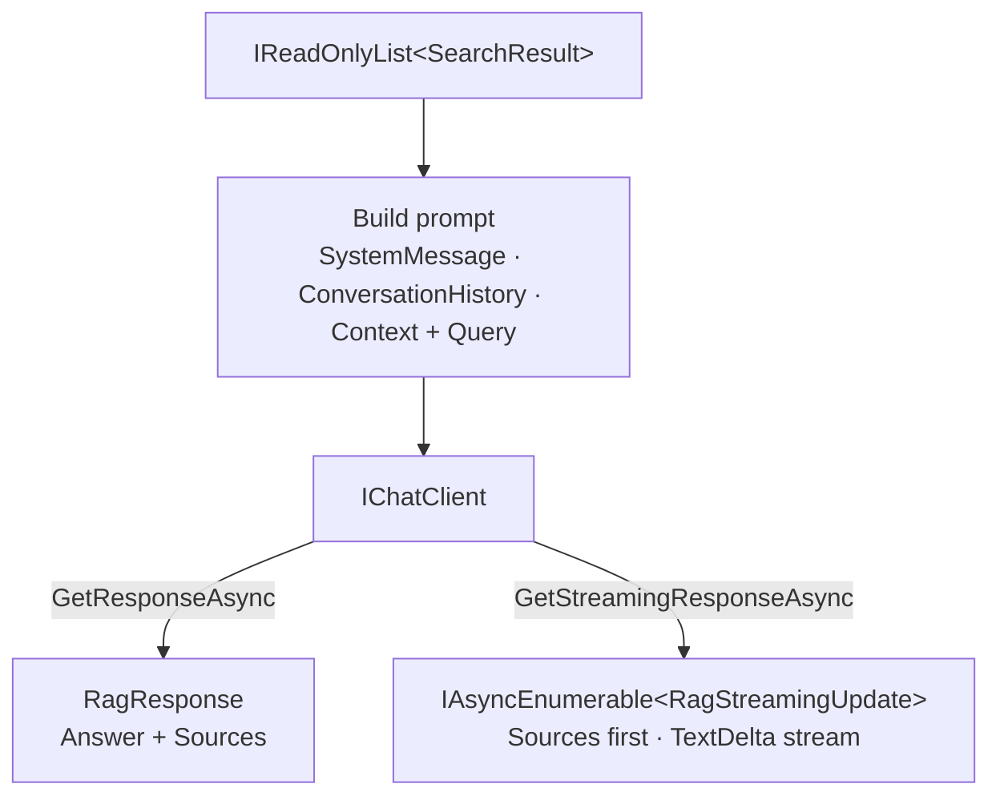

# Architecture

Understanding the internal structure of Rag.NET helps you choose the right extension points and diagnose unexpected behaviour. The library is built around three internal interfaces — `IRetriever`, `IIngestor`, `IAnswerEngine` — assembled as behavior pipelines and exposed through a single public facade, `IRagPipeline`.

## Data flow

### Ingestion path



### Retrieval path



### Ask path



## Core interfaces

### `IRagPipeline`

The single public entry point that application code should depend on.

```csharp
public interface IRagPipeline
{
    Task<IngestionResult> IngestAsync(
        Stream document,
        DocumentMetadata metadata,
        IngestionOptions? options = null,
        IProgress<IngestionProgress>? progress = null,
        CancellationToken cancellationToken = default);

    Task<IReadOnlyList<SearchResult>> RetrieveAsync(
        string query,
        RetrievalOptions? options = null,
        CancellationToken cancellationToken = default);

    Task<RagResponse> AskAsync(
        string query,
        RagOptions? options = null,
        CancellationToken cancellationToken = default);

    IAsyncEnumerable<RagStreamingUpdate> AskStreamingAsync(
        string query,
        RagOptions? options = null,
        CancellationToken cancellationToken = default);

    Task DeleteAsync(string documentId, CancellationToken cancellationToken = default);
}
```

### `IVectorStore`

Implemented by each vector store package. Stores embedded chunks and performs dense ANN search.

```csharp
public interface IVectorStore
{
    Task StoreAsync(IReadOnlyList<EmbeddedChunk> chunks, CancellationToken cancellationToken = default);
    Task<IReadOnlyList<SearchResult>> SearchAsync(
        ReadOnlyMemory<float> queryEmbedding,
        SearchOptions options,
        CancellationToken cancellationToken = default);
    Task DeleteByDocumentIdAsync(string documentId, CancellationToken cancellationToken = default);
}
```

### `IHybridSearchable`

Optional interface that vector stores may implement to provide native hybrid search (e.g., Azure AI Search BM25 + vector). When a store implements both `IVectorStore` and `IHybridSearchable`, the pipeline uses `HybridSearchAsync` directly instead of the in-memory BM25 fallback.

```csharp
public interface IHybridSearchable
{
    Task<IReadOnlyList<SearchResult>> HybridSearchAsync(
        string textQuery,
        ReadOnlyMemory<float> queryEmbedding,
        SearchOptions options,
        CancellationToken cancellationToken = default);
}
```

### `IDocumentParser`

```csharp
public interface IDocumentParser
{
    bool CanParse(string contentType);
    IAsyncEnumerable<DocumentSection> ParseAsync(
        Stream stream,
        DocumentMetadata metadata,
        CancellationToken cancellationToken = default);
}
```

Multiple parsers can be registered. The pipeline calls `CanParse` on each in registration order and uses the first match.

### `IChunkingStrategy`

```csharp
public interface IChunkingStrategy
{
    IAsyncEnumerable<TextChunk> ChunkAsync(
        DocumentSection section,
        ChunkingOptions options,
        CancellationToken cancellationToken = default);
}
```

### `ICollectionManageable`

Optional interface for vector stores that support programmatic index/collection lifecycle management.

```csharp
public interface ICollectionManageable
{
    Task CreateCollectionAsync(string name, int vectorDimensions, CancellationToken cancellationToken = default);
    Task DeleteCollectionAsync(string name, CancellationToken cancellationToken = default);
    Task<bool> CollectionExistsAsync(string name, CancellationToken cancellationToken = default);
}
```

`AzureAISearchVectorStore` implements this interface.

## Core models

| Type | Purpose |
|------|---------|
| `DocumentMetadata` | Input descriptor: `DocumentId`, `FileName`, `ContentType`, `Tags` |
| `DocumentSection` | Parser output: `Text`, `DocumentId`, optional `HeadingLevel`, `Heading`, `PageNumber`, `SectionIndex` |
| `TextChunk` | Chunker output: `Text`, `DocumentId`, `ChunkIndex`, `StartPosition`, `EndPosition`, `Metadata` |
| `EmbeddedChunk` | Internal: `TextChunk` + `ReadOnlyMemory<float>` embedding |
| `SearchResult` | Retrieval output: `TextChunk` + `double Score` |
| `IngestionResult` | `IngestAsync` return: `DocumentId` + `ChunksStored` |
| `RagResponse` | `AskAsync` return: `string Answer` + `IReadOnlyList<SearchResult> Sources` |
| `RerankResult` | Reranker output: `SearchResult` + `double RelevanceScore` |
| `RagStreamingUpdate` | `AskStreamingAsync` yield: `string? TextDelta` + `IReadOnlyList<SearchResult>? Sources` |

## Internal architecture — behavior pipeline

`RagPipeline` is a thin coordinator with three constructor parameters, each resolved from DI:

```csharp
public sealed class RagPipeline(
    IRetriever retriever,
    IIngestor ingestor,
    IAnswerEngine? answerEngine = null) : IRagPipeline
```

Each method delegates directly to the appropriate interface. `IAnswerEngine` is optional — `AskAsync` and `AskStreamingAsync` throw `InvalidOperationException` if no `IChatClient` is registered.

### Internal interfaces

| Interface | Implementation | Responsibility |
|-----------|----------------|----------------|
| `IRetriever` | `PipelineRetriever` | Run retrieval behavior chain → results |
| `IIngestor` | `PipelineIngestor` | Run ingestion behavior chain → store chunks |
| `IAnswerEngine` | `ChatAnswerEngine` | Build prompt from sources → call `IChatClient` |

### Ingestion behavior chain

Ingestion is handled by `PipelineIngestor`, which executes a fixed sequence of singleton behaviors assembled by `IngestionPipelineBuilder`. Each behavior owns its own injected services and receives a lean `IngestionContext` carrying only runtime inputs and accumulated state:

```
OverwriteBehavior
  → ParseBehavior
    → ChunkingBehavior
      → MetadataBehavior
        → ParentDocumentIngestionBehavior   (present when UseParentDocumentRetrieval() called)
          → EmbeddingBehavior
            → StorageBehavior
```

### Retrieval behavior chain

Retrieval is handled by `PipelineRetriever`, which executes a sequence of singleton behaviors assembled by `RetrievalPipelineBuilder`. Each behavior checks per-call flags on `RetrievalOptions` and either applies its logic or passes through to the next behavior:

```
ResultCacheBehavior              (present when UseCaching() called)
  → LostInTheMiddleBehavior      (always present)
    → MmrBehavior                (always present)
      → RedundancyFilterBehavior (always present)
        → ParentDocumentRetrievalBehavior  (present when UseParentDocumentRetrieval() called)
          → RerankingBehavior    (present when IReranker registered)
            → MultiQueryBehavior (present when IQueryExpander registered)
              → HydeBehavior     (present when IHypotheticalDocumentGenerator registered)
                → EmbeddingCacheBehavior  (present when UseCaching() called)
                  → VectorStoreBehavior   (base — always present)
```

Behaviors catch non-cancellation exceptions and fall back gracefully. `RetrievalOptions` is a `sealed record` so behaviors can use `with` expressions to modify options (e.g., over-fetch `TopK`) without mutating the caller's instance.

## In-memory BM25 index

`InMemoryBm25Index` is a DI singleton (BM25 parameters: k1=1.5, b=0.75) shared between `StorageBehavior` (add/remove during ingestion) and `VectorStoreBehavior` (search during retrieval). Every chunk stored via `IngestAsync` is also added to this index. When `UseHybridSearch = true` and the vector store does not implement `IHybridSearchable`, the retrieval behavior queries both the dense index and the BM25 index concurrently and merges results using Reciprocal Rank Fusion (k=60).

The BM25 index is process-scoped, not persisted. It is rebuilt from scratch each time the application starts. If you need persistence, use a vector store that natively implements `IHybridSearchable`.

`InMemoryParentChunkStore` follows the same lifecycle: a DI singleton populated during ingestion and lost on restart. It must be rebuilt by re-running ingestion after each application start.

## DI wiring

See [Getting Started](getting-started.md) for the call sequence. Internally, `ServiceCollectionExtensions.AddRagNet`:

1. Registers `TextDocumentParser` and `MarkdownDocumentParser` as built-in parsers.
2. Registers `RecursiveChunkingStrategy` as the default `IChunkingStrategy` (unless overridden).
3. Registers default `ChunkingOptions` (MaxChunkSize=512, Overlap=50).
4. Registers `InMemoryBm25Index` and `InMemoryParentChunkStore` as singletons.
5. Accepts optional `ingestion:` and `retrieval:` builder callbacks for pipeline extensibility.
6. Assembles the `IIngestor` behavior chain via `IngestionPipelineBuilder` and the `IRetriever` behavior chain via `RetrievalPipelineBuilder`, registering the resulting `PipelineIngestor` and `PipelineRetriever`.
7. Registers `IRagPipeline` (`RagPipeline`).
8. Runs the user-supplied `Action<RagBuilder>` for additional configuration.
