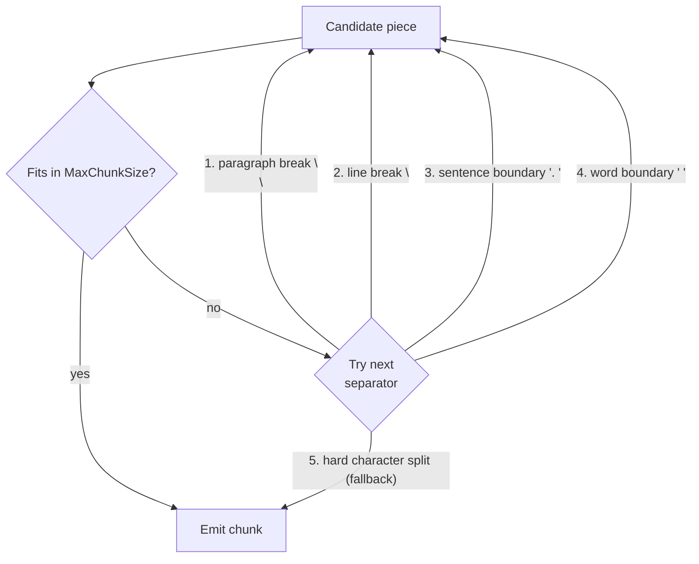

# Chunking

Embedding models have a finite token budget (typically 512–8192 tokens). If a document section exceeds that budget the model silently truncates or errors. Chunking divides each `DocumentSection` into `TextChunk` objects that fit within the budget while preserving enough context for retrieval to work. Choosing the wrong strategy or size is the most common cause of poor RAG quality.

## `ChunkingOptions`

The fixed-size, recursive, and token-aware strategies share the same options type:

```csharp
public sealed class ChunkingOptions
{
    public int MaxChunkSize { get; set; } = 512;  // characters (Fixed/Recursive) or tokens (TokenAware)
    public int Overlap      { get; set; } = 50;   // same unit as MaxChunkSize
}
```

Configure via the `RagBuilder`:

```csharp
services.AddRagNet(rag => rag
    .UseChunkingStrategy<RecursiveChunkingStrategy>(options =>
    {
        options.MaxChunkSize = 800;
        options.Overlap      = 80;
    })
    .UsePgVector(connectionString));
```

The default strategy when nothing is configured is `RecursiveChunkingStrategy` with `MaxChunkSize = 512, Overlap = 50`.

## Strategy comparison

| | `FixedSizeChunkingStrategy` | `RecursiveChunkingStrategy` | `TokenAwareChunkingStrategy` | `SemanticChunkingStrategy` | `HierarchicalMergerChunkingStrategy` | `CodeChunkingStrategy` |
|---|---|---|---|---|---|---|
| Unit | Characters | Characters | Tokens | Characters (min/max) | Characters (max) | Characters |
| Split logic | Hard cut at word boundary | Hierarchical separators | Tiktoken encode → slice → decode | Embedding cosine similarity breakpoints | Heading subtree merge | Language-specific (class/func/method) |
| Overlap | Trailing characters prepended | Trailing characters prepended | Token-level sliding window | None | None | Optional |
| Heading awareness | No | No | No | No (sentence-level) | Yes | No |
| Respects token limits | No | No | Yes | Approximate (min/max chars) | Approximate (max chars) | No |
| Chunking overhead (50 KB) | ~29 µs | ~94 µs | ~1,750 µs | Embedding-latency-bound | ~50 µs | ~50 µs |
| Best for | Homogeneous text, simple pipelines | General prose, markdown, mixed content | Code, URLs, dense technical text | Coherent meaning boundaries, QA systems | Structured documents with headings | Code files (Python, JS/TS, Go, Rust, C#, …) |

See [benchmarks](benchmarks.md) for full throughput numbers. Semantic chunking overhead is embedding-latency-bound (50–500 ms per batch), not CPU-bound — CPU processing is negligible.

## `FixedSizeChunkingStrategy`

Slices the section text at `MaxChunkSize` character positions, walking backward from each cut point to the nearest space to avoid splitting mid-word. Overlap is applied by advancing the position cursor by `(chunkLength - Overlap)` characters after each chunk.

```csharp
services.AddRagNet(rag => rag
    .UseChunkingStrategy<FixedSizeChunkingStrategy>(options =>
    {
        options.MaxChunkSize = 512;
        options.Overlap      = 50;
    }));
```

**Caveats:**
- Character count does not equal token count. A 512-character chunk can be anywhere from ~100 to ~600 tokens depending on the content. If your embedding model has a strict limit (e.g., 512 tokens), use `TokenAwareChunkingStrategy` instead.
- Breaks on whitespace only; it will split in the middle of a sentence when there is no space near the cut point.

## `RecursiveChunkingStrategy`

Attempts to split on natural text boundaries using a priority list of separators tried in order:



For each candidate piece, if it is still larger than `MaxChunkSize`, the strategy recurses with the next separator in the list. Overlap is prepended from the trailing characters of the previous chunk.

```csharp
services.AddRagNet(rag => rag
    .UseChunkingStrategy<RecursiveChunkingStrategy>(options =>
    {
        options.MaxChunkSize = 512;
        options.Overlap      = 50;
    }));
```

This is the **default strategy** and the right choice for most prose-based documents (PDFs, Word, Markdown, HTML).

## `TokenAwareChunkingStrategy`

The **sliding-window baseline**: fixed token windows with configurable overlap, O(n) time, no LLM and no regex. It uses the [Microsoft.ML.Tokenizers](https://learn.microsoft.com/dotnet/api/microsoft.ml.tokenizers) `TiktokenTokenizer` to encode the section text into token IDs, then slides a window of `WindowSizeTokens` tokens with a step of `WindowSizeTokens - OverlapTokens`. Because it counts tokens rather than characters, chunks never exceed embedding model token limits — and its simplicity makes it the natural performance and quality baseline to compare other strategies against.

The simplest registration takes a model name (window and overlap then come from `ChunkingOptions.MaxChunkSize` / `ChunkingOptions.Overlap`, interpreted as **token counts**):

```csharp
services.AddRagNet(rag => rag
    .UseTokenAwareChunking("gpt-4")   // selects cl100k_base encoding
    .UsePgVector(connectionString));
// ChunkingOptions.MaxChunkSize = 512, Overlap = 50 are applied as token counts
```

Or configure the window explicitly with `TokenAwareChunkingOptions`:

```csharp
services.AddRagNet(rag => rag
    .UseTokenAwareChunking(o =>
    {
        o.ModelName        = "gpt-4"; // tokenizer encoding
        o.WindowSizeTokens = 256;     // fixed window, overrides ChunkingOptions.MaxChunkSize
        o.OverlapTokens    = 32;      // overlap between windows, overrides ChunkingOptions.Overlap
    })
    .UsePgVector(connectionString));
```

`WindowSizeTokens` and `OverlapTokens` are optional; any value left `null` falls back to the corresponding `ChunkingOptions` property at chunk time.

> **Warning:** the fallback applies per property. If you set only `WindowSizeTokens` to a value at or below the default `ChunkingOptions.Overlap` (50), the fallback overlap is no longer smaller than the window and chunking throws at runtime — also set `OverlapTokens`:
>
> ```csharp
> // Throws at chunk time: effective overlap 50 (from ChunkingOptions.Overlap)
> // is not less than effective window 32 (from TokenAwareChunkingOptions.WindowSizeTokens).
> rag.UseTokenAwareChunking(o => o.WindowSizeTokens = 32);
>
> // Correct — override both:
> rag.UseTokenAwareChunking(o => { o.WindowSizeTokens = 32; o.OverlapTokens = 8; });
> ```

**Model names:** Any model name accepted by `TiktokenTokenizer.CreateForModel` works (e.g., `"gpt-4"`, `"gpt-3.5-turbo"`, `"text-embedding-ada-002"`). The default is `"gpt-4"` which uses the `cl100k_base` encoding, compatible with most modern OpenAI embedding models.

**Constraint:** the effective overlap must be strictly less than the effective window size; the strategy throws `ArgumentOutOfRangeException` otherwise (at construction when both are set via `TokenAwareChunkingOptions`, at chunk time when falling back to `ChunkingOptions`).

**Overhead:** Tiktoken encoding/decoding adds ~20–60× CPU overhead compared to character-based strategies on 50 KB input (~1,750 µs vs. ~29–94 µs). This is negligible relative to embedding API latency (typically 50–500 ms per batch).

## `SemanticChunkingStrategy`

Splits text at meaning boundaries using sentence embeddings and cosine similarity. Sentences in the same semantic group are merged; a new chunk starts where similarity drops below the configured percentile threshold.

```csharp
services.AddRagNet(rag => rag.UseSemanticChunking());
```

Or with custom options:

```csharp
services.AddRagNet(rag => rag.UseSemanticChunking(new SemanticChunkingOptions
{
    BreakpointPercentile = 0.25f,  // lower = more chunks; higher = fewer, larger chunks
    MinChunkSize = 100,            // characters; undersized groups merge with neighbors
    MaxChunkSize = 1500,           // characters; oversized groups split at sentence boundaries
    ChunkingEmbedder = myFastEmbedder,  // optional: override the embedder for chunking only
}));
```

`UseSemanticChunking` registers `SemanticChunkingStrategy` for all three interfaces — `IChunkingStrategy`, `IDocumentChunkingStrategy`, and `IChunkRefinementStrategy` — all pointing to the same singleton instance.

**Document-level path:** When `SemanticChunkingStrategy` is the active chunking strategy, `ParseBehavior` automatically uses the document-level path (`IDocumentChunkingStrategy`): all sections from a document are batch-embedded in one call, adjacent similar sections are merged into groups, and min/max size constraints are applied across groups. This is more coherent than processing each section independently.

**Overhead:** All processing is embedding-latency-bound. The local similarity computation and grouping add negligible overhead (< 1 ms for typical documents) relative to embedding API latency (50–500 ms per batch).

## `HierarchicalMergerChunkingStrategy`

Merges document sections into heading-subtree chunks. Each chunk covers one heading and all body text beneath it down to a configurable depth. Best for documents with a clear heading hierarchy (Markdown, Word, HTML).

```csharp
services.AddRagNet(rag => rag.UseHierarchicalMerging());
```

See `HierarchicalMergerOptions` for depth and regex pattern configuration.

## Chunk refinement (`IChunkRefinementStrategy`)

Chunk refinement is a post-processing pass that runs after chunking (both per-section and document-level paths). `SemanticChunkingStrategy` implements `IChunkRefinementStrategy` to sub-split oversized chunks at sentence boundaries.

Use `UseSemanticRefinement()` to add semantic sub-splitting on top of any base chunking strategy without replacing it:

```csharp
// Hierarchical structure first, semantic sub-splitting after
services.AddRagNet(rag => rag
    .UseHierarchicalMerging()
    .UseSemanticRefinement());

// Full semantic pipeline (document-level grouping + per-chunk refinement)
services.AddRagNet(rag => rag.UseSemanticChunking());
// IChunkRefinementStrategy is registered automatically — refinement runs for both paths
```

`UseSemanticRefinement` registers `SemanticChunkingStrategy` as **only** `IChunkRefinementStrategy`, leaving the primary `IChunkingStrategy` unchanged.

## Implementing a custom strategy

See [Extending](extending.md#implementing-ichunkingstrategy) for the full guide on implementing `IChunkingStrategy`.

To implement a document-level strategy (receives all sections at once), implement `IDocumentChunkingStrategy`. `ParseBehavior` automatically routes to it when the active `IChunkingStrategy` also implements `IDocumentChunkingStrategy`.

To implement a post-processing refinement step, implement `IChunkRefinementStrategy`. Register it in DI as a singleton; `ParseBehavior` resolves it optionally and applies it after chunking.

## Relationship to ingestion

The chunking strategy is invoked once per `DocumentSection` yielded by the parser (per-section path) or once per document (document-level path when `IDocumentChunkingStrategy` is active). Each section or document produces zero or more `TextChunk` objects. After chunking, the optional refinement pass runs, then the pipeline applies heading metadata and `DocumentMetadata.Tags` to every chunk's `Metadata` dictionary before embedding.

See [Ingestion](ingestion.md) for the full pipeline flow and [Retrieval](retrieval.md) for how chunk metadata is used at query time.

## `CodeChunkingStrategy`

Splits code files at language-appropriate boundaries using per-language separator hierarchies. Each language tries to split at the highest semantic boundary first (class → function → method) before falling back to paragraph and line breaks.

```csharp
services.AddRagNet(rag => rag
    .UseCodeChunking());             // auto-detect language from file extension
```

With explicit language override:

```csharp
services.AddRagNet(rag => rag
    .UseCodeChunking(new CodeChunkingOptions { Language = "python" }));
```

**Supported languages and extensions:**

| Language | Extensions |
|---|---|
| `python` | `.py` |
| `javascript` | `.js`, `.mjs`, `.cjs` |
| `typescript` | `.ts`, `.tsx` |
| `java` | `.java` |
| `go` | `.go` |
| `rust` | `.rs` |
| `ruby` | `.rb` |
| `csharp` | `.cs` |
| `cpp` | `.cpp`, `.cc`, `.cxx`, `.h`, `.hpp` |
| `php` | `.php` |
| `swift` | `.swift` |

Unknown extensions fall back to generic code separators (`\n\n` → `\n` → space).

**Caveats:**
- Uses heuristic string matching — it is not a parser. A `\ndef ` separator will split at any string starting with that pattern, including comments or strings containing `def `.
- Overlap is typically 0 for code. Set `ChunkingOptions.Overlap = 0` explicitly (default is 50 characters).
- For C# specifically, the Roslyn-based chunker (`Rag.NET.Parsers.CSharp`) produces semantically richer chunks with namespace, type, and member metadata.
