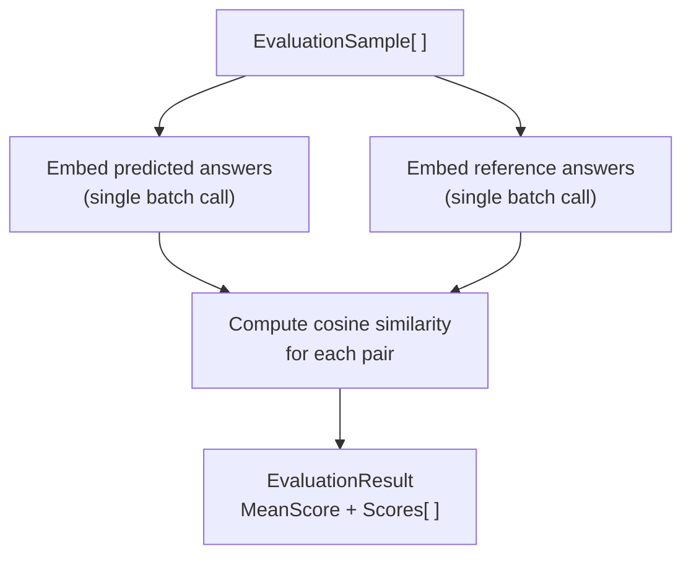

# Evaluation

Evaluating RAG output quality without ground-truth labels is hard. `Rag.NET.Evaluation` provides a lightweight, LLM-free approach: it measures how semantically close a predicted answer is to a reference answer using cosine similarity of their embeddings. This gives a reproducible, fast score that correlates well with human judgement for factual Q&A tasks.

## Package

```bash
dotnet add package Rag.NET.Evaluation
```

## `IRagEvaluator`

```csharp
public interface IRagEvaluator
{
    Task<EvaluationResult> EvaluateAsync(
        IReadOnlyList<EvaluationSample> samples,
        CancellationToken cancellationToken = default);
}
```

## `EmbeddingDistanceEvaluator`

The only built-in implementation. It:



1. Embeds all predicted answers in a single batch call.
2. Embeds all reference answers in a single batch call.
3. Computes cosine similarity for each pair.
4. Returns the mean score and all individual scores.

```csharp
using Microsoft.Extensions.AI;
using Rag.NET.Evaluation;

// Reuse the same IEmbeddingGenerator you registered for the pipeline
var evaluator = new EmbeddingDistanceEvaluator(embeddingGenerator);
```

## `EvaluationSample`

```csharp
public sealed record EvaluationSample(
    string Question,
    string PredictedAnswer,
    string ReferenceAnswer,
    IReadOnlyList<string>? SourceChunks = null);
```

`Question` is carried for your own logging; the evaluator does not embed or score it. `SourceChunks` is optional and only used by `LlmJudgeEvaluator`; `EmbeddingDistanceEvaluator` ignores it.

## `EvaluationResult`

```csharp
public sealed record EvaluationResult(
    double MeanScore,
    IReadOnlyList<double> Scores);
```

`MeanScore` is the arithmetic mean of all per-sample cosine similarities. `Scores[i]` is the cosine similarity for `samples[i]`.

## End-to-end example

```csharp
using Rag.NET.Evaluation;

var samples = new[]
{
    new EvaluationSample(
        Question:        "What is Retrieval-Augmented Generation?",
        PredictedAnswer: response1.Answer,
        ReferenceAnswer: "RAG combines a retrieval system with a language model to generate answers grounded in retrieved documents."),

    new EvaluationSample(
        Question:        "When should I use token-aware chunking?",
        PredictedAnswer: response2.Answer,
        ReferenceAnswer: "Use token-aware chunking when chunk precision matters, such as for code or dense technical text, to avoid silently exceeding embedding model token limits."),
};

var result = await evaluator.EvaluateAsync(samples);

Console.WriteLine($"Mean score: {result.MeanScore:F4}");  // e.g. 0.8923

for (int i = 0; i < samples.Length; i++)
{
    Console.WriteLine($"  Q: {samples[i].Question}");
    Console.WriteLine($"  Score: {result.Scores[i]:F4}");
}
```

## Score interpretation

Scores are cosine similarities in `[0, 1]`:

| Score range | Interpretation |
|-------------|---------------|
| 0.90 – 1.00 | Semantically near-identical — predicted answer captures the reference almost exactly |
| 0.85 – 0.90 | Acceptable — answer conveys the same meaning with different phrasing |
| 0.75 – 0.85 | Partial — answer captures part of the reference or uses tangential language |
| < 0.75 | Poor — answer diverges significantly from the reference |

A threshold of **0.85** is a reasonable pass/fail criterion for automated regression testing of RAG pipelines. The appropriate threshold depends on your embedding model and domain; calibrate against human-labelled examples.

## Using it in a CI gate

```csharp
var result = await evaluator.EvaluateAsync(goldSet);

Assert.True(result.MeanScore >= 0.85,
    $"RAG quality regression: mean score {result.MeanScore:F4} < 0.85");
```

The evaluator makes two embedding API calls (one batch per role: predicted/reference), regardless of the number of samples. This is intentional — batching minimises latency and cost.

## Limitations

- **Embedding similarity is not the same as factual correctness.** A confident but wrong answer that is phrased similarly to the reference will score well. Supplement with human review for high-stakes applications.
- **The metric is symmetric.** A very short predicted answer that happens to share vocabulary with the reference can score deceptively high.
- **Reference answers must be high quality.** Poorly written or ambiguous reference answers produce noisy scores.
- The evaluator requires at least one sample; it throws `ArgumentException` for an empty list.

---

## `LlmJudgeEvaluator`

Where `EmbeddingDistanceEvaluator` measures semantic proximity, `LlmJudgeEvaluator` asks an LLM to reason about answer quality. It can detect hallucinations, factual errors, and off-topic answers — things embedding similarity cannot catch.

One `IChatClient` call is made per sample. All calls run in parallel via `Task.WhenAll`.

### When to use it

| Situation | Recommended evaluator |
|---|---|
| Fast regression gate, no LLM API cost | `EmbeddingDistanceEvaluator` |
| Detecting hallucinations or factual errors | `LlmJudgeEvaluator` |
| Checking whether retrieved context was used faithfully | `LlmJudgeEvaluator` with `SourceChunks` |
| High-stakes production validation | Both, in combination |

### Basic usage

```csharp
using Microsoft.Extensions.AI;
using Rag.NET.Evaluation;

var evaluator = new LlmJudgeEvaluator(chatClient);

var samples = new[]
{
    new EvaluationSample(
        Question: "What is the capital of France?",
        PredictedAnswer: "The capital of France is Paris.",
        ReferenceAnswer: "Paris",
        SourceChunks: new[] { "France is a country in Europe. Its capital is Paris." }),
};

LlmJudgeResult result = await evaluator.EvaluateAsync(samples);

Console.WriteLine(result.MeanScore("correctness")); // e.g. 0.95
Console.WriteLine(result.MeanScore("faithfulness")); // e.g. 0.90
Console.WriteLine(result.MeanScore("relevance"));    // e.g. 1.00
```

### `EvaluationSample` and `SourceChunks`

When `SourceChunks` is null or empty on a sample, faithfulness is automatically excluded from the prompt and result for that sample. You can safely mix samples with and without source chunks in the same run.

### Default criteria

The evaluator uses three built-in criteria by default:

| Criterion | What it checks |
|---|---|
| `JudgeCriterion.Correctness` | Is the predicted answer factually correct given the reference answer? |
| `JudgeCriterion.Faithfulness`* | Does the answer stay grounded in the retrieved context without hallucinating? |
| `JudgeCriterion.Relevance` | Does the answer directly and completely address the question? |

\* Only included when `SourceChunks` is provided for a sample.

### Custom criteria

Pass any combination of built-in and custom criteria to the constructor:

```csharp
var evaluator = new LlmJudgeEvaluator(chatClient, criteria: new[]
{
    JudgeCriterion.Correctness,
    new JudgeCriterion("conciseness", "Is the answer brief and to the point without unnecessary elaboration?"),
});
```

A `JudgeCriterion` is a `(Name, Description)` record. The `Name` is the key used in results; the `Description` is the rubric shown to the LLM judge.

### `LlmJudgeResult`

```csharp
public sealed record LlmJudgeResult(IReadOnlyList<SampleJudgement> Samples)
{
    public double MeanScore(string criterion);
    public bool AllPass(string criterion, double threshold);
}
```

`MeanScore` returns the arithmetic mean across all samples that contain the criterion. `AllPass` returns `true` if every such sample meets or exceeds the threshold — useful as a CI gate.

> **Note:** If the criterion name does not match any sample result — for example, due to a typo — `MeanScore` returns `0.0` and `AllPass` returns `true` vacuously. Always verify criterion names against those configured on the evaluator.

### Using it in a CI gate

```csharp
LlmJudgeResult result = await evaluator.EvaluateAsync(goldSet);

if (!result.AllPass("correctness", threshold: 0.8))
    throw new Exception("Correctness gate failed");
```

### Per-sample reasoning

Each sample exposes the LLM's score and reasoning for every criterion:

```csharp
foreach (var judgement in result.Samples)
{
    Console.WriteLine($"Q: {judgement.Question}");
    foreach (var (criterion, score) in judgement.Criteria)
        Console.WriteLine($"  {criterion}: {score.Score:F2} — {score.Reasoning}");
}
```

### Error handling

| Exception | When thrown |
|---|---|
| `LlmJudgeException` | The LLM returns malformed JSON after markdown fence-stripping. The `RawResponse` property contains the original text for diagnosis. |
| `ArgumentException` | An empty samples list is passed to `EvaluateAsync`. |

---

## `EvaluationDatasetBuilder`

Building a hand-labelled evaluation dataset is expensive. `EvaluationDatasetBuilder` generates a synthetic dataset automatically by sampling random chunks from your existing document corpus and using an LLM to produce a question (and optionally a reference answer) for each chunk.

```bash
dotnet add package Rag.NET.Evaluation
```

### Usage

```csharp
using Rag.NET.Evaluation;

var builder = new EvaluationDatasetBuilder(dataManager, chatClient);

var samples = await builder.BuildAsync(new EvaluationDatasetBuilderOptions
{
    SampleCount = 50,                                // chunks to sample (clamped to corpus size)
    Mode        = DatasetGenerationMode.QuestionOnly, // or QuestionAndAnswer
});
```

`dataManager` is `IRagDataManager` — the same instance registered in your DI container. `chatClient` is any `IChatClient`.

### Generation modes

| Mode | LLM calls per chunk | `ReferenceAnswer` | Use with |
|---|---|---|---|
| `QuestionOnly` (default) | 1 | `""` (empty) | `EmbeddingDistanceEvaluator`, `LlmJudgeEvaluator` |
| `QuestionAndAnswer` | 2 | Ground-truth answer grounded in the chunk | `RagasEvaluationSuite` (Context Precision / Recall require it) |

All per-chunk LLM calls run concurrently. With a large corpus and high `SampleCount`, use a rate-limit-aware `IChatClient` (e.g., `FallbackChatClient`) to avoid 429 errors.

### Workflow

```csharp
// 1. Generate synthetic questions (and optionally reference answers)
var samples = await builder.BuildAsync(new EvaluationDatasetBuilderOptions
{
    SampleCount = 50,
    Mode = DatasetGenerationMode.QuestionAndAnswer,
});

// 2. Run your RAG pipeline to get predicted answers
var evaluated = new List<EvaluationSample>();
foreach (var sample in samples)
{
    var result = await pipeline.AskAsync(sample.Question);
    evaluated.Add(sample with
    {
        PredictedAnswer = result.Answer,
        SourceChunks    = result.SourceChunks,
    });
}

// 3. Score with any evaluator
var result = await evaluator.EvaluateAsync(evaluated);
```

### Limitations

- Synthetic questions reflect the content of individual chunks, not complex multi-hop queries.
- `QuestionOnly` mode produces empty `ReferenceAnswer` — you must either fill it in manually or avoid metrics that require it (Context Precision, Context Recall).
- All LLM calls run concurrently — use a rate-limit-aware client for large sample counts.

---

## RAGAS-Style Metrics

`Rag.NET.Evaluation.Ragas` decomposes RAG quality into four independent metrics, each targeting a specific failure mode. You register only the metrics you need — each adds LLM calls per sample.

```bash
dotnet add package Rag.NET.Evaluation.Ragas
```

### When to use RAGAS vs other evaluators

| Evaluator | LLM calls/sample | Ground truth required | Detects |
|---|---|---|---|
| `EmbeddingDistanceEvaluator` | 0 | Yes (reference answer) | Semantic drift from reference |
| `LlmJudgeEvaluator` | 1 | Yes (reference answer) | Holistic quality, hallucinations |
| `RagasEvaluationSuite` | 5–20+ | Partial (2 of 4 metrics) | Specific retrieval and generation failure modes |

Use RAGAS when you need to diagnose *where* quality is breaking down — retrieval, generation, or both.

### The four metrics

#### Faithfulness

Checks: Are all claims in the predicted answer supported by the retrieved chunks?

- LLM calls: 1 (extract atomic claims) + N per sample (verify each claim)
- Ground truth: **not required**
- Score 1.0: every claim is grounded in the retrieved context
- Score 0.0: all claims are hallucinated

#### Answer Relevance

Checks: Does the answer actually address the original question?

- LLM calls: 3 (generate synthetic questions from the answer) + 1 embedding batch
- Ground truth: **not required**
- Score 1.0: answer directly addresses the question
- Score 0.0: answer is off-topic

#### Context Precision

Checks: Are the retrieved chunks relevant to the ground-truth answer?

- LLM calls: N per sample (one per chunk)
- Ground truth: **required** — `ReferenceAnswer` must be non-empty
- Score 1.0: every retrieved chunk is relevant
- Score 0.0: all retrieved chunks are irrelevant noise

#### Context Recall

Checks: Do the retrieved chunks contain the facts stated in the reference answer?

- LLM calls: 1 (extract ground-truth statements) + M per sample (verify each)
- Ground truth: **required** — `ReferenceAnswer` must be non-empty
- Score 1.0: all ground-truth facts are present in the chunks
- Score 0.0: retrieved chunks are missing the key facts

### Which metrics to register

| Goal | Register |
|---|---|
| Fast regression gate (no ground truth) | Faithfulness + AnswerRelevance |
| Diagnose retrieval quality | ContextPrecision + ContextRecall |
| Full RAGAS diagnostic | All four (requires `QuestionAndAnswer` dataset) |

### Usage

```csharp
using Rag.NET.Evaluation.Ragas;

var suite = new RagasEvaluationSuiteBuilder(chatClient, embeddingGenerator)
    .AddFaithfulness()
    .AddAnswerRelevance()
    .AddContextPrecision()   // requires non-empty ReferenceAnswer
    .AddContextRecall()      // requires non-empty ReferenceAnswer
    .Build();

RagasReport report = await suite.EvaluateAsync(samples);

Console.WriteLine($"Overall:           {report.OverallScore:F2}");
Console.WriteLine($"Faithfulness:      {report.Faithfulness:F2}");
Console.WriteLine($"Answer Relevance:  {report.AnswerRelevance:F2}");
Console.WriteLine($"Context Precision: {report.ContextPrecision:F2}");
Console.WriteLine($"Context Recall:    {report.ContextRecall:F2}");
```

`OverallScore` is the arithmetic mean of all registered (non-null) metrics.

A metric that was not registered appears as `null` in the report.

### `RagasReport`

```csharp
public sealed record RagasReport
{
    public double? Faithfulness     { get; init; }  // null = not registered
    public double? AnswerRelevance  { get; init; }
    public double? ContextPrecision { get; init; }
    public double? ContextRecall    { get; init; }
    public double  OverallScore     { get; init; }  // mean of registered metrics
}
```

### Ground-truth validation

If you register Context Precision or Context Recall and pass a sample with an empty `ReferenceAnswer`, `EvaluateAsync` throws `InvalidOperationException` immediately — before any LLM call. Use `DatasetGenerationMode.QuestionAndAnswer` when building your dataset to avoid this.

### Cost estimation

For N samples with an average of K chunks/claims/statements per sample:

| Metric | LLM calls |
|---|---|
| Faithfulness | N × (1 + K_claims) |
| Answer Relevance | N × 3 (LLM) + 1 embedding batch |
| Context Precision | N × K_chunks |
| Context Recall | N × (1 + K_statements) |

Example: 100 samples, 4 chunks each, ~3 claims/statements → approximately **1,500 LLM calls** for all four metrics. Use a rate-limit-aware `IChatClient` (e.g., `FallbackChatClient`) for production-scale evaluation runs.

### Complete example: synthetic dataset → RAGAS evaluation

```csharp
using Rag.NET.Evaluation;
using Rag.NET.Evaluation.Ragas;

// 1. Build a synthetic evaluation dataset
var builder = new EvaluationDatasetBuilder(dataManager, chatClient);
var samples = await builder.BuildAsync(new EvaluationDatasetBuilderOptions
{
    SampleCount = 50,
    Mode        = DatasetGenerationMode.QuestionAndAnswer, // required for Context metrics
});

// 2. Run your RAG pipeline
var evaluated = new List<EvaluationSample>();
foreach (var sample in samples)
{
    var result = await pipeline.AskAsync(sample.Question);
    evaluated.Add(sample with
    {
        PredictedAnswer = result.Answer,
        SourceChunks    = result.SourceChunks,
    });
}

// 3. Score with RAGAS
var suite = new RagasEvaluationSuiteBuilder(chatClient, embeddingGenerator)
    .AddFaithfulness()
    .AddAnswerRelevance()
    .AddContextPrecision()
    .AddContextRecall()
    .Build();

RagasReport report = await suite.EvaluateAsync(evaluated);

Console.WriteLine($"Overall:           {report.OverallScore:F2}");
Console.WriteLine($"Faithfulness:      {report.Faithfulness:F2}");
Console.WriteLine($"Answer Relevance:  {report.AnswerRelevance:F2}");
Console.WriteLine($"Context Precision: {report.ContextPrecision:F2}");
Console.WriteLine($"Context Recall:    {report.ContextRecall:F2}");
```
