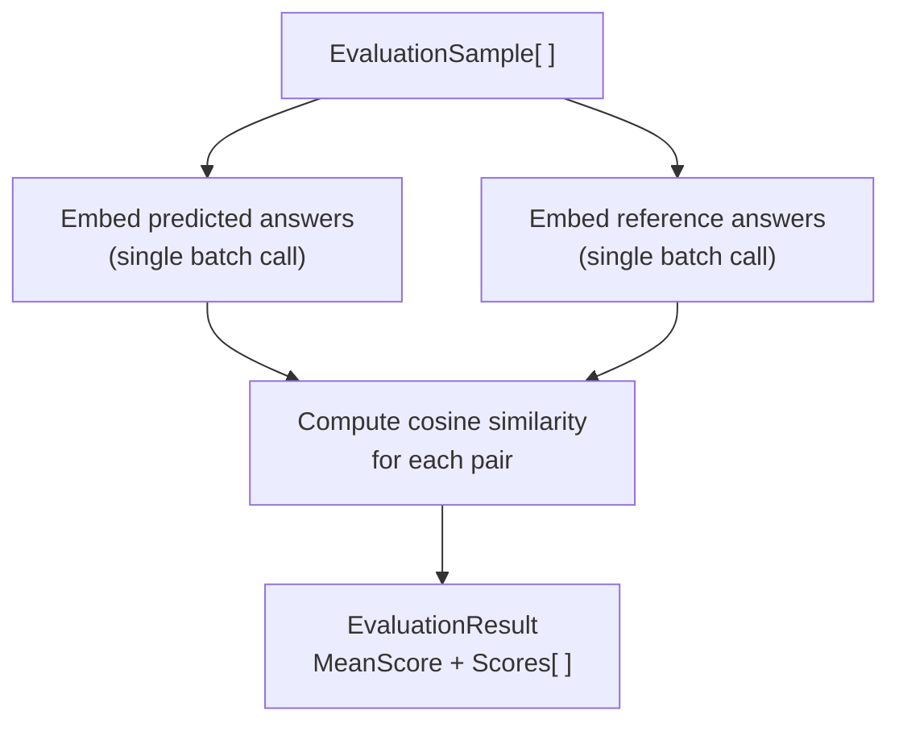

# Evaluation

Evaluating RAG output quality without ground-truth labels is hard. `Rag.NET.Evaluation` provides a lightweight, LLM-free approach: it measures how semantically close a predicted answer is to a reference answer using cosine similarity of their embeddings. This gives a reproducible, fast score that correlates well with human judgement for factual Q&A tasks.

## Package

```bash
dotnet add package Rag.NET.Evaluation
```

## `IRagEvaluator`

```csharp
public interface IRagEvaluator
{
    Task<EvaluationResult> EvaluateAsync(
        IReadOnlyList<EvaluationSample> samples,
        CancellationToken cancellationToken = default);
}
```

## `EmbeddingDistanceEvaluator`

The only built-in implementation. It:



1. Embeds all predicted answers in a single batch call.
2. Embeds all reference answers in a single batch call.
3. Computes cosine similarity for each pair.
4. Returns the mean score and all individual scores.

```csharp
using Microsoft.Extensions.AI;
using Rag.NET.Evaluation;

// Reuse the same IEmbeddingGenerator you registered for the pipeline
var evaluator = new EmbeddingDistanceEvaluator(embeddingGenerator);
```

## `EvaluationSample`

```csharp
public sealed record EvaluationSample(
    string Question,
    string PredictedAnswer,
    string ReferenceAnswer);
```

`Question` is carried for your own logging; the evaluator does not embed or score it.

## `EvaluationResult`

```csharp
public sealed record EvaluationResult(
    double MeanScore,
    IReadOnlyList<double> Scores);
```

`MeanScore` is the arithmetic mean of all per-sample cosine similarities. `Scores[i]` is the cosine similarity for `samples[i]`.

## End-to-end example

```csharp
using Rag.NET.Evaluation;

var samples = new[]
{
    new EvaluationSample(
        Question:        "What is Retrieval-Augmented Generation?",
        PredictedAnswer: response1.Answer,
        ReferenceAnswer: "RAG combines a retrieval system with a language model to generate answers grounded in retrieved documents."),

    new EvaluationSample(
        Question:        "When should I use token-aware chunking?",
        PredictedAnswer: response2.Answer,
        ReferenceAnswer: "Use token-aware chunking when chunk precision matters, such as for code or dense technical text, to avoid silently exceeding embedding model token limits."),
};

var result = await evaluator.EvaluateAsync(samples);

Console.WriteLine($"Mean score: {result.MeanScore:F4}");  // e.g. 0.8923

for (int i = 0; i < samples.Length; i++)
{
    Console.WriteLine($"  Q: {samples[i].Question}");
    Console.WriteLine($"  Score: {result.Scores[i]:F4}");
}
```

## Score interpretation

Scores are cosine similarities in `[0, 1]`:

| Score range | Interpretation |
|-------------|---------------|
| 0.90 – 1.00 | Semantically near-identical — predicted answer captures the reference almost exactly |
| 0.85 – 0.90 | Acceptable — answer conveys the same meaning with different phrasing |
| 0.75 – 0.85 | Partial — answer captures part of the reference or uses tangential language |
| < 0.75 | Poor — answer diverges significantly from the reference |

A threshold of **0.85** is a reasonable pass/fail criterion for automated regression testing of RAG pipelines. The appropriate threshold depends on your embedding model and domain; calibrate against human-labelled examples.

## Using it in a CI gate

```csharp
var result = await evaluator.EvaluateAsync(goldSet);

Assert.True(result.MeanScore >= 0.85,
    $"RAG quality regression: mean score {result.MeanScore:F4} < 0.85");
```

The evaluator makes two embedding API calls (one batch per role: predicted/reference), regardless of the number of samples. This is intentional — batching minimises latency and cost.

## Limitations

- **Embedding similarity is not the same as factual correctness.** A confident but wrong answer that is phrased similarly to the reference will score well. Supplement with human review for high-stakes applications.
- **The metric is symmetric.** A very short predicted answer that happens to share vocabulary with the reference can score deceptively high.
- **Reference answers must be high quality.** Poorly written or ambiguous reference answers produce noisy scores.
- The evaluator requires at least one sample; it throws `ArgumentException` for an empty list.

---

## `LlmJudgeEvaluator`

Where `EmbeddingDistanceEvaluator` measures semantic proximity, `LlmJudgeEvaluator` asks an LLM to reason about answer quality. It can detect hallucinations, factual errors, and off-topic answers — things embedding similarity cannot catch.

One `IChatClient` call is made per sample. All calls run in parallel via `Task.WhenAll`.

### When to use it

| Situation | Recommended evaluator |
|---|---|
| Fast regression gate, no LLM API cost | `EmbeddingDistanceEvaluator` |
| Detecting hallucinations or factual errors | `LlmJudgeEvaluator` |
| Checking whether retrieved context was used faithfully | `LlmJudgeEvaluator` with `SourceChunks` |
| High-stakes production validation | Both, in combination |

### Basic usage

```csharp
using Microsoft.Extensions.AI;
using Rag.NET.Evaluation;

var evaluator = new LlmJudgeEvaluator(chatClient);

var samples = new[]
{
    new EvaluationSample(
        Question: "What is the capital of France?",
        PredictedAnswer: "The capital of France is Paris.",
        ReferenceAnswer: "Paris",
        SourceChunks: ["France is a country in Europe. Its capital is Paris."]),
};

LlmJudgeResult result = await evaluator.EvaluateAsync(samples);

Console.WriteLine(result.MeanScore("correctness")); // e.g. 0.95
Console.WriteLine(result.MeanScore("faithfulness")); // e.g. 0.90
Console.WriteLine(result.MeanScore("relevance"));    // e.g. 1.00
```

### `EvaluationSample` and `SourceChunks`

`EvaluationSample` now carries an optional `SourceChunks` parameter:

```csharp
public sealed record EvaluationSample(
    string Question,
    string PredictedAnswer,
    string ReferenceAnswer,
    IReadOnlyList<string>? SourceChunks = null);
```

When `SourceChunks` is null or empty on a sample, faithfulness is automatically excluded from the prompt and result for that sample. You can safely mix samples with and without source chunks in the same run.

### Default criteria

The evaluator uses three built-in criteria by default:

| Criterion | What it checks |
|---|---|
| `JudgeCriterion.Correctness` | Is the predicted answer factually correct given the reference answer? |
| `JudgeCriterion.Faithfulness` | Does the answer stay grounded in the retrieved context without hallucinating? |
| `JudgeCriterion.Relevance` | Does the answer directly and completely address the question? |

### Custom criteria

Pass any combination of built-in and custom criteria to the constructor:

```csharp
var evaluator = new LlmJudgeEvaluator(chatClient, criteria: new[]
{
    JudgeCriterion.Correctness,
    new JudgeCriterion("conciseness", "Is the answer brief and to the point without unnecessary elaboration?"),
});
```

A `JudgeCriterion` is a `(Name, Description)` record. The `Name` is the key used in results; the `Description` is the rubric shown to the LLM judge.

### `LlmJudgeResult`

```csharp
public sealed record LlmJudgeResult(IReadOnlyList<SampleJudgement> Samples)
{
    public double MeanScore(string criterion);
    public bool AllPass(string criterion, double threshold);
}
```

`MeanScore` returns the arithmetic mean across all samples that contain the criterion. `AllPass` returns `true` if every such sample meets or exceeds the threshold — useful as a CI gate.

### Using it in a CI gate

```csharp
LlmJudgeResult result = await evaluator.EvaluateAsync(goldSet);

if (!result.AllPass("correctness", threshold: 0.8))
    throw new Exception("Correctness gate failed");
```

### Per-sample reasoning

Each sample exposes the LLM's score and reasoning for every criterion:

```csharp
foreach (var judgement in result.Samples)
{
    Console.WriteLine($"Q: {judgement.Question}");
    foreach (var (criterion, score) in judgement.Criteria)
        Console.WriteLine($"  {criterion}: {score.Score:F2} — {score.Reasoning}");
}
```

### Error handling

| Exception | When thrown |
|---|---|
| `LlmJudgeException` | The LLM returns malformed JSON after markdown fence-stripping. The `RawResponse` property contains the original text for diagnosis. |
| `ArgumentException` | An empty samples list is passed to `EvaluateAsync`. |
