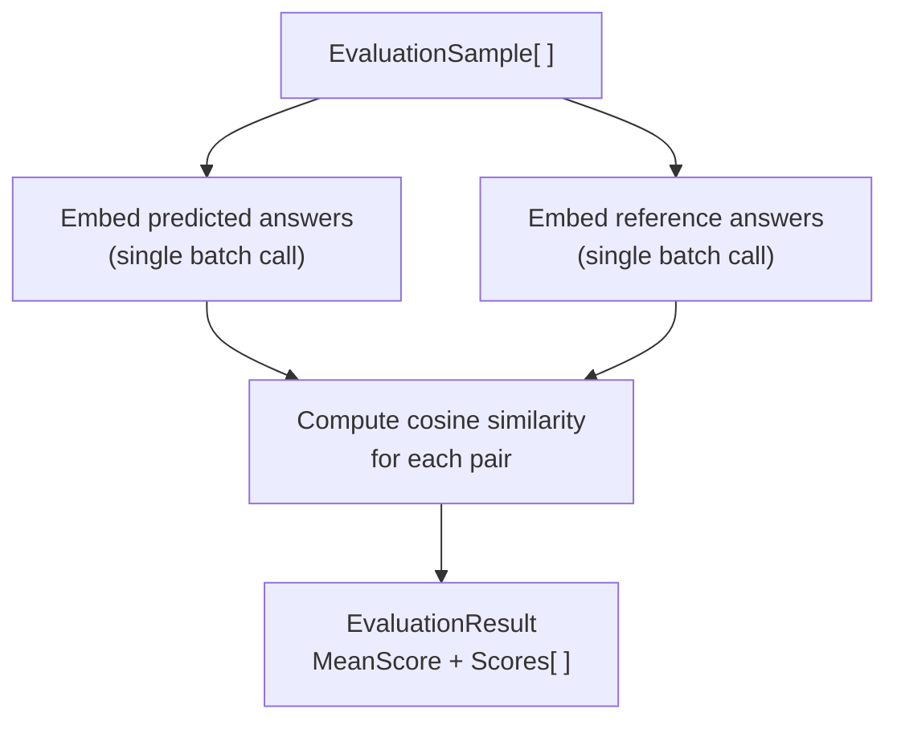

# Evaluation

Evaluating RAG output quality without ground-truth labels is hard. `Rag.NET.Evaluation` provides a lightweight, LLM-free approach: it measures how semantically close a predicted answer is to a reference answer using cosine similarity of their embeddings. This gives a reproducible, fast score that correlates well with human judgement for factual Q&A tasks.

## Package

```bash
dotnet add package Rag.NET.Evaluation
```

## `IRagEvaluator`

```csharp
public interface IRagEvaluator
{
    Task<EvaluationResult> EvaluateAsync(
        IReadOnlyList<EvaluationSample> samples,
        CancellationToken cancellationToken = default);
}
```

## `EmbeddingDistanceEvaluator`

The only built-in implementation. It:



1. Embeds all predicted answers in a single batch call.
2. Embeds all reference answers in a single batch call.
3. Computes cosine similarity for each pair.
4. Returns the mean score and all individual scores.

```csharp
using Microsoft.Extensions.AI;
using Rag.NET.Evaluation;

// Reuse the same IEmbeddingGenerator you registered for the pipeline
var evaluator = new EmbeddingDistanceEvaluator(embeddingGenerator);
```

## `EvaluationSample`

```csharp
public sealed record EvaluationSample(
    string Question,
    string PredictedAnswer,
    string ReferenceAnswer,
    IReadOnlyList<string>? SourceChunks = null);
```

`Question` is carried for your own logging; the evaluator does not embed or score it. `SourceChunks` is optional and used by `LlmJudgeEvaluator` and the RAGAS metrics; `EmbeddingDistanceEvaluator` ignores it.

## `EvaluationResult`

```csharp
public sealed record EvaluationResult(
    double MeanScore,
    IReadOnlyList<double> Scores);
```

`MeanScore` is the arithmetic mean of all per-sample cosine similarities. `Scores[i]` is the cosine similarity for `samples[i]`.

## End-to-end example

```csharp
using Rag.NET.Evaluation;

var samples = new[]
{
    new EvaluationSample(
        Question:        "What is Retrieval-Augmented Generation?",
        PredictedAnswer: response1.Answer,
        ReferenceAnswer: "RAG combines a retrieval system with a language model to generate answers grounded in retrieved documents."),

    new EvaluationSample(
        Question:        "When should I use token-aware chunking?",
        PredictedAnswer: response2.Answer,
        ReferenceAnswer: "Use token-aware chunking when chunk precision matters, such as for code or dense technical text, to avoid silently exceeding embedding model token limits."),
};

var result = await evaluator.EvaluateAsync(samples);

Console.WriteLine($"Mean score: {result.MeanScore:F4}");  // e.g. 0.8923

for (int i = 0; i < samples.Length; i++)
{
    Console.WriteLine($"  Q: {samples[i].Question}");
    Console.WriteLine($"  Score: {result.Scores[i]:F4}");
}
```

## Score interpretation

Scores are cosine similarities in `[0, 1]`:

| Score range | Interpretation |
|-------------|---------------|
| 0.90 – 1.00 | Semantically near-identical — predicted answer captures the reference almost exactly |
| 0.85 – 0.90 | Acceptable — answer conveys the same meaning with different phrasing |
| 0.75 – 0.85 | Partial — answer captures part of the reference or uses tangential language |
| < 0.75 | Poor — answer diverges significantly from the reference |

A threshold of **0.85** is a reasonable pass/fail criterion for automated regression testing of RAG pipelines. The appropriate threshold depends on your embedding model and domain; calibrate against human-labelled examples.

## Using it in a CI gate

```csharp
var result = await evaluator.EvaluateAsync(goldSet);

Assert.True(result.MeanScore >= 0.85,
    $"RAG quality regression: mean score {result.MeanScore:F4} < 0.85");
```

The evaluator makes two embedding API calls (one batch per role: predicted/reference), regardless of the number of samples. This is intentional — batching minimises latency and cost.

## Limitations

- **Embedding similarity is not the same as factual correctness.** A confident but wrong answer that is phrased similarly to the reference will score well. Supplement with human review for high-stakes applications.
- **The metric is symmetric.** A very short predicted answer that happens to share vocabulary with the reference can score deceptively high.
- **Reference answers must be high quality.** Poorly written or ambiguous reference answers produce noisy scores.
- The evaluator requires at least one sample; it throws `ArgumentException` for an empty list.

---

## `LlmJudgeEvaluator`

Where `EmbeddingDistanceEvaluator` measures semantic proximity, `LlmJudgeEvaluator` asks an LLM to reason about answer quality. It can detect hallucinations, factual errors, and off-topic answers — things embedding similarity cannot catch.

One `IChatClient` call is made per sample. All calls run in parallel via `Task.WhenAll`.

### When to use it

| Situation | Recommended evaluator |
|---|---|
| Fast regression gate, no LLM API cost | `EmbeddingDistanceEvaluator` |
| Detecting hallucinations or factual errors | `LlmJudgeEvaluator` |
| Checking whether retrieved context was used faithfully | `LlmJudgeEvaluator` with `SourceChunks` |
| High-stakes production validation | Both, in combination |

### Basic usage

```csharp
using Microsoft.Extensions.AI;
using Rag.NET.Evaluation;

var evaluator = new LlmJudgeEvaluator(chatClient);

var samples = new[]
{
    new EvaluationSample(
        Question: "What is the capital of France?",
        PredictedAnswer: "The capital of France is Paris.",
        ReferenceAnswer: "Paris",
        SourceChunks: new[] { "France is a country in Europe. Its capital is Paris." }),
};

LlmJudgeResult result = await evaluator.EvaluateAsync(samples);

Console.WriteLine(result.MeanScore("correctness")); // e.g. 0.95
Console.WriteLine(result.MeanScore("faithfulness")); // e.g. 0.90
Console.WriteLine(result.MeanScore("relevance"));    // e.g. 1.00
```

### `EvaluationSample` and `SourceChunks`

When `SourceChunks` is null or empty on a sample, faithfulness is automatically excluded from the prompt and result for that sample. You can safely mix samples with and without source chunks in the same run.

### Default criteria

The evaluator uses three built-in criteria by default:

| Criterion | What it checks |
|---|---|
| `JudgeCriterion.Correctness` | Is the predicted answer factually correct given the reference answer? |
| `JudgeCriterion.Faithfulness`* | Does the answer stay grounded in the retrieved context without hallucinating? |
| `JudgeCriterion.Relevance` | Does the answer directly and completely address the question? |

\* Only included when `SourceChunks` is provided for a sample.

### Custom criteria

Pass any combination of built-in and custom criteria to the constructor:

```csharp
var evaluator = new LlmJudgeEvaluator(chatClient, criteria: new[]
{
    JudgeCriterion.Correctness,
    new JudgeCriterion("conciseness", "Is the answer brief and to the point without unnecessary elaboration?"),
});
```

A `JudgeCriterion` is a `(Name, Description)` record. The `Name` is the key used in results; the `Description` is the rubric shown to the LLM judge.

### `LlmJudgeResult`

```csharp
public sealed record LlmJudgeResult(IReadOnlyList<SampleJudgement> Samples)
{
    public double MeanScore(string criterion);
    public bool AllPass(string criterion, double threshold);
}
```

`MeanScore` returns the arithmetic mean across all samples that contain the criterion. `AllPass` returns `true` if every such sample meets or exceeds the threshold — useful as a CI gate.

> **Note:** If the criterion name does not match any sample result — for example, due to a typo — `MeanScore` returns `0.0` and `AllPass` returns `true` vacuously. Always verify criterion names against those configured on the evaluator.

### Using it in a CI gate

```csharp
LlmJudgeResult result = await evaluator.EvaluateAsync(goldSet);

if (!result.AllPass("correctness", threshold: 0.8))
    throw new Exception("Correctness gate failed");
```

### Per-sample reasoning

Each sample exposes the LLM's score and reasoning for every criterion:

```csharp
foreach (var judgement in result.Samples)
{
    Console.WriteLine($"Q: {judgement.Question}");
    foreach (var (criterion, score) in judgement.Criteria)
        Console.WriteLine($"  {criterion}: {score.Score:F2} — {score.Reasoning}");
}
```

### Error handling

| Exception | When thrown |
|---|---|
| `LlmJudgeException` | The LLM returns malformed JSON after markdown fence-stripping. The `RawResponse` property contains the original text for diagnosis. |
| `ArgumentException` | An empty samples list is passed to `EvaluateAsync`. |

---

## `EvaluationDatasetBuilder`

Building a hand-labelled evaluation dataset is expensive. `EvaluationDatasetBuilder` generates a synthetic dataset automatically by sampling random chunks from your existing document corpus and using an LLM to produce a question (and optionally a reference answer) for each chunk.

```bash
dotnet add package Rag.NET.Evaluation
```

### Usage

```csharp
using Rag.NET.Evaluation;

var builder = new EvaluationDatasetBuilder(dataManager, chatClient);

var samples = await builder.BuildAsync(new EvaluationDatasetBuilderOptions
{
    SampleCount = 50,                                // chunks to sample (clamped to corpus size)
    Mode        = DatasetGenerationMode.QuestionOnly, // or QuestionAndAnswer
});
```

`dataManager` is `IRagDataManager` — the same instance registered in your DI container. `chatClient` is any `IChatClient`.

### Generation modes

| Mode | LLM calls per chunk | `ReferenceAnswer` | Use with |
|---|---|---|---|
| `QuestionOnly` (default) | 1 | `""` (empty) | `EmbeddingDistanceEvaluator`, `LlmJudgeEvaluator` |
| `QuestionAndAnswer` | 2 | Ground-truth answer grounded in the chunk | `RagasEvaluationSuite` (Context Precision / Recall require it) |

All per-chunk LLM calls run concurrently. With a large corpus and high `SampleCount`, use a rate-limit-aware `IChatClient` (e.g., `FallbackChatClient`) to avoid 429 errors.

### Workflow

```csharp
// 1. Generate synthetic questions (and optionally reference answers)
var samples = await builder.BuildAsync(new EvaluationDatasetBuilderOptions
{
    SampleCount = 50,
    Mode = DatasetGenerationMode.QuestionAndAnswer,
});

// 2. Run your RAG pipeline to get predicted answers
var evaluated = new List<EvaluationSample>();
foreach (var sample in samples)
{
    var result = await pipeline.AskAsync(sample.Question);
    evaluated.Add(sample with
    {
        PredictedAnswer = result.Answer,
        SourceChunks    = result.SourceChunks,
    });
}

// 3. Score with any evaluator
var result = await evaluator.EvaluateAsync(evaluated);
```

### Limitations

- Synthetic questions reflect the content of individual chunks, not complex multi-hop queries.
- `QuestionOnly` mode produces empty `ReferenceAnswer` — you must either fill it in manually or avoid metrics that require it (Context Precision, Context Recall).
- All LLM calls run concurrently — use a rate-limit-aware client for large sample counts.

---

## RAGAS-Style Metrics

`Rag.NET.Evaluation.Ragas` decomposes RAG quality into four metrics, each targeting a specific failure mode. You register only the metrics you need — each adds LLM calls per sample.

```bash
dotnet add package Rag.NET.Evaluation.Ragas
```

### Scores changed — re-baseline before comparing

> **Warning:** the metrics were corrected to match the published RAGAS definitions. A run against the same data will **not** produce the same numbers it produced before, and the difference is a fix rather than a regression.

Three changes move scores:

- **Context Precision is now rank-aware.** It was `relevant / total`, which scored a retriever that returned the gold chunk *first* identically to one that returned it *last*. Scores now go up for well-ordered retrieval and down for badly-ordered retrieval of the same chunks.
- **Answer Relevance now penalises evasion.** An answer like "I don't know" or "the context does not say" scores `0.0`, where before it could score well simply for being topically close to the question. Evasive answers get materially worse.
- **A parse failure no longer scores `1.0`.** Faithfulness and Context Recall caught a malformed model reply, turned it into an empty claim list, and scored the empty list as perfect. Those samples now score `null` and are excluded. Aggregates computed over a model that frequently returned unreadable replies will drop.

Nothing here is published to NuGet yet — packaging is a later phase — so this is documented here rather than recorded as a release break. If you hold a stored baseline, re-baseline it; do not file the delta as a quality regression.

### When to use RAGAS vs other evaluators

| Evaluator | LLM calls/sample | Ground truth required | Detects |
|---|---|---|---|
| `EmbeddingDistanceEvaluator` | 0 | Yes (reference answer) | Semantic drift from reference |
| `LlmJudgeEvaluator` | 1 | Yes (reference answer) | Holistic quality, hallucinations |
| `RagasEvaluationSuite` | 10–20+ | Partial (2 of 4 metrics) | Specific retrieval and generation failure modes |

Use RAGAS when you need to diagnose *where* quality is breaking down — retrieval, generation, or both.

### The four metrics

#### Faithfulness

Checks: are all claims in the predicted answer supported by the retrieved chunks?

**Formula:** `supported_claims / readable_claim_verdicts`.

- LLM calls: 1 (extract atomic claims) + one per claim (verify it against the context)
- Ground truth: **not required**
- Score 1.0: every claim is grounded in the retrieved context
- Score 0.0: no claim is grounded
- Score `null`: nothing was retrieved, the claim list could not be read, or no verdict could be read
- An answer that asserts nothing (an empty claim list the model genuinely produced) scores **1.0** — nothing unfaithful was asserted. That is now distinguishable from a reply that could not be parsed, which was the defect described above.

#### Answer Relevance

Checks: does the answer actually address the question that was asked?

**Formula:** mean cosine similarity between the original question and `n` synthetic questions the answer would answer, clamped to `[0, 1]`. A noncommittal answer short-circuits to `0.0`.

- LLM calls: 2 (one evasion check, one call returning all `n` questions as a JSON array) + one embedding batch per sample
- Ground truth: **not required**
- Score 1.0: the answer responds to the question that was asked
- Score 0.0: off-topic, or evasive (see below)
- Score `null`: the synthetic-question list could not be read, was empty, or the embedding generator returned fewer vectors than texts

Cosine similarity ranges over `[-1, 1]` but the score contract is `[0, 1]`, so a negative similarity clamps to `0.0` rather than dragging the aggregate below zero.

`n` is `RagasOptions.SyntheticQuestionCount` (default `3`). All `n` come back from **one** call, so they can differ from each other; asking `n` times at temperature 0 returns the same question `n` times and collapses the mean to a single sample.

#### Context Precision

Checks: were the relevant chunks ranked highly, not merely present?

**Formula:** rank-aware average precision over the retrieved order, `Σ(P@k × rel_k) / total_relevant` — **not** `relevant / total`. `P@k` is the precision over the first `k` chunks and `rel_k` is 1 when the chunk at rank `k` was judged relevant.

- LLM calls: one per retrieved chunk
- Ground truth: **required** — `ReferenceAnswer` must be non-empty
- Score 1.0: every relevant chunk was ranked above every irrelevant one
- Score 0.0: no chunk was judged relevant
- Score `null`: nothing was retrieved, or no verdict could be read

Worked example: three chunks where only the gold one is relevant scores `1.00` if it came back first and `0.33` if it came back last. Under the old `relevant / total` both scored `0.33`, which is the discrimination the metric exists to provide.

#### Context Recall

Checks: do the retrieved chunks contain the facts stated in the reference answer?

**Formula:** `supported_statements / readable_statement_verdicts`.

- LLM calls: 1 (extract atomic statements from the reference answer) + one per statement
- Ground truth: **required** — `ReferenceAnswer` must be non-empty
- Score 1.0: every ground-truth statement is covered by the chunks
- Score 0.0: none is
- Score `null`: nothing was retrieved, the statement list could not be read, or no verdict could be read

### Which metrics need a `ReferenceAnswer`

| Metric | Needs a non-empty `ReferenceAnswer` |
|---|---|
| Faithfulness | No |
| Answer Relevance | No |
| Context Precision | **Yes** |
| Context Recall | **Yes** |

If Context Precision or Context Recall is registered and *any* sample has an empty `ReferenceAnswer`, `EvaluateAsync` throws `InvalidOperationException` **before any LLM call** — you do not pay for a run that cannot produce the scores you asked for. Used standalone, `ContextPrecisionEvaluator.ScoreAsync` and `ContextRecallEvaluator.ScoreAsync` throw the same exception for that sample.

Build the dataset with `DatasetGenerationMode.QuestionAndAnswer` to get reference answers, or register only Faithfulness and Answer Relevance.

### Reading a `null` score

This is the central idea of the metrics, and the one most likely to surprise: **a verdict the model did not give is not a verdict.**

Every metric returns `double?`. `null` means *this sample could not be scored*, which is a different fact from `0.0` (*this sample scored as badly as possible*). A sample scoring `null` is **excluded from the metric's mean** rather than folded in, and counted in `RagasReport.UnscoreableSamples`.

A sample is unscoreable when:

- nothing was retrieved (`SourceChunks` is null or empty) — an absence of evidence, not evidence of bad retrieval;
- the model's list reply could not be parsed as a JSON array of strings;
- no yes/no verdict in the sample could be read at all.

Individual unreadable verdicts *within* a sample are dropped from the denominator, not counted as "no". Counting them as "no" would state that the model denied something it never answered.

```csharp
RagasReport report = await suite.EvaluateAsync(samples);

if (report.Faithfulness is { } faithfulness)
    Console.WriteLine($"Faithfulness: {faithfulness:F2}");
else
    Console.WriteLine("Faithfulness: no sample could be scored");

foreach (var (metric, count) in report.UnscoreableSamples)
    Console.WriteLine($"{metric}: {count} of {samples.Count} samples unscoreable");
```

Read the two together. A Faithfulness of `0.95` over 100 samples means something quite different when `UnscoreableSamples["Faithfulness"]` is `0` than when it is `80` — in the second case the mean describes twenty samples and is silent about the rest. A metric that scored everything still reports a `0` count, so an absent key means the metric was not registered rather than that nothing failed.

The rule holds at every level. A metric that **no** sample could be scored by reports `null` rather than `0.0`, and so does `OverallScore` when no registered metric could be scored at all — a run that established nothing about quality does not get to report the worst possible quality.

One case is deliberately *not* surfaced. Answer Relevance's evasion check short-circuits to `0.0` only on an explicit `Yes`; if that check itself comes back unreadable, the sample is scored normally on question similarity alone. That is the right call — a failed gate should not discard an otherwise usable measurement — but it is invisible: the sample scores like any other and is not counted in `UnscoreableSamples`. An evasive answer whose evasion check failed to parse therefore scores as it would have before the check existed.

### Concurrency: `MaxConcurrentCalls` is per run, not per metric

```csharp
var options = new RagasOptions
{
    MaxConcurrentCalls     = 4,   // default
    SyntheticQuestionCount = 3,   // default
};

var suite = new RagasEvaluationSuiteBuilder(chatClient, embeddingGenerator, options)
    .AddFaithfulness()
    .AddAnswerRelevance()
    .AddContextPrecision()
    .AddContextRecall()
    .Build();
```

Every metric the builder registers shares **one** judge, and therefore one semaphore. `MaxConcurrentCalls = 4` means at most four LLM calls are in flight across the whole run — not four per metric.

That is deliberate, because per-metric ceilings multiply. Four metrics each fanning out over a 50-chunk sample at a per-metric ceiling of 4 would be 16 concurrent requests, and the number you configured would not be the number you got. Rate limits are imposed on your API key, not on one metric, so the ceiling has to be enforced where the key is.

Raise it if your provider tolerates it; the default of 4 is conservative because a full four-metric run over a 50-sample dataset is several thousand calls.

### Cost recording

Pass an `ICostLedger` to the builder and every chat call the run makes is recorded to it as a `CostKind.Chat` entry carrying the model's reported input and output token counts:

```csharp
var options = new RagasOptions
{
    PricePerInputToken  = 3m / 1_000_000m,   // your provider's price per input token
    PricePerOutputToken = 15m / 1_000_000m,  // ... per output token
};

var suite = new RagasEvaluationSuiteBuilder(chatClient, embeddingGenerator, options, costLedger)
    .AddFaithfulness()
    .AddContextRecall()
    .Build();
```

Things to know:

- **Prices default to zero.** `PricePerInputToken` and `PricePerOutputToken` are `0` unless you set them, so entries record real token counts at a cost of zero. The ledger never prices anything itself — as everywhere else in the library, the caller supplies the price sheet. Note these are per *token*, not per million tokens like `CostBudgetOptions`.
- **Evaluation spend now counts toward the same budget window `UseCostBudgeting` enforces.** That is correct — it is one budget — but it is a change you will notice: a large evaluation run can trip the daily or monthly gate for your *production* chat and embedding calls. See [cost budgeting](resilience.md#cost-budgeting). Pass a separate ledger, or no ledger, if you want evaluation spend kept out of that window.
- **Only chat spend is recorded — embedding spend is not.** Answer Relevance's embedding batch goes straight to the `IEmbeddingGenerator` you supplied; the suite writes no entry for it. If you passed the generator that `UseCostBudgeting` decorated, that decorator records it; otherwise that portion of the run's spend is invisible to the ledger. This is a stated limitation, not an oversight in your configuration.
- **A call the model reported no usage for records nothing.** Writing a zero-token entry would state as fact that the call was free.
- **A ledger write failure never fails the run.** The judgement has already been paid for; losing it over a bookkeeping error would be the worse outcome.

### Per-sample output

`RagasReport.Samples` carries every metric's score for every sample, in the order the samples were passed in, so a poor aggregate can be traced to the samples that caused it:

```csharp
public sealed record RagasSampleScore(
    string Question,
    IReadOnlyDictionary<string, double?> Scores);
```

```csharp
foreach (var sample in report.Samples)
{
    Console.WriteLine($"Q: {sample.Question}");
    foreach (var (metric, score) in sample.Scores)
        Console.WriteLine($"  {metric}: {(score is { } value ? value.ToString("F2") : "unscoreable")}");
}
```

The dictionary keys are the metric names the builder registers: `Faithfulness`, `AnswerRelevance`, `ContextPrecision`, `ContextRecall`. Only registered metrics appear.

### `RagasReport`

```csharp
public sealed record RagasReport
{
    public double? Faithfulness     { get; init; }  // null = not registered, or nothing scoreable
    public double? AnswerRelevance  { get; init; }
    public double? ContextPrecision { get; init; }
    public double? ContextRecall    { get; init; }
    public double? OverallScore     { get; init; }  // mean of the metrics that scored; null if none did

    public IReadOnlyList<RagasSampleScore> Samples            { get; init; }
    public IReadOnlyDictionary<string, int> UnscoreableSamples { get; init; }
}
```

### Model replies the judge accepts

- **Verdicts are exact.** A yes/no prompt is read as a verdict only when the reply is `yes` or `no` after trimming whitespace and the punctuation models decorate one-word answers with (`.`, `!`, `*`, `"`, `,`, `:`) — so `Yes.`, `**no**` and `"yes"` all read fine. Prose does not: `Yes, but only partially.` is `Unparseable`, because it is. Guessing at prose is how `The claim is supported` used to count as *unsupported*.
- **Fenced JSON is tolerated.** A list reply wrapped in a markdown code fence is unwrapped before parsing, matching `LlmJudgeEvaluator` and the proposition chunker — models fence JSON constantly outside structured-output mode, and rejecting all of it would make the metrics report `null` against a fence-happy model. A reply like this parses to the same two items a bare array would:

````text
```json
["a claim", "another claim"]
```
````

  The stripping is deliberately narrow: it unwraps a fence around the **whole** reply and stops there. JSON buried in the middle of a sentence is not salvaged, because scoring a reply the model never intended as JSON is guessing.

### Which metrics to register

| Goal | Register |
|---|---|
| Fast regression gate (no ground truth) | Faithfulness + AnswerRelevance |
| Diagnose retrieval quality | ContextPrecision + ContextRecall |
| Full RAGAS diagnostic | All four (requires `QuestionAndAnswer` dataset) |

### Usage

```csharp
using Rag.NET.Evaluation.Ragas;

var suite = new RagasEvaluationSuiteBuilder(chatClient, embeddingGenerator)
    .AddFaithfulness()
    .AddAnswerRelevance()
    .AddContextPrecision()   // requires non-empty ReferenceAnswer
    .AddContextRecall()      // requires non-empty ReferenceAnswer
    .Build();

RagasReport report = await suite.EvaluateAsync(samples);

Console.WriteLine($"Overall:           {report.OverallScore:F2}");
Console.WriteLine($"Faithfulness:      {report.Faithfulness:F2}");
Console.WriteLine($"Answer Relevance:  {report.AnswerRelevance:F2}");
Console.WriteLine($"Context Precision: {report.ContextPrecision:F2}");
Console.WriteLine($"Context Recall:    {report.ContextRecall:F2}");
```

Every value above is nullable, `OverallScore` included, and a `null` formats as an empty string because it has no `F2` form. Test for `null` explicitly when the difference between "scored badly" and "could not be scored" matters — which, for a quality gate, it always does.

### Using a single metric standalone

The suite is not composable by callers: its constructor is internal and the builder exposes four fixed `Add*` methods, so custom metric registration is not available (a deliberate non-goal). Each evaluator class *is* public and directly usable on its own:

```csharp
using Rag.NET.Evaluation;
using Rag.NET.Evaluation.Ragas;

var evaluator = new FaithfulnessEvaluator(chatClient);

var sample = new EvaluationSample(
    Question:        "What is the capital of France?",
    PredictedAnswer: "The capital of France is Paris.",
    ReferenceAnswer: "Paris",
    SourceChunks:    ["France is a country in Europe. Its capital is Paris."]);

double? score = await evaluator.ScoreAsync(sample, cancellationToken);
```

The other three are `AnswerRelevanceEvaluator(chatClient, embeddingGenerator)`, `ContextPrecisionEvaluator(chatClient)` and `ContextRecallEvaluator(chatClient)`. Each also accepts an optional `RagasOptions` and `ICostLedger`. Note that `ScoreAsync` has no default for its `CancellationToken` — pass one.

An evaluator constructed this way owns its own judge, and therefore its own `MaxConcurrentCalls` ceiling. Two evaluators built separately do not share one.

### Cost estimation

For N samples with an average of K chunks and ~C claims/statements per sample:

| Metric | LLM calls |
|---|---|
| Faithfulness | N × (1 + C) |
| Answer Relevance | N × 2, plus N embedding batches |
| Context Precision | N × K |
| Context Recall | N × (1 + C) |

Example: 100 samples, 4 chunks each, ~3 claims/statements → roughly **1,400 chat calls and 100 embedding batches** for all four metrics. `MaxConcurrentCalls` bounds how many are in flight, not how many are made; use a rate-limit-aware `IChatClient` (e.g., `FallbackChatClient`) for production-scale runs.

### Complete example: synthetic dataset → RAGAS evaluation

```csharp
using Rag.NET.Evaluation;
using Rag.NET.Evaluation.Ragas;

// 1. Build a synthetic evaluation dataset
var builder = new EvaluationDatasetBuilder(dataManager, chatClient);
var samples = await builder.BuildAsync(new EvaluationDatasetBuilderOptions
{
    SampleCount = 50,
    Mode        = DatasetGenerationMode.QuestionAndAnswer, // required for Context metrics
});

// 2. Run your RAG pipeline
var evaluated = new List<EvaluationSample>();
foreach (var sample in samples)
{
    var result = await pipeline.AskAsync(sample.Question);
    evaluated.Add(sample with
    {
        PredictedAnswer = result.Answer,
        SourceChunks    = result.SourceChunks,
    });
}

// 3. Score with RAGAS under one shared ceiling
var suite = new RagasEvaluationSuiteBuilder(
        chatClient,
        embeddingGenerator,
        new RagasOptions { MaxConcurrentCalls = 4 })
    .AddFaithfulness()
    .AddAnswerRelevance()
    .AddContextPrecision()
    .AddContextRecall()
    .Build();

RagasReport report = await suite.EvaluateAsync(evaluated);

Console.WriteLine(report.OverallScore is { } overall
    ? $"Overall: {overall:F2}"
    : "Overall: no metric could be scored");

foreach (var (metric, unscoreable) in report.UnscoreableSamples)
    Console.WriteLine($"{metric}: {unscoreable} unscoreable of {evaluated.Count}");
```

### Limitations

- **The judge is an LLM, so the metrics inherit its judgement.** A model that verifies claims badly produces confidently wrong scores; the tri-state verdict removes fabricated scores from *parse* failures, not from bad judging.
- **Samples are processed sequentially**, with the registered metrics running concurrently within each sample. A large dataset therefore takes proportionally longer, and `MaxConcurrentCalls` is the only lever on throughput — two samples are never in flight at once, so raising the ceiling above one sample's fan-out buys nothing.
- **Answer Relevance depends on the embedding model** the same way `EmbeddingDistanceEvaluator` does, with the same calibration caveats.
- **Custom metric registration is not supported** — see [Using a single metric standalone](#using-a-single-metric-standalone) for what is available instead.
