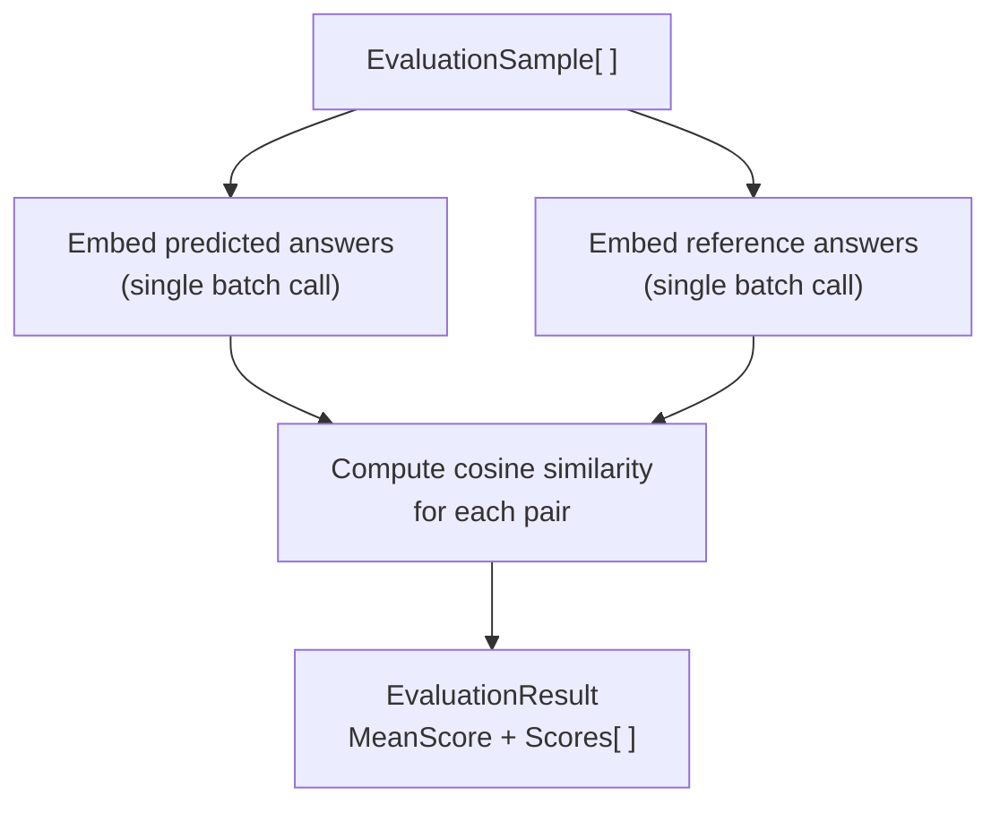

# Evaluation

Evaluating RAG output quality without ground-truth labels is hard. `Rag.NET.Evaluation` provides a lightweight, LLM-free approach: it measures how semantically close a predicted answer is to a reference answer using cosine similarity of their embeddings. This gives a reproducible, fast score that correlates well with human judgement for factual Q&A tasks.

## Package

```bash
dotnet add package Rag.NET.Evaluation
```

## `IRagEvaluator`

```csharp
public interface IRagEvaluator
{
    Task<EvaluationResult> EvaluateAsync(
        IReadOnlyList<EvaluationSample> samples,
        CancellationToken cancellationToken = default);
}
```

## `EmbeddingDistanceEvaluator`

The only built-in implementation. It:



1. Embeds all predicted answers in a single batch call.
2. Embeds all reference answers in a single batch call.
3. Computes cosine similarity for each pair.
4. Returns the mean score and all individual scores.

```csharp
using Microsoft.Extensions.AI;
using Rag.NET.Evaluation;

// Reuse the same IEmbeddingGenerator you registered for the pipeline
var evaluator = new EmbeddingDistanceEvaluator(embeddingGenerator);
```

## `EvaluationSample`

```csharp
public sealed record EvaluationSample(
    string Question,
    string PredictedAnswer,
    string ReferenceAnswer,
    IReadOnlyList<string>? SourceChunks = null);
```

`Question` is carried for your own logging; the evaluator does not embed or score it. `SourceChunks` is optional and used by `LlmJudgeEvaluator` and the RAGAS metrics; `EmbeddingDistanceEvaluator` ignores it.

## `EvaluationResult`

```csharp
public sealed record EvaluationResult(
    double MeanScore,
    IReadOnlyList<double> Scores);
```

`MeanScore` is the arithmetic mean of all per-sample cosine similarities. `Scores[i]` is the cosine similarity for `samples[i]`.

## End-to-end example

```csharp
using Rag.NET.Evaluation;

var samples = new[]
{
    new EvaluationSample(
        Question:        "What is Retrieval-Augmented Generation?",
        PredictedAnswer: response1.Answer,
        ReferenceAnswer: "RAG combines a retrieval system with a language model to generate answers grounded in retrieved documents."),

    new EvaluationSample(
        Question:        "When should I use token-aware chunking?",
        PredictedAnswer: response2.Answer,
        ReferenceAnswer: "Use token-aware chunking when chunk precision matters, such as for code or dense technical text, to avoid silently exceeding embedding model token limits."),
};

var result = await evaluator.EvaluateAsync(samples);

Console.WriteLine($"Mean score: {result.MeanScore:F4}");  // e.g. 0.8923

for (int i = 0; i < samples.Length; i++)
{
    Console.WriteLine($"  Q: {samples[i].Question}");
    Console.WriteLine($"  Score: {result.Scores[i]:F4}");
}
```

## Score interpretation

Scores are cosine similarities in `[0, 1]`:

| Score range | Interpretation |
|-------------|---------------|
| 0.90 – 1.00 | Semantically near-identical — predicted answer captures the reference almost exactly |
| 0.85 – 0.90 | Acceptable — answer conveys the same meaning with different phrasing |
| 0.75 – 0.85 | Partial — answer captures part of the reference or uses tangential language |
| < 0.75 | Poor — answer diverges significantly from the reference |

A threshold of **0.85** is a reasonable pass/fail criterion for automated regression testing of RAG pipelines. The appropriate threshold depends on your embedding model and domain; calibrate against human-labelled examples.

## Using it in a CI gate

```csharp
var result = await evaluator.EvaluateAsync(goldSet);

Assert.True(result.MeanScore >= 0.85,
    $"RAG quality regression: mean score {result.MeanScore:F4} < 0.85");
```

The evaluator makes two embedding API calls (one batch per role: predicted/reference), regardless of the number of samples. This is intentional — batching minimises latency and cost.

## Limitations

- **Embedding similarity is not the same as factual correctness.** A confident but wrong answer that is phrased similarly to the reference will score well. Supplement with human review for high-stakes applications.
- **The metric is symmetric.** A very short predicted answer that happens to share vocabulary with the reference can score deceptively high.
- **Reference answers must be high quality.** Poorly written or ambiguous reference answers produce noisy scores.
- The evaluator requires at least one sample; it throws `ArgumentException` for an empty list.

---

## `LlmJudgeEvaluator`

Where `EmbeddingDistanceEvaluator` measures semantic proximity, `LlmJudgeEvaluator` asks an LLM to reason about answer quality. It can detect hallucinations, factual errors, and off-topic answers — things embedding similarity cannot catch.

One `IChatClient` call is made per sample. All calls run in parallel via `Task.WhenAll`.

### When to use it

| Situation | Recommended evaluator |
|---|---|
| Fast regression gate, no LLM API cost | `EmbeddingDistanceEvaluator` |
| Detecting hallucinations or factual errors | `LlmJudgeEvaluator` |
| Checking whether retrieved context was used faithfully | `LlmJudgeEvaluator` with `SourceChunks` |
| High-stakes production validation | Both, in combination |

### Basic usage

```csharp
using Microsoft.Extensions.AI;
using Rag.NET.Evaluation;

var evaluator = new LlmJudgeEvaluator(chatClient);

var samples = new[]
{
    new EvaluationSample(
        Question: "What is the capital of France?",
        PredictedAnswer: "The capital of France is Paris.",
        ReferenceAnswer: "Paris",
        SourceChunks: new[] { "France is a country in Europe. Its capital is Paris." }),
};

LlmJudgeResult result = await evaluator.EvaluateAsync(samples);

Console.WriteLine(result.MeanScore("correctness")); // e.g. 0.95
Console.WriteLine(result.MeanScore("faithfulness")); // e.g. 0.90
Console.WriteLine(result.MeanScore("relevance"));    // e.g. 1.00
```

### `EvaluationSample` and `SourceChunks`

When `SourceChunks` is null or empty on a sample, faithfulness is automatically excluded from the prompt and result for that sample. You can safely mix samples with and without source chunks in the same run.

### Default criteria

The evaluator uses three built-in criteria by default:

| Criterion | What it checks |
|---|---|
| `JudgeCriterion.Correctness` | Is the predicted answer factually correct given the reference answer? |
| `JudgeCriterion.Faithfulness`* | Does the answer stay grounded in the retrieved context without hallucinating? |
| `JudgeCriterion.Relevance` | Does the answer directly and completely address the question? |

\* Only included when `SourceChunks` is provided for a sample.

### Custom criteria

Pass any combination of built-in and custom criteria to the constructor:

```csharp
var evaluator = new LlmJudgeEvaluator(chatClient, criteria: new[]
{
    JudgeCriterion.Correctness,
    new JudgeCriterion("conciseness", "Is the answer brief and to the point without unnecessary elaboration?"),
});
```

A `JudgeCriterion` is a `(Name, Description)` record. The `Name` is the key used in results; the `Description` is the rubric shown to the LLM judge.

### `LlmJudgeResult`

```csharp
public sealed record LlmJudgeResult(IReadOnlyList<SampleJudgement> Samples)
{
    public double MeanScore(string criterion);
    public bool AllPass(string criterion, double threshold);
}
```

`MeanScore` returns the arithmetic mean across all samples that contain the criterion. `AllPass` returns `true` if every such sample meets or exceeds the threshold — useful as a CI gate.

> **Note:** If the criterion name does not match any sample result — for example, due to a typo — `MeanScore` returns `0.0` and `AllPass` returns `true` vacuously. Always verify criterion names against those configured on the evaluator.

### Using it in a CI gate

```csharp
LlmJudgeResult result = await evaluator.EvaluateAsync(goldSet);

if (!result.AllPass("correctness", threshold: 0.8))
    throw new Exception("Correctness gate failed");
```

### Per-sample reasoning

Each sample exposes the LLM's score and reasoning for every criterion:

```csharp
foreach (var judgement in result.Samples)
{
    Console.WriteLine($"Q: {judgement.Question}");
    foreach (var (criterion, score) in judgement.Criteria)
        Console.WriteLine($"  {criterion}: {score.Score:F2} — {score.Reasoning}");
}
```

### Error handling

| Exception | When thrown |
|---|---|
| `LlmJudgeException` | The LLM returns malformed JSON after markdown fence-stripping. The `RawResponse` property contains the original text for diagnosis. |
| `ArgumentException` | An empty samples list is passed to `EvaluateAsync`. |

---

## `EvaluationDatasetBuilder`

Building a hand-labelled evaluation dataset is expensive. `EvaluationDatasetBuilder` generates a synthetic dataset automatically by sampling random chunks from your existing document corpus and using an LLM to produce a question (and optionally a reference answer) for each chunk.

```bash
dotnet add package Rag.NET.Evaluation
```

### Rebuild any dataset generated before this version

> **Warning:** datasets built before Phase 3.2 are **not reproducible and may contain empty-question samples.** Sampling was unseeded, so there is no seed that regenerates one; and a generation the model returned nothing for was emitted as a sample with `Question = ""` rather than dropped. Such a sample is scored by every evaluator downstream — Answer Relevance embeds `""` and returns a similarity like any other — so it is invisible in the results it corrupts.
>
> If you are holding an older dataset, **rebuild it** rather than trusting it. There is no way to tell from the file whether it contains empty questions, and no seed on it to reproduce it with.

### Usage

```csharp
using Rag.NET.Evaluation;

var builder = new EvaluationDatasetBuilder(dataManager, chatClient);

EvaluationDataset dataset = await builder.BuildAsync(new EvaluationDatasetBuilderOptions
{
    SampleCount        = 50,                                // chunks to sample (clamped to corpus size)
    Mode               = DatasetGenerationMode.QuestionOnly, // or QuestionAndAnswer
    Seed               = 1234,                               // omit for a different draw every build
    MaxConcurrentCalls = 4,                                  // default
});

Console.WriteLine($"{dataset.Samples.Count} of {dataset.Requested} sampled chunks became samples");
```

`dataManager` is `IRagDataManager` — the same instance registered in your DI container. `chatClient` is any `IChatClient`.

### Reading the result

`BuildAsync` returns an `EvaluationDataset`, not a bare list. A short list on its own is silent about *why* it is short, and the two reasons it can be short are different events:

| Member | Meaning |
|---|---|
| `Samples` | The `IReadOnlyList<EvaluationSample>` that generated successfully. |
| `Requested` | How many chunks were **actually sampled** and sent for generation. |
| `Skipped` | `IReadOnlyDictionary<string, int>` — how many sampled chunks produced no usable sample, by reason. |

**`Requested` is not the `SampleCount` you asked for.** It is the number of chunks the sampler could draw, clamped to the corpus: ask for 50 against a corpus of 12 chunks and `Requested` is 12. That distinction is the point of the property — 12 samples out of 50 requested and 12 out of 12 sampled are not the same outcome, and only the second one means "the corpus is small".

The invariant that ties them together:

```
Samples.Count + sum(Skipped.Values) == Requested
```

Every sampled chunk is accounted for exactly once. `Skipped` is keyed by the `EvaluationDataset.SkipReasons` constants, and a reason that never occurred is **absent** rather than present with a zero — so an empty `Skipped` means nothing was lost:

| Constant | Value | When |
|---|---|---|
| `EvaluationDataset.SkipReasons.EmptyQuestion` | `"EmptyQuestion"` | The model returned nothing, or only whitespace, for the question. |
| `EvaluationDataset.SkipReasons.EmptyReferenceAnswer` | `"EmptyReferenceAnswer"` | The model returned nothing for the reference answer, in `QuestionAndAnswer` mode. |

They are string constants rather than an enum because a dataset is something you serialise and compare across runs, and a name survives that where an ordinal does not.

```csharp
if (dataset.Skipped.Count > 0)
{
    foreach (var (reason, count) in dataset.Skipped)
        Console.WriteLine($"{count} chunk(s) dropped: {reason}");
}
```

### Empty generations are dropped, not emitted

A sample with an empty question is not a sample. The builder excludes it and counts it in `Skipped` rather than putting it in `Samples`.

This matters more than it looks. An empty-question sample is not rejected downstream — it is *scored*. Every evaluator accepts it: RAGAS Answer Relevance embeds `""` and returns a cosine similarity like any other number, the judge grades an answer against nothing, and the result lands in the aggregate looking exactly like a real measurement. The corruption is invisible from the moment it enters the dataset, which is why the failure has to be surfaced at the point it happens.

An empty reference answer in `QuestionAndAnswer` mode drops the sample too, for the opposite reason: Context Precision and Context Recall both **throw** on one. Emitting it would move the failure from here, where the cause is known, to an evaluation run that cannot explain it.

A failed generation is **not retried**. Retrying is speculative and doubles the cost model; the drop is recorded instead so you can decide.

### Reproducibility: `Seed`

Set `Seed` and the sampling becomes repeatable. Leave it null — the default — and every build draws different chunks, so the dataset cannot be regenerated.

**The guarantee is exactly this: the same seed over the same corpus samples the same chunks.** That is enough to make a before/after comparison mean something — rebuild after a chunking or retrieval change and the delta measures the change rather than a fresh draw of questions.

Three things it does **not** give you:

- **It does not survive ingestion.** The seed fixes which chunks are drawn from what is there; ingesting or deleting documents changes what is there, and the same seed then draws a different set. Reproducibility holds for a *fixed* corpus, not across changes to it.
- **It does not fix the generated text.** Question generation is an LLM call and the model is not seeded by this. Above temperature 0 the same chunk yields a different question on every build. Seeding selects the same chunks, not the same questions. If you need the same questions, persist the dataset — do not re-derive it.
- **It depends on your store enumerating stably.** Reservoir sampling's decision at each item depends on every item before it, so an `IRagDataManager` that returns documents or chunks in a different order selects differently even with the same seed. This is a condition on the store, stated rather than assumed — it is not something the builder can enforce.

### Generation modes

| Mode | LLM calls per chunk | `ReferenceAnswer` | Use with |
|---|---|---|---|
| `QuestionOnly` (default) | 1 | `""` (empty) | `EmbeddingDistanceEvaluator`, `LlmJudgeEvaluator` |
| `QuestionAndAnswer` | 2 | Ground-truth answer grounded in the chunk | `RagasEvaluationSuite` (Context Precision / Recall require it) |

### Concurrency: `MaxConcurrentCalls`

`MaxConcurrentCalls` bounds how many LLM calls are in flight across the **whole build**, and defaults to `4`. It is the same mechanism a RAGAS run uses — the same shared-caller *type*, not the same instance. A dataset build and a concurrent RAGAS evaluation each hold their own ceiling, so their limits add rather than combine.

Before this existed, the builder started every chunk's generation at once: a 500-chunk sample in `QuestionAndAnswer` mode was up to 500 concurrent two-call chains, which is a 429 from any real provider. It bounds how many calls are *in flight*, not how many are *made* — a 50-chunk sample in `QuestionAndAnswer` mode is 100 calls at any ceiling. For production-scale runs also use a rate-limit-aware `IChatClient` such as `FallbackChatClient`.

### Cost recording

Pass an `ICostLedger` and every chat call the build makes is recorded as a `CostKind.Chat` entry carrying the model's reported input and output token counts:

```csharp
var builder = new EvaluationDatasetBuilder(dataManager, chatClient, costLedger);

await builder.BuildAsync(new EvaluationDatasetBuilderOptions
{
    SampleCount         = 50,
    Seed                = 1234,
    PricePerInputToken  = 3m / 1_000_000m,   // your provider's price per input token
    PricePerOutputToken = 15m / 1_000_000m,  // ... per output token
});
```

Things to know:

- **Prices default to zero.** `PricePerInputToken` and `PricePerOutputToken` are `0` unless you set them, so entries record real token counts at a cost of zero. The ledger never prices anything itself — the caller supplies the price sheet. Note these are per *token*, not per million tokens like `CostBudgetOptions`.
- **There is no embedding price here.** A dataset build generates text and never embeds, so `PricePerEmbeddingToken` lives on `RagasOptions` rather than on the shared `EvaluationCallOptions` base — it would be a knob on a build that nothing could ever read.
- **A call the provider reported no usage for records nothing.** Both token counters must be provider-reported. Writing a zero-token entry would state as fact that the call was free, and filling a missing side with `0` would understate spend while looking authoritative.

> **Do not hand a `UseCostBudgeting`-decorated client to the builder and the same ledger.**
> `UseCostBudgeting` decorates the registered `IChatClient`, and that decorator records to the
> ledger itself — so anything you resolve from DI and pass to `EvaluationDatasetBuilder` is counted
> twice. This is the same exposure the RAGAS suite has, for the same reason.
>
> It is not merely a reporting error. `CostTrackingChatClient` checks the budget **before** each
> call, so a doubled ledger trips `BudgetExceededException` at about half your real spend — and it
> aborts *production* traffic, not just the dataset build. Either pass an undecorated client to the
> builder, or give the builder its own ledger (or none).

### Workflow

```csharp
// 1. Generate synthetic questions (and optionally reference answers)
EvaluationDataset dataset = await builder.BuildAsync(new EvaluationDatasetBuilderOptions
{
    SampleCount = 50,
    Seed        = 1234,
    Mode        = DatasetGenerationMode.QuestionAndAnswer,
});

// 2. Run your RAG pipeline to get predicted answers
var evaluated = new List<EvaluationSample>();
foreach (var sample in dataset.Samples)
{
    var result = await pipeline.AskAsync(sample.Question);
    evaluated.Add(sample with
    {
        PredictedAnswer = result.Answer,
        SourceChunks    = result.Sources.Select(s => s.Chunk.Text).ToList(),
    });
}

// 3. Score with any evaluator
var evaluation = await evaluator.EvaluateAsync(evaluated);
```

### Limitations

- Synthetic questions reflect the content of individual chunks, not complex multi-hop queries.
- `QuestionOnly` mode produces empty `ReferenceAnswer` — you must either fill it in manually or avoid metrics that require it (Context Precision, Context Recall).
- **A seed reproduces the sampling, not the dataset.** The questions are model output and vary between builds; persist the dataset if you need the text itself to be stable.
- **The build is not O(sample) in memory.** `IRagDataManager` exposes no streaming overload, so a build holds the document list and one document's chunks at a time, on top of the sample. It no longer holds every *document's* chunks at once, which was the previous behaviour and is by far the larger cost — but a corpus whose *document list* does not fit in memory will not build, and a single document whose own chunks do not fit will not either.

---

## RAGAS-Style Metrics

`Rag.NET.Evaluation.Ragas` decomposes RAG quality into four metrics, each targeting a specific failure mode. You register only the metrics you need — each adds LLM calls per sample.

```bash
dotnet add package Rag.NET.Evaluation.Ragas
```

### Scores changed — re-baseline before comparing

> **Warning:** the metrics were corrected to match the published RAGAS definitions. A run against the same data will **not** produce the same numbers it produced before, and the difference is a fix rather than a regression.

Three changes move scores:

- **Context Precision is now rank-aware.** It was `relevant / total`, which scored a retriever that returned the gold chunk *first* identically to one that returned it *last*. Scores now go up for well-ordered retrieval and down for badly-ordered retrieval of the same chunks.
- **Answer Relevance now penalises evasion.** An answer like "I don't know" or "the context does not say" scores `0.0`, where before it could score well simply for being topically close to the question. Evasive answers get materially worse.
- **A parse failure no longer scores `1.0`.** Faithfulness and Context Recall caught a malformed model reply, turned it into an empty claim list, and scored the empty list as perfect. Those samples now score `null` and are excluded. Aggregates computed over a model that frequently returned unreadable replies will drop.

Nothing here is published to NuGet yet — packaging is a later phase — so this is documented here rather than recorded as a release break. If you hold a stored baseline, re-baseline it; do not file the delta as a quality regression.

### When to use RAGAS vs other evaluators

| Evaluator | LLM calls/sample | Ground truth required | Detects |
|---|---|---|---|
| `EmbeddingDistanceEvaluator` | 0 | Yes (reference answer) | Semantic drift from reference |
| `LlmJudgeEvaluator` | 1 | Yes (reference answer) | Holistic quality, hallucinations |
| `RagasEvaluationSuite` | 10–20+ | Partial (2 of 4 metrics) | Specific retrieval and generation failure modes |

Use RAGAS when you need to diagnose *where* quality is breaking down — retrieval, generation, or both.

### The four metrics

#### Faithfulness

Checks: are all claims in the predicted answer supported by the retrieved chunks?

**Formula:** `supported_claims / readable_claim_verdicts`.

- LLM calls: 1 (extract atomic claims) + one per claim (verify it against the context)
- Ground truth: **not required**
- Score 1.0: every claim is grounded in the retrieved context
- Score 0.0: no claim is grounded
- Score `null`: nothing was retrieved, the claim list could not be read, or no verdict could be read
- An answer that asserts nothing (an empty claim list the model genuinely produced) scores **1.0** — nothing unfaithful was asserted. That is now distinguishable from a reply that could not be parsed, which was the defect described above.

#### Answer Relevance

Checks: does the answer actually address the question that was asked?

**Formula:** mean cosine similarity between the original question and `n` synthetic questions the answer would answer, clamped to `[0, 1]`. A noncommittal answer short-circuits to `0.0`.

- LLM calls: 2 (one evasion check, one call returning all `n` questions as a JSON array) + one embedding batch per sample
- Ground truth: **not required**
- Score 1.0: the answer responds to the question that was asked
- Score 0.0: off-topic, or evasive (see below)
- Score `null`: the synthetic-question list could not be read, was empty, or the embedding generator returned fewer vectors than texts

Cosine similarity ranges over `[-1, 1]` but the score contract is `[0, 1]`, so a negative similarity clamps to `0.0` rather than dragging the aggregate below zero.

`n` is `RagasOptions.SyntheticQuestionCount` (default `3`). All `n` come back from **one** call, so they can differ from each other; asking `n` times at temperature 0 returns the same question `n` times and collapses the mean to a single sample.

#### Context Precision

Checks: were the relevant chunks ranked highly, not merely present?

**Formula:** rank-aware average precision over the retrieved order, `Σ(P@k × rel_k) / total_relevant` — **not** `relevant / total`. `P@k` is the precision over the first `k` chunks and `rel_k` is 1 when the chunk at rank `k` was judged relevant.

- LLM calls: one per retrieved chunk
- Ground truth: **required** — `ReferenceAnswer` must be non-empty
- Score 1.0: every relevant chunk was ranked above every irrelevant one
- Score 0.0: no chunk was judged relevant
- Score `null`: nothing was retrieved, or no verdict could be read

Worked example: three chunks where only the gold one is relevant scores `1.00` if it came back first and `0.33` if it came back last. Under the old `relevant / total` both scored `0.33`, which is the discrimination the metric exists to provide.

A chunk whose verdict could not be read leaves the ranking entirely instead of being marked irrelevant, so the chunks behind it move up: `[unreadable, gold]` scores `1.00`, not the `0.50` gold-at-rank-2 would give. That is deliberate — the chunk is scored as though it was never retrieved, because keeping it would charge the retriever for a judgement the model never gave.

#### Context Recall

Checks: do the retrieved chunks contain the facts stated in the reference answer?

**Formula:** `supported_statements / readable_statement_verdicts`.

- LLM calls: 1 (extract atomic statements from the reference answer) + one per statement
- Ground truth: **required** — `ReferenceAnswer` must be non-empty
- Score 1.0: every ground-truth statement is covered by the chunks
- Score 0.0: none is
- Score `null`: nothing was retrieved, the statement list could not be read, or no verdict could be read

### Which metrics need a `ReferenceAnswer`

| Metric | Needs a non-empty `ReferenceAnswer` |
|---|---|
| Faithfulness | No |
| Answer Relevance | No |
| Context Precision | **Yes** |
| Context Recall | **Yes** |

If Context Precision or Context Recall is registered and *any* sample has an empty `ReferenceAnswer`, `EvaluateAsync` throws `InvalidOperationException` **before any LLM call** — you do not pay for a run that cannot produce the scores you asked for. Used standalone, `ContextPrecisionEvaluator.ScoreAsync` and `ContextRecallEvaluator.ScoreAsync` throw the same exception for that sample.

Build the dataset with `DatasetGenerationMode.QuestionAndAnswer` to get reference answers, or register only Faithfulness and Answer Relevance.

### Reading a `null` score

This is the central idea of the metrics, and the one most likely to surprise: **a verdict the model did not give is not a verdict.**

Every metric returns `double?`. `null` means *this sample could not be scored*, which is a different fact from `0.0` (*this sample scored as badly as possible*). A sample scoring `null` is **excluded from the metric's mean** rather than folded in, and counted in `RagasReport.UnscoreableSamples`.

A sample is unscoreable when:

- nothing was retrieved (`SourceChunks` is null or empty) — an absence of evidence, not evidence of bad retrieval. This applies to the three metrics that read the chunks; Answer Relevance never inspects them and scores normally with none;
- the model's list reply could not be parsed as a JSON array of strings;
- no yes/no verdict in the sample could be read at all.

Individual unreadable verdicts *within* a sample are dropped from the denominator, not counted as "no". Counting them as "no" would state that the model denied something it never answered.

```csharp
RagasReport report = await suite.EvaluateAsync(samples);

if (report.Faithfulness is { } faithfulness)
    Console.WriteLine($"Faithfulness: {faithfulness:F2}");
else
    Console.WriteLine("Faithfulness: no sample could be scored");

foreach (var (metric, count) in report.UnscoreableSamples)
    Console.WriteLine($"{metric}: {count} of {samples.Count} samples unscoreable");
```

Read the two together. A Faithfulness of `0.95` over 100 samples means something quite different when `UnscoreableSamples["Faithfulness"]` is `0` than when it is `80` — in the second case the mean describes twenty samples and is silent about the rest. A metric that scored everything still reports a `0` count, so an absent key means the metric was not registered rather than that nothing failed.

The rule holds at every level. A metric that **no** sample could be scored by reports `null` rather than `0.0`, and so does `OverallScore` when no registered metric could be scored at all — a run that established nothing about quality does not get to report the worst possible quality.

One case is deliberately *not* surfaced. Answer Relevance's evasion check short-circuits to `0.0` only on an explicit `Yes`; if that check itself comes back unreadable, the sample is scored normally on question similarity alone. That is the right call — a failed gate should not discard an otherwise usable measurement — but it is invisible: the sample scores like any other and is not counted in `UnscoreableSamples`. An evasive answer whose evasion check failed to parse therefore scores as it would have before the check existed.

### Concurrency: `MaxConcurrentCalls` is per run, not per metric

```csharp
var options = new RagasOptions
{
    MaxConcurrentCalls     = 4,   // default
    SyntheticQuestionCount = 3,   // default
};

var suite = new RagasEvaluationSuiteBuilder(chatClient, embeddingGenerator, options)
    .AddFaithfulness()
    .AddAnswerRelevance()
    .AddContextPrecision()
    .AddContextRecall()
    .Build();
```

Every metric the builder registers shares **one** judge, and therefore one semaphore. `MaxConcurrentCalls = 4` means at most four LLM calls are in flight across the whole run — not four per metric.

That is deliberate, because per-metric ceilings multiply. Four metrics each fanning out over a 50-chunk sample at a per-metric ceiling of 4 would be 16 concurrent requests, and the number you configured would not be the number you got. Rate limits are imposed on your API key, not on one metric, so the ceiling has to be enforced where the key is.

Raise it if your provider tolerates it; the default of 4 is conservative because a full four-metric run over a 50-sample dataset is several thousand calls.

### Cost recording

Pass an `ICostLedger` to the builder and every billable call the run makes is recorded to it: each chat call as a `CostKind.Chat` entry carrying the model's reported input and output token counts, and Answer Relevance's embedding batch as a `CostKind.Embedding` entry carrying its reported input token count:

```csharp
var options = new RagasOptions
{
    PricePerInputToken     = 3m / 1_000_000m,   // your provider's price per input token
    PricePerOutputToken    = 15m / 1_000_000m,  // ... per output token
    PricePerEmbeddingToken = 0.02m / 1_000_000m,  // ... per embedding token
};

var suite = new RagasEvaluationSuiteBuilder(chatClient, embeddingGenerator, options, costLedger)
    .AddFaithfulness()
    .AddContextRecall()
    .Build();
```

Things to know:

- **Prices default to zero.** `PricePerInputToken`, `PricePerOutputToken` and `PricePerEmbeddingToken` are `0` unless you set them, so entries record real token counts at a cost of zero. The ledger never prices anything itself — as everywhere else in the library, the caller supplies the price sheet. Note these are per *token*, not per million tokens like `CostBudgetOptions`.
- **Evaluation spend now counts toward the same budget window `UseCostBudgeting` enforces.** That is correct — it is one budget — but it is a change you will notice: a large evaluation run can trip the daily or monthly gate for your *production* chat and embedding calls. See [cost budgeting](resilience.md#cost-budgeting). Pass a separate ledger, or no ledger, if you want evaluation spend kept out of that window.
- **Embedding spend is recorded once per batch, not once per text.** Answer Relevance embeds the question and all `n` synthetic questions in a single call, and that call is one `CostKind.Embedding` entry. Only `InputTokens` is set on it — an embedding API bills the text you sent it, and its output is vectors rather than tokens.
- **A call the provider reported no usage for records nothing.** Writing a zero-token entry would state as fact that the call was free. Both token counters must be provider-reported: an empty `UsageDetails`, or one that fills only a total or only one side, is not a report of zero, and filling the missing side with `0` would understate spend while looking authoritative. For an embedding batch that means the input token count specifically, since that is the only counter such an entry carries.
> **Do not hand a `UseCostBudgeting`-decorated client to the suite and the same ledger.**
> `UseCostBudgeting` decorates the registered `IChatClient` **and** the registered
> `IEmbeddingGenerator`. Both decorators record to the ledger themselves, so anything you resolve
> from DI and pass to `RagasEvaluationSuiteBuilder` is counted twice.
>
> The chat side is by far the larger exposure: by the table above, a 100-sample run with all four
> metrics is roughly **1,400 chat calls against 100 embedding batches**. Every one of those chat
> calls is recorded by `CostTrackingChatClient` as well as by the suite.
>
> This is not merely a reporting error. `CostTrackingChatClient` checks the budget **before** each
> call, so a doubled ledger trips `BudgetExceededException` at about half your real spend — and it
> aborts *production* traffic, not just the evaluation. Either pass an undecorated client and
> generator to the suite, or give the suite its own ledger (or none).
- **A ledger write failure never fails the run.** The judgement has already been paid for; losing it over a bookkeeping error would be the worse outcome.

### Per-sample output

`RagasReport.Samples` carries every metric's score for every sample, in the order the samples were passed in, so a poor aggregate can be traced to the samples that caused it:

```csharp
public sealed record RagasSampleScore(
    string Question,
    IReadOnlyDictionary<string, double?> Scores);
```

```csharp
foreach (var sample in report.Samples)
{
    Console.WriteLine($"Q: {sample.Question}");
    foreach (var (metric, score) in sample.Scores)
        Console.WriteLine($"  {metric}: {(score is { } value ? value.ToString("F2") : "unscoreable")}");
}
```

The dictionary keys are the metric names the builder registers: `Faithfulness`, `AnswerRelevance`, `ContextPrecision`, `ContextRecall`. Only registered metrics appear.

### `RagasReport`

```csharp
public sealed record RagasReport
{
    public double? Faithfulness     { get; init; }  // null = not registered, or nothing scoreable
    public double? AnswerRelevance  { get; init; }
    public double? ContextPrecision { get; init; }
    public double? ContextRecall    { get; init; }
    public double? OverallScore     { get; init; }  // mean of the metrics that scored; null if none did

    public IReadOnlyList<RagasSampleScore> Samples            { get; init; }
    public IReadOnlyDictionary<string, int> UnscoreableSamples { get; init; }
}
```

### Model replies the judge accepts

- **Verdicts are exact.** A yes/no prompt is read as a verdict only when the reply is `yes` or `no` after trimming whitespace and the punctuation models decorate one-word answers with (`.`, `!`, `*`, `"`, `,`, `:`) — so `Yes.`, `**no**` and `"yes"` all read fine. Prose does not: `Yes, but only partially.` is `Unparseable`, because it is. Guessing at prose is how `The claim is supported` used to count as *unsupported*.
- **Fenced JSON is tolerated.** A list reply wrapped in a markdown code fence is unwrapped before parsing, matching `LlmJudgeEvaluator` and the proposition chunker — models fence JSON constantly outside structured-output mode, and rejecting all of it would make the metrics report `null` against a fence-happy model. A reply like this parses to the same two items a bare array would:

````text
```json
["a claim", "another claim"]
```
````

  The stripping is deliberately narrow: it unwraps a fence around the **whole** reply and stops there. JSON buried in the middle of a sentence is not salvaged, because scoring a reply the model never intended as JSON is guessing.

### Which metrics to register

| Goal | Register |
|---|---|
| Fast regression gate (no ground truth) | Faithfulness + AnswerRelevance |
| Diagnose retrieval quality | ContextPrecision + ContextRecall |
| Full RAGAS diagnostic | All four (requires `QuestionAndAnswer` dataset) |

### Usage

```csharp
using Rag.NET.Evaluation.Ragas;

var suite = new RagasEvaluationSuiteBuilder(chatClient, embeddingGenerator)
    .AddFaithfulness()
    .AddAnswerRelevance()
    .AddContextPrecision()   // requires non-empty ReferenceAnswer
    .AddContextRecall()      // requires non-empty ReferenceAnswer
    .Build();

RagasReport report = await suite.EvaluateAsync(samples);

Console.WriteLine($"Overall:           {report.OverallScore:F2}");
Console.WriteLine($"Faithfulness:      {report.Faithfulness:F2}");
Console.WriteLine($"Answer Relevance:  {report.AnswerRelevance:F2}");
Console.WriteLine($"Context Precision: {report.ContextPrecision:F2}");
Console.WriteLine($"Context Recall:    {report.ContextRecall:F2}");
```

Every value above is nullable, `OverallScore` included, and a `null` formats as an empty string because it has no `F2` form. Test for `null` explicitly when the difference between "scored badly" and "could not be scored" matters — which, for a quality gate, it always does.

### Using a single metric standalone

The suite is not composable by callers: its constructor is internal and the builder exposes four fixed `Add*` methods, so custom metric registration is not available (a deliberate non-goal). Each evaluator class *is* public and directly usable on its own:

```csharp
using Rag.NET.Evaluation;
using Rag.NET.Evaluation.Ragas;

var evaluator = new FaithfulnessEvaluator(chatClient);

var sample = new EvaluationSample(
    Question:        "What is the capital of France?",
    PredictedAnswer: "The capital of France is Paris.",
    ReferenceAnswer: "Paris",
    SourceChunks:    ["France is a country in Europe. Its capital is Paris."]);

double? score = await evaluator.ScoreAsync(sample, cancellationToken);
```

The other three are `AnswerRelevanceEvaluator(chatClient, embeddingGenerator)`, `ContextPrecisionEvaluator(chatClient)` and `ContextRecallEvaluator(chatClient)`. Each also accepts an optional `RagasOptions` and `ICostLedger`. Note that `ScoreAsync` has no default for its `CancellationToken` — pass one.

An evaluator constructed this way owns its own judge, and therefore its own `MaxConcurrentCalls` ceiling. Two evaluators built separately do not share one.

### Cost estimation

For N samples with an average of K chunks and ~C claims/statements per sample:

| Metric | LLM calls |
|---|---|
| Faithfulness | N × (1 + C) |
| Answer Relevance | N × 2, plus N embedding batches |
| Context Precision | N × K |
| Context Recall | N × (1 + C) |

Example: 100 samples, 4 chunks each, ~3 claims/statements → roughly **1,400 chat calls and 100 embedding batches** for all four metrics. `MaxConcurrentCalls` bounds how many are in flight, not how many are made; use a rate-limit-aware `IChatClient` (e.g., `FallbackChatClient`) for production-scale runs.

### Complete example: synthetic dataset → RAGAS evaluation

```csharp
using Rag.NET.Evaluation;
using Rag.NET.Evaluation.Ragas;

// 1. Build a synthetic evaluation dataset
var builder = new EvaluationDatasetBuilder(dataManager, chatClient);
EvaluationDataset dataset = await builder.BuildAsync(new EvaluationDatasetBuilderOptions
{
    SampleCount = 50,
    Seed        = 1234,                                    // so this run can be regenerated
    Mode        = DatasetGenerationMode.QuestionAndAnswer, // required for Context metrics
});

// Sampled chunks that generated nothing are excluded and counted, never emitted as blanks.
foreach (var (reason, count) in dataset.Skipped)
    Console.WriteLine($"{count} of {dataset.Requested} sampled chunks dropped: {reason}");

// 2. Run your RAG pipeline
var evaluated = new List<EvaluationSample>();
foreach (var sample in dataset.Samples)
{
    var result = await pipeline.AskAsync(sample.Question);
    evaluated.Add(sample with
    {
        PredictedAnswer = result.Answer,
        SourceChunks    = result.Sources.Select(s => s.Chunk.Text).ToList(),
    });
}

// 3. Score with RAGAS under one shared ceiling
var suite = new RagasEvaluationSuiteBuilder(
        chatClient,
        embeddingGenerator,
        new RagasOptions { MaxConcurrentCalls = 4 })
    .AddFaithfulness()
    .AddAnswerRelevance()
    .AddContextPrecision()
    .AddContextRecall()
    .Build();

RagasReport report = await suite.EvaluateAsync(evaluated);

Console.WriteLine(report.OverallScore is { } overall
    ? $"Overall: {overall:F2}"
    : "Overall: no metric could be scored");

foreach (var (metric, unscoreable) in report.UnscoreableSamples)
    Console.WriteLine($"{metric}: {unscoreable} unscoreable of {evaluated.Count}");
```

### Limitations

- **The judge is an LLM, so the metrics inherit its judgement.** A model that verifies claims badly produces confidently wrong scores; the tri-state verdict removes fabricated scores from *parse* failures, not from bad judging.
- **Samples are processed sequentially**, with the registered metrics running concurrently within each sample. A large dataset therefore takes proportionally longer, and `MaxConcurrentCalls` is the only lever on throughput — two samples are never in flight at once, so raising the ceiling above one sample's fan-out buys nothing.
- **Answer Relevance depends on the embedding model** the same way `EmbeddingDistanceEvaluator` does, with the same calibration caveats.
- **Custom metric registration is not supported** — see [Using a single metric standalone](#using-a-single-metric-standalone) for what is available instead.

## A/B Testing

`RagAbTester` runs one evaluation dataset through **two** pipeline configurations and reports which is better — together with an interval that says whether "better" means anything at all.

```bash
dotnet add package Rag.NET.Evaluation.Ragas
```

> **It spans two packages, and not the way you would guess.** `RagAbTester` is in `Rag.NET.Evaluation.Ragas`. Everything it produces — `AbReport`, `AbMetricComparison`, `AbLatencyComparison`, `AbVariant`, `AbOptions`, `AbTally`, `AbConfidenceInterval` — is in `Rag.NET.Evaluation`.
>
> Pairing needs a per-sample score *for each metric*, and `RagasReport.Samples` is the only thing in the evaluation stack that produces one: `IRagEvaluator.EvaluateAsync` returns an aggregate with no metric breakdown and no way to express "unscoreable". Since `Rag.NET.Evaluation.Ragas` references `Rag.NET.Evaluation` and not the other way round, a tester that takes a `RagasEvaluationSuite` can only live on the RAGAS side of that edge — putting it in `Rag.NET.Evaluation` would be a reference cycle. The report model stays behind so it owes nothing to RAGAS.

### What a variant is

```csharp
public sealed record AbVariant(
    string Name,
    IRagPipeline Pipeline,
    RagOptions? Options = null,
    ICostLedger? CostLedger = null);
```

A variant is **a whole `IRagPipeline`**, not a bag of options. That is deliberate: the changes worth A/B testing are mostly not per-call settings. Swapping the embedding model, the chunker, the vector store, or adding a reranker all happen at composition time, and none of them can be expressed as a `RagOptions` on an existing pipeline. Taking the pipeline itself means one harness covers "same pipeline, `TopK` 5 vs 10" and "an entirely different retrieval stack" without needing two designs. `Options` is there for the former as a convenience; it is not the mechanism.

The `Name` is not decoration — it keys the responses, the timings and the cost, so the two must be distinct and non-blank.

**Exactly two.** Not "at least two". The statistics are strictly pairwise — `delta_i = B_i − A_i`, and the tally has a B column and an A column with nowhere to put a third — and an N-way comparison needs a multiple-comparisons correction that is out of scope for this release. Three variants are rejected before anything runs, rather than executed at full LLM cost and then quietly dropped. Compare the pairs you care about separately.

### Basic usage

```csharp
using Rag.NET.Evaluation;
using Rag.NET.Evaluation.Ragas;

// Both variants are judged by the same suite. One suite rather than one per variant: a
// comparison in which the metrics differ measures the metrics.
var suite = new RagasEvaluationSuiteBuilder(chatClient, embeddingGenerator)
    .AddFaithfulness()
    .AddAnswerRelevance()
    .AddContextPrecision()
    .AddContextRecall()
    .Build();

var tester = new RagAbTester(suite, new AbOptions { Seed = 1234 });

AbReport report = await tester.CompareAsync(
    new AbVariant("baseline", baselinePipeline),
    new AbVariant("reranked", rerankedPipeline),
    dataset.Samples);
```

Only `Question` and `ReferenceAnswer` are read from each sample. The predicted answer and the source chunks come from the variant that produced them — which is the entire point, and is why a dataset built by [`EvaluationDatasetBuilder`](#evaluationdatasetbuilder) can be fed straight in without running a pipeline over it first.

### Why execution alternates

Both variants answer every question, sequentially, with **the lead alternating by sample**: A,B then B,A then A,B.

Whichever variant runs second benefits from provider-side prompt caching and a warm vector store. A fixed order therefore hands one side a systematic advantage on *every* sample and then reports that advantage as a result. Alternating cancels it out to first order.

This matters least for quality scores and most for latency — and latency is half the reason to run a comparison at all, so the ordering is chosen for the measurement that is sensitive to it.

The two variants are **not** run concurrently. That would roughly halve wall-clock, but the two would then contend for the same provider and the same connection pool, so the latency numbers would measure contention as much as they measure the variants.

### Reading the result

```csharp
foreach (var (metric, comparison) in report.Metrics)
{
    if (comparison.ConfidenceInterval is not { } ci)
    {
        Console.WriteLine($"{metric}: nothing comparable ({comparison.DroppedAsUnscoreable} unscoreable)");
        continue;
    }

    var verdict = ci.Lower > 0 ? $"{report.VariantB} is better"
        : ci.Upper < 0 ? $"{report.VariantA} is better"
        : "no difference this run can support";

    Console.WriteLine(
        $"{metric}: {comparison.MeanA:F3} -> {comparison.MeanB:F3} " +
        $"(delta {comparison.MeanDelta:F3}, 95% CI [{ci.Lower:F3}, {ci.Upper:F3}]) — {verdict}");

    Console.WriteLine(
        $"  {comparison.Tally.BWins} B wins / {comparison.Tally.AWins} A wins / " +
        $"{comparison.Tally.Ties} ties over {comparison.ComparedPairs} pairs");
}
```

#### A confidence interval spanning zero is not a win

This is the sentence this section exists for.

An A/B run **always** produces a higher number on one side. Two identical pipelines compared over fifty samples will still show a mean delta of `+0.004` or `−0.011`, because an LLM judge is noisy and fifty samples is not many. The mean delta on its own therefore rubber-stamps whatever you tried last, every single time.

The interval is the only thing separating a result from noise:

| Mean delta | 95% CI | What it means |
|---|---|---|
| `+0.07` | `[+0.02, +0.12]` | A finding. B is better; the run supports it. |
| `+0.07` | `[−0.04, +0.18]` | **Not a finding.** The same `+0.07`, and this run cannot tell it from zero. |
| `−0.01` | `[−0.03, +0.01]` | Not a finding, and the interval is tight — good evidence the change did nothing. |

If the interval contains zero, the honest report is *"no difference this run can support"* — not "B was slightly ahead". A tighter interval comes from more samples, or from a less noisy metric. It does not come from raising `BootstrapResamples`; see below.

The **tally** is a different question from the interval, and both are worth reading. `AbTally(BWins, AWins, Ties)` counts how many individual samples each side won, ignoring by how much. A metric can show 30 B-wins to 20 A-wins and still have an interval spanning zero — B wins more often but by small amounts, and loses by large ones. `TieEpsilon` (default `1e-9`) is the half-width of the tie band, and at its default it exists only to keep floating-point noise on two identically scored samples out of a win column.

#### `MeanA` and `MeanB` are over the compared pairs

Not over each variant's full run. If a metric scored A on all fifty samples but B on only forty-eight, `MeanA` is taken over the same forty-eight — otherwise the two means would describe different sample sets, and `MeanB − MeanA` would contradict `MeanDelta` in the same report. That identity holds by construction:

```text
MeanB - MeanA == MeanDelta
```

### The two drop rules

Pairs leave the comparison for two different reasons, they are counted separately, and they have different fixes.

| Field | Cause | Scope | What to do |
|---|---|---|---|
| `DroppedForRunFailure` | One variant threw, or returned no response, while answering the question | The sample leaves **every** metric | Fix the pipeline. Read `report.Failures` — it names the question, the variant and the exception type. |
| `DroppedAsUnscoreable` | Both variants answered, but a metric returned `null` on one side or the other | The sample leaves **that metric only** | See [Reading a `null` score](#reading-a-null-score). Usually a judge parse failure or a missing `ReferenceAnswer`. |

A pair is all-or-nothing in both cases. Keeping the readable half of a pair would compute the two means over different sample sets while still calling the result paired — which is precisely the kind of number that looks comparable and is not.

```csharp
Console.WriteLine($"{report.ComparableSamples} of {report.SamplesRun} samples were comparable");

foreach (var failure in report.Failures)
    Console.WriteLine(failure);   // 'question': variant did not answer — InvalidOperationException: ...
```

Watch the counts. A clean, tight interval over the eleven pairs that survived out of fifty is not a result about your dataset, and the drop counts are the only place that is visible.

If **no** sample was comparable at all, `report.Metrics` is empty rather than full of nulls — the metric names come from the suite's own report, and the suite was never run, so inventing rows would claim it ran and found nothing. `RunFailures` says what happened instead.

### Latency

```csharp
var latency = report.Latency;

Console.WriteLine($"p50  A {latency.MedianA?.TotalMilliseconds:F0} ms   B {latency.MedianB?.TotalMilliseconds:F0} ms");
Console.WriteLine($"p95  A {latency.Percentile95A?.TotalMilliseconds:F0} ms   B {latency.Percentile95B?.TotalMilliseconds:F0} ms");

if (latency.ConfidenceIntervalMilliseconds is { } ci)
{
    Console.WriteLine(
        $"delta {latency.MeanDeltaMilliseconds:F1} ms, 95% CI [{ci.Lower:F1}, {ci.Upper:F1}]");
}
```

Wall-clock per variant per sample, measured by the harness rather than reported by the pipeline, over the comparable pairs only — both variants' percentiles have to come from the same set of questions or they describe two different workloads. The mean delta gets the same bootstrap interval as the quality metrics, and reads the same way: spanning zero means this run cannot tell the two apart.

### Cost needs one ledger per variant

`ICostLedger` aggregates into a time-window bucket with no per-caller attribution, so a *shared* ledger cannot say which variant spent what. Each variant gets its own instance, and they are reported separately:

```csharp
using Rag.NET.Resilience;

var report = await tester.CompareAsync(
    new AbVariant("baseline", baselinePipeline, CostLedger: new InMemoryCostLedger()),
    new AbVariant("reranked", rerankedPipeline, CostLedger: new InMemoryCostLedger()),
    dataset.Samples);

foreach (var name in new[] { report.VariantA, report.VariantB })
{
    Console.WriteLine(report.Cost.TryGetValue(name, out var spend)
        ? $"{name} spent {spend}"
        : $"{name}: not measured");
}
```

**A variant with no ledger is absent from `report.Cost`, never zero.** A zero would state as fact that the variant was free. `TryGetValue` returning `false` means *not measured*; treat it that way.

There are **two** reasons a variant can be absent, and the code above cannot tell them apart:

- No ledger was supplied for it.
- **The ledger's window rolled over mid-run.** Spend is read before and after, and `CostWindow.Day` is the current UTC calendar day — so a comparison that crosses midnight would subtract yesterday's total from today's and produce a negative figure. A negative spend is not imprecise, it is impossible, so the variant is dropped instead of reported. A long run finishing shortly after 00:00 UTC is the case to watch for.

Both mean the same thing to a reader — *this number was not measured* — which is why they share a signal. If you need the distinction, note whether you passed a ledger.

The pipeline must actually record to the ledger you hand over — pass it through `UseCostBudgeting` or `CostTrackingChatClient` when composing the variant — and Rag.NET does not price tokens itself, so the price sheet is yours to supply, as everywhere else. See [cost budgeting](resilience.md#cost-budgeting).

### `AbOptions`

```csharp
var tester = new RagAbTester(suite, new AbOptions
{
    Seed               = 1234,   // null (default) draws fresh randomness each run
    BootstrapResamples = 2000,   // default; minimum 1000
    TieEpsilon         = 1e-9,   // default; the half-width of the tally's tie band
});
```

#### `Seed` fixes the interval, not the run

The guarantee is exactly this: **the same seed over the same deltas gives the same interval.** An unreproducible confidence interval is not evidence — the same rule [`EvaluationDatasetBuilderOptions.Seed`](#reproducibility-seed) establishes for sampling.

It does **not** make the comparison deterministic:

- **The pipelines are not seeded.** Both variants are asked real questions by a real model, and above temperature 0 the same question yields a different answer every time.
- **The judge is not seeded.** RAGAS scores come from an LLM. A sample that scored `0.8` once can score `0.7` next time, or become unscoreable altogether.

So two runs over the same dataset with the same seed can produce **different deltas, and therefore different intervals**. The seed fixes the resampling of whatever deltas the run produced; it does not fix the production of them. What it is genuinely for is rerunning the statistics over a stored set of deltas, and pinning an interval in a test.

#### `BootstrapResamples` has a floor of 1000, and lowering it is not a speed-up

More resamples reduce the Monte-Carlo jitter of the interval itself. They do **not** narrow it — the width is set by your data, so raising this buys precision about the interval, never a more confident answer.

Lowering it buys nothing either. The resampling is `pairs × resamples` multiply-adds over an array already in memory: a fifty-sample comparison at the default is 100k operations, which is invisible beside the two LLM runs that produced the scores. If a comparison feels slow, the time is in the pipelines and the judge.

**Below 1000 it throws**, and the reason is worth knowing. A 95% percentile interval trims `floor(0.025 × resamples)` values from each tail — and that expression is **zero for every value at or below 39**. With nothing trimmed the "interval" is simply the smallest and largest resample mean, whose expected coverage is `(B−1)/(B+1)`: 0.818 at ten resamples, not 0.95. It *under*-covers while still being labelled 95%, so it excludes zero more often than it should, which is the one failure this whole comparison exists to prevent. The floor sits at 1000 rather than 40 because each endpoint is an order statistic whose own jitter shrinks with how many draws land in the tail; at 1000 the lower endpoint is the 25th of 1000, which no handful of draws decides.

### Shadow mode is not in this release

`RagAbTester` is an **offline** harness. It runs a dataset you supply, out of band, at your own cost. It does not wrap production traffic.

Shadow mode — a live pipeline returning the primary answer to the caller while a secondary runs out-of-band for scoring — is **scheduled as Phase 3.8** and deliberately not bolted on here. It is a production-path concern with its own failure modes: doubled LLM spend on every request, fire-and-forget work that is lost on host shutdown, a secondary that must never break a primary the caller has already received, and — because live traffic has no ground-truth answer — only the two reference-free metrics of the four. It deserves its own design rather than a flag on this one.

Side-by-side review of two live answers is likewise out of scope for the same reason.

### Limitations

- **Two variants, not N.** N-way comparison needs a multiple-comparisons correction; running fifteen pairwise tests and reporting the winner is how you find an effect in pure noise.
- **The judge is an LLM, and both sides inherit its judgement.** Using one suite for both variants makes the *comparison* fair, but a metric that judges badly judges both variants badly.
- **No power analysis.** The harness reports what the run achieved; it will not tell you in advance how many samples you need to detect a difference of a given size.
- **Sequential by design**, so a comparison costs roughly twice a single evaluation run in both wall-clock and tokens.
- **Latency is measured on your machine against your provider**, including network and any warm-up the alternation did not cancel. Treat it as a comparison between the two variants under identical conditions, not as an absolute benchmark.
- **Contextual compression is invisible to the two context metrics.** Both variants are scored on `SearchResult.Chunk.Text` — the chunk as retrieved — and never on `SearchResult.CompressedText`. That is deliberate: compression is non-destructive, so scoring the compressed view would judge a hard-compressing variant on a shorter context than it actually retrieved, and hand the win to whichever variant threw more away. The consequence is blunt, and it is a headline use case for this harness: **A/B-testing a compressor against no compressor will show no difference at all in Context Precision or Context Recall**, because the compressor returns the same chunks with `CompressedText` filled in and both sides are therefore scored against byte-identical context. The comparison is not wrong, it is empty — a mean delta of `0.000` with an interval spanning zero, which reads exactly like "no effect found" rather than like "not measured". What the run *does* still measure is Faithfulness and Answer Relevance, which are computed from answers the compressed context really produced, plus latency and cost — which is where a compressor is supposed to pay for itself anyway.

  A cheaper way to think about it: this harness A/B-tests what compression *does to the answer*, never what it does to the context.
