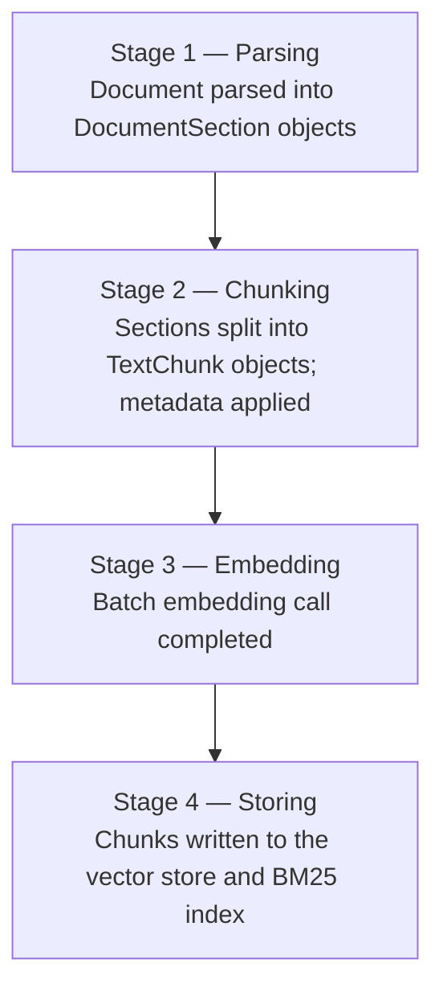

# Ingestion

Ingestion is the process of taking a raw document, converting it to searchable text, splitting it into chunks, generating embeddings, and writing everything to the vector store. Understanding each sub-stage helps you choose the right parser, configure metadata correctly, and track progress in production.

## The four stages

`IngestAsync` progresses through four sequential stages. If you pass an `IProgress<IngestionProgress>`, a callback fires at the end of each stage:



| Stage | `IngestionProgressStage` value | What happened |
|-------|-------------------------------|---------------|
| 1 | `Parsing` | Document parsed into `DocumentSection` objects |
| 2 | `Chunking` | Sections split into `TextChunk` objects; metadata applied |
| 3 | `Embedding` | Batch embedding call completed |
| 4 | `Storing` | Chunks written to the vector store and BM25 index |

## `DocumentMetadata`

Every ingestion call requires a `DocumentMetadata` record:

```csharp
public sealed record DocumentMetadata
{
    public required string DocumentId { get; init; }
    public required string FileName   { get; init; }
    public string? ContentType        { get; init; }
    public IDictionary<string, string> Tags { get; init; }
        = new Dictionary<string, string>(StringComparer.Ordinal);
}
```

| Property | Purpose |
|----------|---------|
| `DocumentId` | Stable identifier for the document. Used to delete or overwrite all its chunks. Must be unique per document across your corpus. |
| `FileName` | Human-readable file name. Written into every chunk's `Metadata["file_name"]`. |
| `ContentType` | MIME type used for parser selection (e.g., `"application/pdf"`). Defaults to `"text/plain"` when `null`. |
| `Tags` | Arbitrary key-value pairs propagated into every chunk's `Metadata`. Use these for [metadata filtering](retrieval.md#metadata-filtering) at query time. |

```csharp
var metadata = new DocumentMetadata
{
    DocumentId  = "policy-hr-001",
    FileName    = "hr-policy.docx",
    ContentType = "application/vnd.openxmlformats-officedocument.wordprocessingml.document",
    Tags = new Dictionary<string, string>
    {
        ["category"] = "hr",
        ["version"]  = "2024-01",
    },
};
```

After ingestion, every `TextChunk.Metadata` for this document will contain:
- `"document_id"` → `"policy-hr-001"`
- `"file_name"` → `"hr-policy.docx"`
- `"category"` → `"hr"`
- `"version"` → `"2024-01"`
- Plus any heading metadata injected by the parser (see below)

## `IngestionOptions`

```csharp
public sealed class IngestionOptions
{
    public bool Overwrite { get; set; }

    /// <summary>
    /// Maximum number of documents to ingest concurrently
    /// when using IngestFromProviderAsync. Default is 1 (sequential).
    /// </summary>
    public int MaxDegreeOfParallelism { get; init; } = 1;

    /// <summary>Chunks per embedding batch within a single document. Default 100.</summary>
    public int EmbedBatchSize { get; init; } = 100;

    /// <summary>Maximum embedding batches in flight concurrently per document. Default 2.</summary>
    public int MaxConcurrentEmbeddingBatches { get; init; } = 2;
}
```

When `Overwrite = true`, the pipeline calls `IVectorStore.DeleteByDocumentIdAsync` and removes the document from the BM25 index before storing new chunks. This is the idempotent update pattern:

```csharp
await pipeline.IngestAsync(stream, metadata,
    options: new IngestionOptions { Overwrite = true });
```

Without `Overwrite`, re-ingesting the same `DocumentId` accumulates duplicate chunks. Set it on every refresh operation.

`MaxDegreeOfParallelism` controls how many documents `IngestFromProviderAsync` processes concurrently. The default `1` preserves the previous sequential behaviour. Increase it when your vector store and embedding service can handle concurrent requests:

```csharp
var result = await pipeline.IngestFromProviderAsync(provider, "my-corpus",
    options: new IngestionOptions { MaxDegreeOfParallelism = 4 },
    hashStore: hashStore);
```

A value of `4` is a reasonable starting point for most cloud embedding APIs. The optimal value depends on your embedding service's rate limits and your vector store's connection pool size.

### Chunk-batch embedding

Within a single document, chunks that need embedding are sliced into batches of `EmbedBatchSize` (default 100) and the batches are embedded concurrently, bounded by `MaxConcurrentEmbeddingBatches` (default 2). A document with at most `EmbedBatchSize` pending chunks is embedded in one generator call, exactly as before — batching only kicks in for larger documents. Chunk order and precomputed embeddings are always preserved; results are reassembled by original chunk index. Tune `EmbedBatchSize` to your embedding API's maximum inputs per request, and raise `MaxConcurrentEmbeddingBatches` when the service tolerates more parallel requests. Both values must be greater than zero. Note that `MaxDegreeOfParallelism` (documents) and `MaxConcurrentEmbeddingBatches` (batches per document) multiply: with `4 × 2` you can have up to eight embedding requests in flight. This changed the default behaviour for documents with more than 100 pending chunks: previously they were embedded in a single request, now in up to 2 concurrent requests of at most 100 chunks each — operators with strict embedding-API rate limits can set `MaxConcurrentEmbeddingBatches = 1` to keep requests sequential.

> Concurrent ingestion of the same `DocumentId` is not supported. The BM25 index update and vector store write are not transactional. Serialise ingestion per document at the application layer.

## Parsers

Parsers implement `IDocumentParser`. The pipeline selects the first registered parser whose `CanParse(contentType)` returns `true`.

### Built-in parsers (always available in `Rag.NET` core)

| Content type | Parser | Notes |
|-------------|--------|-------|
| `text/plain` | `TextDocumentParser` | Produces a single `DocumentSection` |
| `text/markdown` | `MarkdownDocumentParser` | Heading-aware: extracts `HeadingLevel` and `Heading` per section |

### Optional parsers (separate packages)

| Content type | Package | Notes |
|-------------|---------|-------|
| `application/pdf` | `Rag.NET.Parsers.Pdf` | |
| `text/html` | `Rag.NET.Parsers.Html` | Heading-aware (AngleSharp) |
| `application/vnd.openxmlformats-officedocument.wordprocessingml.document` | `Rag.NET.Parsers.Word` | OpenXml |
| `application/vnd.openxmlformats-officedocument.spreadsheetml.sheet` | `Rag.NET.Parsers.Excel` | OpenXml |
| `application/vnd.openxmlformats-officedocument.presentationml.presentation` | `Rag.NET.Parsers.PowerPoint` | OpenXml |
| `text/csv` | (core) `CsvDocumentParser` | |
| `application/json` | (core) `JsonDocumentParser` | |

Register additional parsers via `AddParser<T>()` or by calling the package-specific extension method:

```csharp
services.AddRagNet(rag => rag
    .AddPdfParser()
    .AddHtmlParser()
    .AddWordParser()
    .AddExcelParser()
    .AddPowerPointParser());
```

To register your own parser implementation directly:

```csharp
services.AddRagNet(rag => rag
    .AddParser<MyXmlParser>());
```

## `DocumentSection`

Parsers produce a stream of `DocumentSection` records:

```csharp
public sealed record DocumentSection
{
    public required string Text        { get; init; }
    public required string DocumentId  { get; init; }
    public int? HeadingLevel           { get; init; }  // 1–6 (H1–H6), null if no heading
    public string? Heading             { get; init; }  // heading text, null if no heading
    public int? PageNumber             { get; init; }  // null for non-paginated formats
    public int SectionIndex            { get; init; }
}
```

### Heading-aware metadata

When `HeadingLevel` and `Heading` are set (by the Markdown or HTML parser), the pipeline automatically builds a breadcrumb trail and writes three entries into every `TextChunk.Metadata` produced from that section:

| Key | Example value |
|-----|--------------|
| `heading` | `"Section 2"` |
| `heading_level` | `"2"` |
| `heading_breadcrumb` | `"Chapter 1 > Section 2"` |

The breadcrumb is built by concatenating all ancestor headings in order, separated by ` > `. A new heading at level N resets all headings at levels N+1 through 6.

These metadata keys can be used for [metadata filtering](retrieval.md#metadata-filtering).

## Progress reporting

Pass any `IProgress<IngestionProgress>` to receive stage-completion callbacks:

```csharp
public sealed record IngestionProgress
{
    public required IngestionProgressStage Stage { get; init; }
    public required string DocumentId            { get; init; }
    public int? Current                          { get; init; }
    public int? Total                            { get; init; }
    public required string Message               { get; init; }
}
```

```csharp
var progress = new Progress<IngestionProgress>(p =>
    Console.WriteLine($"[{p.Stage}] {p.Message} ({p.Current}/{p.Total})"));

using var stream = File.OpenRead("report.pdf");
var result = await pipeline.IngestAsync(stream, metadata, progress: progress);
```

Example output:

```
[Parsing] Parsing complete (/)
[Chunking] Chunked into 42 chunks (42/42)
[Embedding] Generated 42 embeddings (42/42)
[Storing] Stored 42 chunks (42/42)
```

`Current` and `Total` are `null` for the `Parsing` stage because the total section count is not known until parsing completes.

## Ingestion return value

```csharp
public sealed record IngestionResult
{
    public required string DocumentId  { get; init; }
    public required int ChunksStored   { get; init; }
}
```

`ChunksStored` can be 0 if the document parsed to no content (empty file or all-whitespace input). The pipeline short-circuits before the embedding call in that case.

## Performance notes

See [benchmarks](benchmarks.md) for detailed measurements. Key takeaways:

- Parsing and chunking of a 50 KB document completes in under 400 µs (mocked embedder).
- Real ingestion time is dominated by the embedding API call, typically 50–500 ms per batch.
- Use `Overwrite = true` and a stable `DocumentId` for incremental refreshes to avoid accumulating stale chunks.

## Data providers

For batch ingestion from a directory, website, or GitHub repository, use `IngestFromProviderAsync` instead of calling `IngestAsync` in a loop. It handles ETag/hash deduplication, optional cleanup, and — via `IngestionOptions.MaxDegreeOfParallelism` — parallel processing of multiple documents.

### `LocalFilesDataProvider`

```csharp
var provider = new LocalFilesDataProvider("/data/docs", new LocalFilesOptions
{
    Extensions   = [".pdf", ".docx", ".md"],
    SearchOption = SearchOption.AllDirectories,
    Filter       = path => !path.Contains(".git"),
});

var result = await pipeline.IngestFromProviderAsync(provider, "my-corpus",
    hashStore: sp.GetRequiredService<IContentHashStore>(),
    cleanupMode: CleanupMode.Full);

Console.WriteLine($"Ingested: {result.Ingested}, Skipped: {result.Skipped}, Deleted: {result.Deleted}");
```

### `SitemapDataProvider`

```csharp
var provider = new SitemapDataProvider("https://docs.example.com/sitemap.xml", httpClient);
await pipeline.IngestFromProviderAsync(provider, "docs-site", hashStore: hashStore);
```

### `RssDataProvider`

```csharp
var provider = new RssDataProvider("https://example.com/feed.rss", httpClient);
await pipeline.IngestFromProviderAsync(provider, "blog-feed", hashStore: hashStore);
```

Supports RSS 2.0 and Atom feeds. `Id` is the `<guid>` or `<link>` element; `ETag` is `<pubDate>` / `<updated>` — so unchanged posts are automatically skipped on subsequent runs.

### `WebCrawlerDataProvider`

```csharp
var provider = new WebCrawlerDataProvider("https://docs.example.com", httpClient, new WebCrawlerOptions
{
    MaxDepth = 3,
    MaxPages = 500,
    SameDomain = true,
    RespectRobotsTxt = true,
});
await pipeline.IngestFromProviderAsync(provider, "docs-site", hashStore: hashStore);
```

### `GitHubDataProvider`

```csharp
var provider = new GitHubDataProvider("my-org", "my-repo", githubClient, new GitHubDataProviderOptions
{
    Branch                = "main",
    Extensions            = [".md", ".cs"],
    Filter                = path => !path.StartsWith("docs/plans/"),
    LastIngestedCommitSha = settings.LastIngestedCommitSha, // null on first run
});
await pipeline.IngestFromProviderAsync(provider, "github-repo", hashStore: hashStore);
// Save result to settings for next run: settings.LastIngestedCommitSha = latestCommitSha;
```

### Registration

```csharp
services.AddRagNet(b => b
    .UsePgVector(connectionString, vectorDimensions: 1536)
    .UseContentHashRecordManager("ragnet-hashes.db"));
```

## Event-driven ingestion

Ingestion can also be push-based: a bounded job queue plus a `BackgroundService` processor (`UseEventDrivenIngestion`), fed by an HMAC-verified webhook endpoint (`Rag.NET.Api`) or a background polling trigger (`UsePollingIngestion`). See [Event-driven ingestion in the data providers guide](data-providers.md#event-driven-ingestion) for setup, the webhook payload contract, and signature examples.

## Embedding versioning & re-indexing

Switching embedding models invalidates every stored vector — dense similarity scores are only meaningful within one model's embedding space. `UseEmbeddingVersioning` tracks which model produced each document's vectors so you can re-embed only what is stale instead of wiping and re-ingesting the corpus.

### Model migration walkthrough

**1. Register versioning before (or at) your first ingest:**

```csharp
services.AddRagNet(b => b
    .UseEmbeddingVersioning(o => o.DatabasePath = "ragnet-versions.db"));

// Stores chunk text — enables real re-indexing (otherwise ReindexStaleAsync is report-only):
services.AddSingleton<IRagDataManager>(new SqliteDocumentStore("ragnet-data.db"));
```

After every successful store, the pipeline stamps the document with the resolved model identity and the vector dimension. The identity comes from the generator's `EmbeddingGeneratorMetadata` (`"{ProviderName}/{DefaultModelId}"`); for adapters that expose no metadata, set `o.ModelId` explicitly — without either source, stamping is disabled with a one-time warning (the identity is never guessed). `DeleteAsync` removes the stamp along with the document.

**2. Switch the embedding model** (new registration, new deployment — nothing else changes). Newly ingested documents are stamped with the new identity; existing documents keep their old stamp.

**3. Re-index the stale documents:**

```csharp
var result = await pipeline.ReindexStaleAsync(serviceProvider, cancellationToken: cancellationToken);
// Optionally pass IngestionOptions to tune the re-embedding batch size:
// await pipeline.ReindexStaleAsync(serviceProvider, new IngestionOptions { EmbedBatchSize = 50 }, cancellationToken);
// result.Reindexed     — re-embedded, re-stored, re-stamped
// result.ReportedStale — stale but not re-indexable (no data manager registered)
// result.Failed        — (documentId, error) pairs; the loop continued past them
```

A document is stale when its stamped model identity differs from the current one, or when its stamped dimension differs from the current model's output dimension (learned by embedding one constant probe text — a single extra embedding call per run, only made when at least one stamp matches the current model id). Stale documents are re-embedded from the chunk text stored by the `IRagDataManager`, their old vectors are deleted (so surplus stale chunks under higher chunk indices cannot survive), the new vectors are stored, and the stamp is updated. Re-embedding honours `IngestionOptions.EmbedBatchSize`. When a sparse encoder (`ISparseEmbeddingGenerator`) and a sparse-capable store are both registered, sparse vectors are regenerated from the same text; a sparse failure is logged and the dense re-index still succeeds. BM25 needs no re-index (the text is unchanged).

An overload taking explicit dependencies (`versionStore`, `embedder`, `vectorStore`, `dataManager`, options) is available for non-DI composition, mirroring `IngestFromProviderAsync`.

### Limitations

- **Chunks are reused verbatim.** Re-indexing re-embeds the stored chunk text; it does not re-parse or re-chunk the source document. If you also changed chunking settings, re-ingest instead.
- **Report-only without a data manager.** Without an `IRagDataManager` (which stores the chunk text), stale documents land in `ReportedStale` for caller-driven re-ingest from the original source.
- **Fixed-dimension backends need the collection recreated first.** On Qdrant and pgvector the collection/column dimension is fixed at creation. For a dimension-changing migration, recreate the collection (or column) for the new dimension *before* calling `ReindexStaleAsync` — otherwise every stale document lands in `Failed` with a backend error. Only the in-memory store tolerates mixed dimensions.
- **Quiesce ingestion while re-indexing.** Concurrent ingestion converges (both paths replace by `(DocumentId, ChunkIndex)` and re-stamp), but search results can transiently mix old- and new-model vectors — prefer running `ReindexStaleAsync` while ingestion is paused.
- **Only stamped documents are seen.** Documents ingested before `UseEmbeddingVersioning` was registered have no stamp and are invisible to `ReindexStaleAsync` — re-ingest them once to get them stamped. The same applies when stamping itself failed: a stamp failure is logged as a warning (ingestion still succeeds), but until the document is successfully re-ingested it will be missed — or, after a model switch, mis-reported — by re-indexing.
- The `ragnet reindex --stale` CLI command ships with the CLI tool (Milestone 3).
