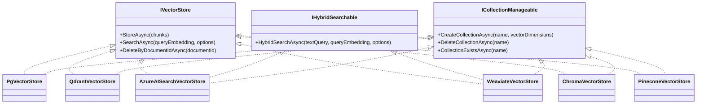

# Vector Stores

The vector store is the persistence layer for embedded chunks. Rag.NET ships six implementations, each registered via a fluent extension method on `RagBuilder`. The interface is designed to be swapped without changing any pipeline code.

## Feature matrix

| Feature | `PgVectorStore` | `QdrantVectorStore` | `AzureAISearchVectorStore` | `WeaviateVectorStore` | `ChromaVectorStore` | `PineconeVectorStore` |
|---------|:-:|:-:|:-:|:-:|:-:|:-:|
| Package | `Rag.NET.VectorStores.PgVector` | `Rag.NET.VectorStores.Qdrant` | `Rag.NET.VectorStores.AzureAISearch` | `Rag.NET.VectorStores.Weaviate` | `Rag.NET.VectorStores.Chroma` | `Rag.NET.VectorStores.Pinecone` |
| Dense (semantic) search | Yes | Yes | Yes | Yes | Yes | Yes |
| Hybrid search (native) | No — BM25 fallback | No — BM25 fallback | Yes (`IHybridSearchable`) | Yes (`IHybridSearchable`) | No — BM25 fallback | No — BM25 fallback |
| Sparse search (SPLADE, `ISparseSearchable`) | No (deferred) | Yes (`enableSparseVectors: true`) | No | No | No | Yes (`EnableSparseVectors = true`) |
| Metadata filtering | Yes (JSONB `@>`) | Yes (payload match) | Yes (`search.ismatch`) | Yes (`where` on `meta_*` props) | Yes (`where` `$eq`/`$and`) | Yes (filter `$eq`/`$and`) |
| `ICollectionManageable` | Yes | Yes | Yes | Yes | Yes | Yes |
| Similarity function | Cosine (via `<=>`) | Cosine | Cosine | Cosine | Cosine | Cosine (dotproduct when sparse) |
| Index algorithm | IVFFlat / HNSW (pgvector) | HNSW | HNSW | HNSW | HNSW | Serverless (managed) |
| Persistence | PostgreSQL | Qdrant server | Azure managed | Weaviate server | Chroma server | Pinecone managed |

## Interface hierarchy



## Shared interface

All six implement `IVectorStore`:

```csharp
public interface IVectorStore
{
    Task StoreAsync(IReadOnlyList<EmbeddedChunk> chunks, CancellationToken cancellationToken = default);

    Task<IReadOnlyList<SearchResult>> SearchAsync(
        ReadOnlyMemory<float> queryEmbedding,
        SearchOptions options,
        CancellationToken cancellationToken = default);

    Task DeleteByDocumentIdAsync(string documentId, CancellationToken cancellationToken = default);
}
```

`SearchOptions` carries `TopK`, `MinScore`, `MetadataFilter`, and `UseHybridSearch`. The `UseHybridSearch` flag in `SearchOptions` is used by `IHybridSearchable` implementations; stores that do not implement that interface ignore it (the pipeline handles routing before calling `SearchAsync`).

## Collection management

All six also implement `ICollectionManageable`, registered alongside `IVectorStore` in the DI container:

```csharp
public interface ICollectionManageable
{
    Task CreateCollectionAsync(string name, int vectorDimensions, CancellationToken cancellationToken = default);
    Task DeleteCollectionAsync(string name, CancellationToken cancellationToken = default);
    Task<bool> CollectionExistsAsync(string name, CancellationToken cancellationToken = default);
}
```

Resolve it directly from DI when you need to manage the index lifecycle:

```csharp
var manageable = provider.GetRequiredService<ICollectionManageable>();
if (!await manageable.CollectionExistsAsync("rag-index"))
    await manageable.CreateCollectionAsync("rag-index", vectorDimensions: 1536);
```

---

## PostgreSQL + pgvector

**Package:** `Rag.NET.VectorStores.PgVector`

Stores chunks in a `rag_chunks` table. Uses the `pgvector` extension for ANN search via the `<=>` cosine distance operator. Metadata is stored as `JSONB` and filtered using PostgreSQL's containment operator.

### Setup

```csharp
services.AddRagNet(rag => rag
    .UsePgVector(
        connectionString: "Host=localhost;Database=ragdb;Username=postgres;Password=secret",
        vectorDimensions: 1536));
```

The `vectorDimensions` must match the output dimension of your embedding model (`text-embedding-3-small` → 1536, `mxbai-embed-large` → 1024, etc.).

### Schema

`InitializeAsync` creates the following objects if they do not already exist:

```sql
CREATE EXTENSION IF NOT EXISTS vector;

CREATE TABLE IF NOT EXISTS rag_chunks (
    id          BIGINT GENERATED ALWAYS AS IDENTITY PRIMARY KEY,
    document_id TEXT    NOT NULL,
    chunk_index INTEGER NOT NULL,
    text        TEXT    NOT NULL,
    metadata    JSONB   NOT NULL DEFAULT '{}',
    embedding   vector(<dimensions>) NOT NULL
);

CREATE INDEX IF NOT EXISTS idx_rag_chunks_document_id ON rag_chunks (document_id);
```

Call `InitializeAsync` once at application startup (e.g., in a hosted service or `Program.cs`) before any ingestion:

```csharp
var store = provider.GetRequiredService<ICollectionManageable>() as PgVectorStore;
await store!.InitializeAsync();
```

Or resolve `PgVectorStore` directly:

```csharp
var store = provider.GetRequiredService<IVectorStore>() as PgVectorStore;
await store!.InitializeAsync();
```

### Similarity score

pgvector returns `1 - (embedding <=> query)` as the score, which is cosine similarity in `[0, 1]`. `MinScore` is applied as a `WHERE` clause filter before `ORDER BY` and `LIMIT`.

### Hybrid search

`PgVectorStore` does not implement `IHybridSearchable`. When `UseHybridSearch = true`, the pipeline falls back to the in-memory BM25 index + RRF merge. See [Retrieval — Hybrid search](retrieval.md#hybrid-search-bm25--vector).

---

## Qdrant

**Package:** `Rag.NET.VectorStores.Qdrant`

Stores chunks as Qdrant points with a payload. Metadata is stored both as a serialised JSON string in `metadata` and as individual `meta_{key}` payload fields to enable Qdrant's native payload filtering.

### Setup

```csharp
services.AddRagNet(rag => rag
    .UseQdrant(
        host:            "localhost",
        port:            6334,
        collectionName:  "my-collection",
        vectorDimensions: 1536));
```

### Collection initialisation

Call `InitializeAsync` before first use. It creates the collection with cosine distance if it does not already exist:

```csharp
var store = provider.GetRequiredService<IVectorStore>() as QdrantVectorStore;
await store!.InitializeAsync();
```

### Metadata filtering

Qdrant filters on `meta_{key}` payload fields using must-match conditions:

```csharp
var results = await pipeline.RetrieveAsync("query", new RetrievalOptions
{
    MetadataFilter = new Dictionary<string, string>
    {
        ["department"] = "finance",   // matches meta_department payload field
    },
});
```

### Hybrid search

`QdrantVectorStore` does not implement `IHybridSearchable`. When `UseHybridSearch = true`, the pipeline falls back to the in-memory BM25 index + RRF merge.

### Sparse vectors (SPLADE)

Pass `enableSparseVectors: true` to `UseQdrant` to register `QdrantSparseVectorStore` — a subtype that creates the collection with a named sparse vector (`"splade"`) next to the dense vector and serves `ISparseSearchable`. The dense-only `QdrantVectorStore` deliberately does **not** implement `ISparseSearchable`, so the pipelines' capability probe is honest and no SPLADE encoding work happens against a store that cannot persist it. Sparse vectors live on the same points as the dense embeddings: point ids become deterministic per `(DocumentId, ChunkIndex)` (making chunk upserts idempotent), and `StoreSparseAsync` attaches sparse vectors to points previously upserted by `StoreAsync` — ingestion always calls them in that order. `InitializeAsync` fails fast when an existing collection was created without sparse support — delete the collection and re-ingest to enable it. See [Sparse retrieval (SPLADE)](retrieval.md#sparse-retrieval-splade) for the full setup including `UseSpladeEncoder`.

---

## Azure AI Search

**Package:** `Rag.NET.VectorStores.AzureAISearch`

Stores chunks as Azure AI Search documents. Implements both `IVectorStore` and `IHybridSearchable` — **native** hybrid search combining BM25 full-text search with HNSW vector search at the service level (as does [Weaviate](#weaviate)).

### Setup

```csharp
using Azure;
using Rag.NET.VectorStores.AzureAISearch;

services.AddRagNet(rag => rag
    .UseAzureAISearch(
        endpoint:         new Uri("https://my-search.search.windows.net"),
        indexName:        "my-rag-index",
        credential:       new AzureKeyCredential("your-api-key"),
        vectorDimensions: 1536));
```

### Index schema

`InitializeAsync` creates or updates the index with these fields:

| Field | Type | Role |
|-------|------|------|
| `id` | `String` (key) | UUID per chunk |
| `document_id` | `String` (filterable) | For delete-by-document |
| `chunk_index` | `Int32` | Chunk ordinal |
| `text` | `SearchableString` | Full-text search |
| `metadata` | `String` | Serialised JSON |
| `embedding` | `Collection(Single)` | HNSW vector field |

The vector field is configured with an HNSW algorithm profile named `"default-algorithm"`.

```csharp
var store = provider.GetRequiredService<ICollectionManageable>() as AzureAISearchVectorStore;
await store!.InitializeAsync();
```

### Native hybrid search

When `UseHybridSearch = true` and `AzureAISearchVectorStore` is registered, the pipeline calls `HybridSearchAsync` directly. This issues a single Azure AI Search request with both a full-text query and a vectorised query, letting the service perform BM25+vector fusion:

```csharp
var results = await pipeline.RetrieveAsync("ISO 27001 audit requirements", new RetrievalOptions
{
    TopK            = 10,
    UseHybridSearch = true,
});
```

The returned scores are Azure AI Search's internal BM25+vector fusion scores, not cosine similarities. They are positive and unbounded above; `MinScore` can still be applied to filter out low-confidence results.

### Metadata filtering

Metadata is stored as a serialised JSON string in the `metadata` field. The filter uses `search.ismatch` to check for key-value substrings within the JSON:

```csharp
// Generates: search.ismatch('"department":"finance"', 'metadata')
var results = await pipeline.RetrieveAsync("query", new RetrievalOptions
{
    MetadataFilter = new Dictionary<string, string>
    {
        ["department"] = "finance",
    },
});
```

Multiple filter entries are combined with `and`.

### Indexing latency

Azure AI Search indexing is near real-time. `StoreAsync` includes a 1-second delay after batch upload to allow the index to become consistent before a subsequent `SearchAsync` call. This delay is intentional and sourced from the implementation; plan for it in integration tests.

---

## Weaviate

**Package:** `Rag.NET.VectorStores.Weaviate`

Stores chunks as objects of a single Weaviate class (`vectorizer: none` — Rag.NET brings its own vectors; cosine distance). Implements `IVectorStore`, `IHybridSearchable` (native BM25+vector fusion), and `ICollectionManageable`, all served by one singleton. Object ids are deterministic per `(DocumentId, ChunkIndex)`, so re-ingesting a chunk replaces it.

### Local quickstart

```bash
docker run -p 8080:8080 \
  -e AUTHENTICATION_ANONYMOUS_ACCESS_ENABLED=true \
  -e PERSISTENCE_DATA_PATH=/var/lib/weaviate \
  -e DEFAULT_VECTORIZER_MODULE=none \
  cr.weaviate.io/semitechnologies/weaviate:latest
```

### Setup

```csharp
services.AddRagNet(rag => rag
    .UseWeaviate(
        endpoint:         new Uri("http://localhost:8080"),
        className:        "RagChunks",   // capital letter + letters/digits/underscores
        vectorDimensions: 1536));
```

The class name doubles as a GraphQL field, so Weaviate requires a capitalized GraphQL-valid name (validated eagerly at registration). Optional settings via the `configure` callback:

```csharp
services.AddRagNet(rag => rag
    .UseWeaviate(new Uri("https://my-cluster.weaviate.cloud"), "RagChunks", 1536, options =>
    {
        options.ApiKey = "wcs-api-key";   // sent as Authorization: Bearer
        options.Tenant = "customer_a";    // opt into multi-tenancy
    }));
```

### Class schema and initialisation

`InitializeAsync` creates the class if missing: fixed properties `document_id` (text, `field` tokenization so `Equal` filters match whole ids), `chunk_index` (int), `text` (text — feeds BM25), and `metadata_json` (serialised metadata for lossless round-tripping). `StoreAsync` also initialises lazily on first write, so a forgotten `InitializeAsync` can never let Weaviate's auto-schema create the class with the wrong tokenization.

```csharp
var store = provider.GetRequiredService<IVectorStore>() as WeaviateVectorStore;
await store!.InitializeAsync();
```

### Scores

Dense search maps Weaviate's cosine `distance` (0 = identical … 2 = opposite) to `Score = 1 - distance / 2`, so an identical vector scores 1.0. Hybrid search returns Weaviate's relative-score-fusion value, already in `[0, 1]`. `MinScore` is applied to the mapped score in both modes.

### Native hybrid search

When `UseHybridSearch = true`, the pipeline calls `HybridSearchAsync` directly — a single GraphQL `hybrid: {query, vector}` request lets Weaviate fuse BM25 and vector rankings server-side, so a chunk that matches only by keyword is still found. See [Retrieval — Hybrid search](retrieval.md#hybrid-search-bm25--vector).

### Metadata filtering and auto-schema

Each chunk metadata key is written as an extra `meta_{key}` text property; Weaviate's auto-schema (enabled by default in the official image) adds these properties on first write, making them server-side filterable:

```csharp
// Generates: where: {path: ["meta_department"], operator: Equal, valueText: "finance"}
var results = await pipeline.RetrieveAsync("query", new RetrievalOptions
{
    MetadataFilter = new Dictionary<string, string>
    {
        ["department"] = "finance",
    },
});
```

Multiple filter entries are wrapped in a single `And` operand. Note that auto-schema created `meta_*` properties use Weaviate's default `word` tokenization, so `Equal` on a multi-word value matches per token — keep filterable metadata values single-token.

### Multi-tenancy

Set `WeaviateOptions.Tenant` to isolate data per tenant: the class is created with `multiTenancyConfig: {enabled: true}`, the tenant itself is created during initialisation (idempotent), and every store/search/delete carries it. Two stores configured with different tenants on the same class never see each other's chunks.

---

## Chroma

**Package:** `Rag.NET.VectorStores.Chroma`

Stores chunks as records of a single Chroma collection via the REST v2 API — deliberately the lightweight, **dense-only** adapter. Implements `IVectorStore` and `ICollectionManageable`, served by one singleton. Record ids are `{documentId}:{chunkIndex}`, so re-ingesting a chunk upserts (replaces) it; the chunk text rides as the record's document and metadata carries the chunk metadata plus `document_id` and `chunk_index`.

### Local quickstart

```bash
docker run -p 8000:8000 chromadb/chroma
```

### Setup

```csharp
services.AddRagNet(rag => rag
    .UseChroma(
        endpoint:       new Uri("http://localhost:8000"),
        collectionName: "rag-chunks"));   // 3-512 chars: letters/digits/._-, alphanumeric ends
```

The collection is created automatically (with the cosine space) on first use; Chroma infers vector dimensions from the first upsert, so no dimension parameter is needed. Optional settings via the `configure` callback:

```csharp
services.AddRagNet(rag => rag
    .UseChroma(new Uri("http://localhost:8000"), "rag-chunks", options =>
    {
        options.Tenant   = "my_tenant";     // default: default_tenant
        options.Database = "my_database";   // default: default_database
        options.ApiKey   = "static-token";  // sent as Authorization: Bearer
    }));
```

Chroma addresses collections by UUID internally; the store resolves the configured name to its UUID once and caches it. If the collection is deleted or recreated behind the store's back, the next operation transparently re-resolves and retries once.

### Scores

Chroma returns cosine `distance = 1 - cosine similarity` (0 = identical … 2 = opposite), mapped to `Score = 1 - distance`, so an identical vector scores 1.0 and an orthogonal one 0.0 (opposite vectors go negative). `MinScore` is applied to the converted score.

The store **requires the cosine space**. If the configured collection already exists with a different space (Chroma's default is squared L2), the first operation fails fast with an `InvalidOperationException` naming the actual space — the score conversion would otherwise be silently on the wrong scale and `MinScore` would misfilter. Delete and recreate the collection (re-ingesting its documents) or point the store at a cosine collection.

### Hybrid search

`ChromaVectorStore` does not implement `IHybridSearchable` (or `ISparseSearchable`) — Chroma has no native BM25+vector fusion for externally supplied embeddings. When `UseHybridSearch = true`, the pipeline falls back to the in-memory BM25 index + RRF merge; if you want *native* hybrid or sparse search, use [Qdrant](#qdrant) or [Pinecone](#pinecone) (sparse/SPLADE), [Weaviate](#weaviate), or [Azure AI Search](#azure-ai-search) instead. See [Retrieval — Hybrid search](retrieval.md#hybrid-search-bm25--vector).

### Metadata filtering

Chunk metadata keys are stored as-is on each record and filtered server-side with Chroma's `$eq` operator; multiple filter entries are composed with `$and`:

```csharp
// Generates: where: {"$and": [{"department": {"$eq": "finance"}}, {"team": {"$eq": "core"}}]}
var results = await pipeline.RetrieveAsync("query", new RetrievalOptions
{
    MetadataFilter = new Dictionary<string, string>
    {
        ["department"] = "finance",
        ["team"]       = "core",
    },
});
```

Note that `document_id` and `chunk_index` are reserved record-metadata keys (a same-named chunk metadata key would be overwritten by them).

---

## Pinecone

**Package:** `Rag.NET.VectorStores.Pinecone`

Stores chunks as records of a Pinecone **serverless** index via the official `Pinecone.Client` SDK. Implements `IVectorStore` and `ICollectionManageable`, served by one singleton; the opt-in sparse variant adds `ISparseSearchable` (see below). Record ids are `{documentId}:{chunkIndex}`, so re-ingesting a chunk upserts (replaces) it.

Pinecone stores no document body: the chunk text lives in record metadata (key `text`) next to `document_id` and `chunk_index`, and is read back into `SearchResult.Text`. Keep chunks comfortably under Pinecone's **~40 KB metadata limit per record** — text plus all metadata must fit.

> **SDK version note:** the package pins `Pinecone.Client` **3.1.0**, not 4.x. The 4.x control-plane models require a `vector_type` response field that Pinecone Local (API version 2025-01) does not send, so index create/describe/list fail against the emulator ([pinecone-dotnet-client#54](https://github.com/pinecone-io/pinecone-dotnet-client/issues/54); the SDK repository was archived in July 2026, so no fix is expected). 3.1.0 targets the same API version as the emulator and works against both it and the real service.

### Setup

```csharp
services.AddRagNet(rag => rag
    .UsePinecone(
        apiKey:           "your-api-key",
        indexName:        "rag-chunks",   // 1-45 chars: lowercase letters/digits/-, alphanumeric ends
        vectorDimensions: 1536));
```

Optional settings via the `configure` callback:

```csharp
services.AddRagNet(rag => rag
    .UsePinecone("your-api-key", "rag-chunks", 1536, options =>
    {
        options.Namespace = "customer-a";              // namespace isolation (see below)
        options.EnableSparseVectors = true;            // sparse variant — dotproduct index required
        options.Cloud  = ServerlessSpecCloud.Aws;      // serverless placement, default aws
        options.Region = "us-east-1";                  //   ... default us-east-1
        options.Endpoint = new Uri("http://localhost:5080");  // Pinecone Local
    }));
```

### Index lifecycle

`CreateCollectionAsync(name, dimensions)` creates a serverless index (cloud/region from the options; cosine metric — dotproduct when sparse vectors are enabled) and polls `describe` until the index reports ready, bounded by `PineconeOptions.IndexReadyTimeout` (default 2 minutes; serverless creation typically takes under a minute, Pinecone Local is ready instantly). Deleting a missing index is a no-op; storing or searching against a missing index fails fast with an exception naming `CreateCollectionAsync` as the fix.

### Local development (Pinecone Local)

Pinecone Local is an in-memory emulator of the control and data planes — no account or API key needed (keys are accepted and ignored):

```bash
docker run -p 5080-5090:5080-5090 \
  -e PORT=5080 -e PINECONE_HOST=localhost \
  ghcr.io/pinecone-io/pinecone-local:latest
```

Point the store at it with `options.Endpoint = new Uri("http://localhost:5080")` — the `http` scheme also switches the SDK's data-plane gRPC channels to plaintext. The emulator serves the control plane on port 5080 and gives every index its own data-plane port from 5081–5090, advertised as `localhost:{port}` — hence the port-range publish (and a cap of ten live indexes). Emulator limitations to plan around: data is not persisted across restarts, at most 100,000 records per index, and **no sparse values on dense indexes** (see the sparse section below); delete-by-metadata-filter is rejected exactly like the real serverless service.

### Scores

Pinecone returns native similarity scores, so `MinScore` applies directly: cosine similarity in `[-1, 1]` on the default metric (identical vector ⇒ 1.0, orthogonal ⇒ 0.0). On a dotproduct index (sparse variant) dense scores are raw dot products and sparse scores are sums of matching term-weight products — both unbounded above, so tune `MinScore` for that scale.

### Namespace isolation

Set `PineconeOptions.Namespace` to scope every upsert, query, and delete to one Pinecone namespace — the features.md "namespace-based collection isolation". Two stores configured with different namespaces on the same index never see each other's chunks, and `DeleteByDocumentIdAsync` only deletes within its own namespace. Leave it null for the default namespace.

### Metadata filtering

Chunk metadata keys are stored as-is on each record and filtered server-side with Pinecone's `$eq` operator; multiple filter entries are composed with `$and`:

```csharp
// Generates: filter: {"$and": [{"department": {"$eq": "finance"}}, {"team": {"$eq": "core"}}]}
var results = await pipeline.RetrieveAsync("query", new RetrievalOptions
{
    MetadataFilter = new Dictionary<string, string>
    {
        ["department"] = "finance",
        ["team"]       = "core",
    },
});
```

`document_id`, `chunk_index`, and `text` are reserved record-metadata keys (a same-named chunk metadata key would be overwritten by them).

### Delete by document

Serverless indexes do not support delete-by-metadata-filter (the service answers "Serverless and Starter indexes do not support deleting with metadata filtering" — Pinecone Local included), so `DeleteByDocumentIdAsync` lists vector ids by the `{documentId}:` prefix and deletes by id, in batches. Ids whose remainder after the prefix is not purely digits are skipped — they belong to a longer document id that merely starts the same way (e.g. deleting `doc` never touches `doc:7`'s chunks).

### Sparse vectors (SPLADE)

Set `EnableSparseVectors = true` in the `configure` callback to register `PineconeSparseVectorStore` — a subtype that serves `ISparseSearchable` next to the dense interfaces. The dense-only `PineconeVectorStore` deliberately does **not** implement `ISparseSearchable`, so the pipelines' capability probe is honest and no SPLADE encoding work happens against a store that cannot persist it (the same type-split as [Qdrant](#sparse-vectors-splade)). Pair it with `UseSpladeEncoder` — see [Sparse retrieval (SPLADE)](retrieval.md#sparse-retrieval-splade) for the full setup.

Sparse values ride on the same records as the dense embeddings: `StoreSparseAsync` re-upserts the full record (dense + sparse + metadata), so ordering against `StoreAsync` does not matter. `SearchSparseAsync` issues a sparse query with an all-zero dense vector (Pinecone requires a dense vector on every query; zeroing it nulls the dense contribution — the documented `alpha = 0` weighting).

Pinecone only accepts sparse values on **dotproduct** indexes. The sparse variant's `CreateCollectionAsync` therefore creates dotproduct indexes, and its first data-plane use fails fast with an `InvalidOperationException` naming the fix when the configured index has a different metric — the real service would accept sparse upserts into a cosine index and only reject at *query* time.

**Pinecone Local gap:** the emulator does not support sparse values on dense indexes (its gRPC upsert rejects them; its REST path silently drops them), so the sparse round-trip is only exercisable against the real serverless service. The container suite covers everything else about the sparse variant (dotproduct index creation, dense ops through it, the cosine fail-fast) and skips the sparse round-trip with that documented reason.

---

## Multi-index federation

**Package:** `Rag.NET` (core)

`FederatedVectorStore` wraps two or more `IVectorStore` instances behind a single store, so you can search across collections living in different backends (e.g. a private PgVector index plus a shared Qdrant index) without migrating data. It is registered as *the* `IVectorStore`, so the entire pipeline (MMR, reranking, caching, …) composes unchanged.

### Setup

```csharp
services.AddRagNet(rag => rag
    .UseFederatedSearch(f => f
        .AddStore(_ => new PgVectorStore("Host=...;Database=private", 1536), "private-pg")
        .AddStore(_ => new QdrantVectorStore("localhost", 6334, "shared", 1536), "shared-qdrant")
        .WithPrimary(0)      // optional: writes/deletes target this store (default: first)
        .WithRrfK(60)));     // optional: RRF constant (default: 60)
```

At least two stores are required (validated at registration). Store factories receive the `IServiceProvider` and run once, when the federated store is first resolved.

### Behaviour

- **Search** fans out to all stores concurrently, then merges the per-store rankings with N-way Reciprocal Rank Fusion: each hit contributes `1 / (k + rank)` (1-based rank, `k` = `RrfK`) and the merged `Score` is the summed RRF score, not a cosine similarity. `TopK` is applied after the merge. Ties on the merged score are broken deterministically: the chunk that first appeared in the lower store index wins, then the lower per-store rank.
- **`MinScore`** is applied by each store against its own similarity scale *before* fusion; the merged `Score` is RRF. Beware cross-backend coherence: the same `MinScore` value means different things to different backends (e.g. cosine similarity in `[0, 1]` for PgVector/Qdrant vs. Azure AI Search's unbounded hybrid scores), so a threshold tuned for one store may over- or under-filter another.
- **Provenance:** every merged result's chunk metadata gains a `source.store` entry with the store's name (from `AddStore(..., name)`) or its zero-based index. The source store's own chunk is never mutated — the tag is written into a copied metadata dictionary.
- **Writes and deletes** go to the primary store only. `DeleteByDocumentIdAsync` does **not** touch secondary stores — documents ingested directly into secondaries must be deleted there.
- **Degraded, never broken:** a store that throws during search is skipped with a logged warning; the federated search itself only throws (`InvalidOperationException` naming the stores) when *every* store failed.

### Interaction with other registrations

`UseFederatedSearch` supersedes any earlier `IVectorStore` registration (standard last-wins container semantics). Do not combine it with `UsePgVector`/`UseQdrant`-style calls — add those stores through the builder instead.

**Persistent conversation memory (known limitation):** `UsePersistentMemory` resolves the DI `IVectorStore` and filters recalled exchanges by `PersistentMemoryOptions.MinScore` (default 0.7), which is calibrated to the similarity scale. Federated results carry RRF scores (about 0.033 at best for two stores), so persistent memory backed by the federated store would silently never recall anything. Point persistent memory at a dedicated (non-federated) store until score normalization lands.

### Limitations

Federation is **dense-only** in this release: `IHybridSearchable` (native hybrid), sparse search, and `ICollectionManageable` capabilities of the underlying stores are not federated. When `UseHybridSearch = true`, the pipeline's BM25 fallback still applies over the shared in-memory/SQLite BM25 index, not per federated store.

---

## Implementing a custom vector store

See [Extending](extending.md#implementing-ivectorstore) for the full guide.
