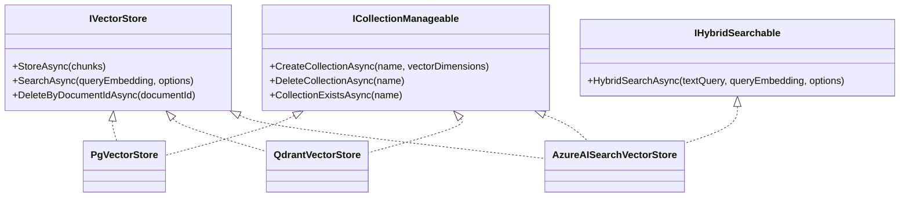

# Vector Stores

The vector store is the persistence layer for embedded chunks. Rag.NET ships three implementations, each registered via a fluent extension method on `RagBuilder`. The interface is designed to be swapped without changing any pipeline code.

## Feature matrix

| Feature | `PgVectorStore` | `QdrantVectorStore` | `AzureAISearchVectorStore` |
|---------|:-:|:-:|:-:|
| Package | `Rag.NET.VectorStores.PgVector` | `Rag.NET.VectorStores.Qdrant` | `Rag.NET.VectorStores.AzureAISearch` |
| Dense (semantic) search | Yes | Yes | Yes |
| Hybrid search (native) | No — BM25 fallback | No — BM25 fallback | Yes (`IHybridSearchable`) |
| Metadata filtering | Yes (JSONB `@>`) | Yes (payload match) | Yes (`search.ismatch`) |
| `ICollectionManageable` | Yes | Yes | Yes |
| Similarity function | Cosine (via `<=>`) | Cosine | Cosine |
| Index algorithm | IVFFlat / HNSW (pgvector) | HNSW | HNSW |
| Persistence | PostgreSQL | Qdrant server | Azure managed |

## Interface hierarchy



## Shared interface

All three implement `IVectorStore`:

```csharp
public interface IVectorStore
{
    Task StoreAsync(IReadOnlyList<EmbeddedChunk> chunks, CancellationToken cancellationToken = default);

    Task<IReadOnlyList<SearchResult>> SearchAsync(
        ReadOnlyMemory<float> queryEmbedding,
        SearchOptions options,
        CancellationToken cancellationToken = default);

    Task DeleteByDocumentIdAsync(string documentId, CancellationToken cancellationToken = default);
}
```

`SearchOptions` carries `TopK`, `MinScore`, `MetadataFilter`, and `UseHybridSearch`. The `UseHybridSearch` flag in `SearchOptions` is used by `IHybridSearchable` implementations; stores that do not implement that interface ignore it (the pipeline handles routing before calling `SearchAsync`).

## Collection management

All three also implement `ICollectionManageable`, registered alongside `IVectorStore` in the DI container:

```csharp
public interface ICollectionManageable
{
    Task CreateCollectionAsync(string name, int vectorDimensions, CancellationToken cancellationToken = default);
    Task DeleteCollectionAsync(string name, CancellationToken cancellationToken = default);
    Task<bool> CollectionExistsAsync(string name, CancellationToken cancellationToken = default);
}
```

Resolve it directly from DI when you need to manage the index lifecycle:

```csharp
var manageable = provider.GetRequiredService<ICollectionManageable>();
if (!await manageable.CollectionExistsAsync("rag-index"))
    await manageable.CreateCollectionAsync("rag-index", vectorDimensions: 1536);
```

---

## PostgreSQL + pgvector

**Package:** `Rag.NET.VectorStores.PgVector`

Stores chunks in a `rag_chunks` table. Uses the `pgvector` extension for ANN search via the `<=>` cosine distance operator. Metadata is stored as `JSONB` and filtered using PostgreSQL's containment operator.

### Setup

```csharp
services.AddRagNet(rag => rag
    .UsePgVector(
        connectionString: "Host=localhost;Database=ragdb;Username=postgres;Password=secret",
        vectorDimensions: 1536));
```

The `vectorDimensions` must match the output dimension of your embedding model (`text-embedding-3-small` → 1536, `mxbai-embed-large` → 1024, etc.).

### Schema

`InitializeAsync` creates the following objects if they do not already exist:

```sql
CREATE EXTENSION IF NOT EXISTS vector;

CREATE TABLE IF NOT EXISTS rag_chunks (
    id          BIGINT GENERATED ALWAYS AS IDENTITY PRIMARY KEY,
    document_id TEXT    NOT NULL,
    chunk_index INTEGER NOT NULL,
    text        TEXT    NOT NULL,
    metadata    JSONB   NOT NULL DEFAULT '{}',
    embedding   vector(<dimensions>) NOT NULL
);

CREATE INDEX IF NOT EXISTS idx_rag_chunks_document_id ON rag_chunks (document_id);
```

Call `InitializeAsync` once at application startup (e.g., in a hosted service or `Program.cs`) before any ingestion:

```csharp
var store = provider.GetRequiredService<ICollectionManageable>() as PgVectorStore;
await store!.InitializeAsync();
```

Or resolve `PgVectorStore` directly:

```csharp
var store = provider.GetRequiredService<IVectorStore>() as PgVectorStore;
await store!.InitializeAsync();
```

### Similarity score

pgvector returns `1 - (embedding <=> query)` as the score, which is cosine similarity in `[0, 1]`. `MinScore` is applied as a `WHERE` clause filter before `ORDER BY` and `LIMIT`.

### Hybrid search

`PgVectorStore` does not implement `IHybridSearchable`. When `UseHybridSearch = true`, the pipeline falls back to the in-memory BM25 index + RRF merge. See [Retrieval — Hybrid search](retrieval.md#hybrid-search-bm25--vector).

---

## Qdrant

**Package:** `Rag.NET.VectorStores.Qdrant`

Stores chunks as Qdrant points with a payload. Metadata is stored both as a serialised JSON string in `metadata` and as individual `meta_{key}` payload fields to enable Qdrant's native payload filtering.

### Setup

```csharp
services.AddRagNet(rag => rag
    .UseQdrant(
        host:            "localhost",
        port:            6334,
        collectionName:  "my-collection",
        vectorDimensions: 1536));
```

### Collection initialisation

Call `InitializeAsync` before first use. It creates the collection with cosine distance if it does not already exist:

```csharp
var store = provider.GetRequiredService<IVectorStore>() as QdrantVectorStore;
await store!.InitializeAsync();
```

### Metadata filtering

Qdrant filters on `meta_{key}` payload fields using must-match conditions:

```csharp
var results = await pipeline.RetrieveAsync("query", new RetrievalOptions
{
    MetadataFilter = new Dictionary<string, string>
    {
        ["department"] = "finance",   // matches meta_department payload field
    },
});
```

### Hybrid search

`QdrantVectorStore` does not implement `IHybridSearchable`. When `UseHybridSearch = true`, the pipeline falls back to the in-memory BM25 index + RRF merge.

---

## Azure AI Search

**Package:** `Rag.NET.VectorStores.AzureAISearch`

Stores chunks as Azure AI Search documents. Implements both `IVectorStore` and `IHybridSearchable` — it is the only built-in store with **native** hybrid search, combining BM25 full-text search with HNSW vector search at the service level.

### Setup

```csharp
using Azure;
using Rag.NET.VectorStores.AzureAISearch;

services.AddRagNet(rag => rag
    .UseAzureAISearch(
        endpoint:         new Uri("https://my-search.search.windows.net"),
        indexName:        "my-rag-index",
        credential:       new AzureKeyCredential("your-api-key"),
        vectorDimensions: 1536));
```

### Index schema

`InitializeAsync` creates or updates the index with these fields:

| Field | Type | Role |
|-------|------|------|
| `id` | `String` (key) | UUID per chunk |
| `document_id` | `String` (filterable) | For delete-by-document |
| `chunk_index` | `Int32` | Chunk ordinal |
| `text` | `SearchableString` | Full-text search |
| `metadata` | `String` | Serialised JSON |
| `embedding` | `Collection(Single)` | HNSW vector field |

The vector field is configured with an HNSW algorithm profile named `"default-algorithm"`.

```csharp
var store = provider.GetRequiredService<ICollectionManageable>() as AzureAISearchVectorStore;
await store!.InitializeAsync();
```

### Native hybrid search

When `UseHybridSearch = true` and `AzureAISearchVectorStore` is registered, the pipeline calls `HybridSearchAsync` directly. This issues a single Azure AI Search request with both a full-text query and a vectorised query, letting the service perform BM25+vector fusion:

```csharp
var results = await pipeline.RetrieveAsync("ISO 27001 audit requirements", new RetrievalOptions
{
    TopK            = 10,
    UseHybridSearch = true,
});
```

The returned scores are Azure AI Search's internal BM25+vector fusion scores, not cosine similarities. They are positive and unbounded above; `MinScore` can still be applied to filter out low-confidence results.

### Metadata filtering

Metadata is stored as a serialised JSON string in the `metadata` field. The filter uses `search.ismatch` to check for key-value substrings within the JSON:

```csharp
// Generates: search.ismatch('"department":"finance"', 'metadata')
var results = await pipeline.RetrieveAsync("query", new RetrievalOptions
{
    MetadataFilter = new Dictionary<string, string>
    {
        ["department"] = "finance",
    },
});
```

Multiple filter entries are combined with `and`.

### Indexing latency

Azure AI Search indexing is near real-time. `StoreAsync` includes a 1-second delay after batch upload to allow the index to become consistent before a subsequent `SearchAsync` call. This delay is intentional and sourced from the implementation; plan for it in integration tests.

---

## Multi-index federation

**Package:** `Rag.NET` (core)

`FederatedVectorStore` wraps two or more `IVectorStore` instances behind a single store, so you can search across collections living in different backends (e.g. a private PgVector index plus a shared Qdrant index) without migrating data. It is registered as *the* `IVectorStore`, so the entire pipeline (MMR, reranking, caching, …) composes unchanged.

### Setup

```csharp
services.AddRagNet(rag => rag
    .UseFederatedSearch(f => f
        .AddStore(_ => new PgVectorStore("Host=...;Database=private", 1536), "private-pg")
        .AddStore(_ => new QdrantVectorStore("localhost", 6334, "shared", 1536), "shared-qdrant")
        .WithPrimary(0)      // optional: writes/deletes target this store (default: first)
        .WithRrfK(60)));     // optional: RRF constant (default: 60)
```

At least two stores are required (validated at registration). Store factories receive the `IServiceProvider` and run once, when the federated store is first resolved.

### Behaviour

- **Search** fans out to all stores concurrently, then merges the per-store rankings with N-way Reciprocal Rank Fusion: each hit contributes `1 / (k + rank)` (1-based rank, `k` = `RrfK`) and the merged `Score` is the summed RRF score, not a cosine similarity. `TopK` is applied after the merge.
- **Provenance:** every merged result's chunk metadata gains a `source.store` entry with the store's name (from `AddStore(..., name)`) or its zero-based index. The source store's own chunk is never mutated — the tag is written into a copied metadata dictionary.
- **Writes and deletes** go to the primary store only. `DeleteByDocumentIdAsync` does **not** touch secondary stores — documents ingested directly into secondaries must be deleted there.
- **Degraded, never broken:** a store that throws during search is skipped with a logged warning; the federated search itself only throws (`InvalidOperationException` naming the stores) when *every* store failed.

### Interaction with other registrations

`UseFederatedSearch` supersedes any earlier `IVectorStore` registration (standard last-wins container semantics). Do not combine it with `UsePgVector`/`UseQdrant`-style calls — add those stores through the builder instead.

### Limitations

Federation is **dense-only** in this release: `IHybridSearchable` (native hybrid), sparse search, and `ICollectionManageable` capabilities of the underlying stores are not federated. When `UseHybridSearch = true`, the pipeline's BM25 fallback still applies over the shared in-memory/SQLite BM25 index, not per federated store.

---

## Implementing a custom vector store

See [Extending](extending.md#implementing-ivectorstore) for the full guide.
