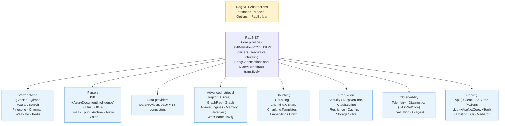

# Rag.NET Documentation

Rag.NET is a modular Retrieval-Augmented Generation (RAG) pipeline library for .NET, built on [Microsoft.Extensions.AI](https://devblogs.microsoft.com/dotnet/introducing-microsoft-extensions-ai-preview/) abstractions. These docs cover every layer from first setup to production-grade extensions.

## Pages

| Page | What it covers |
|------|---------------|
| [Why RAG?](why-rag.md) | What RAG is, the problem it solves, and when Rag.NET is the right tool |
| [Getting Started](getting-started.md) | Dependency injection setup, ingesting a document, and running a Q&A loop |
| [Positioning](positioning.md) | Where Rag.NET sits against Semantic Kernel, LangChain, LlamaIndex and Haystack — and where it loses |
| [Architecture](guide/architecture.md) | Pipeline internals, data-flow diagram, all interfaces and core models |
| [Ingestion](guide/ingestion.md) | Parsers, `DocumentMetadata`, `IngestionOptions`, progress reporting |
| [Data Providers](guide/data-providers.md) | Cloud storage and web connectors; OAuth token management; delta ingestion |
| [Chunking](guide/chunking.md) | `FixedSize`, `Recursive`, and `TokenAware` strategies with trade-off table |
| [Retrieval](guide/retrieval.md) | `RetrievalOptions`, semantic search, hybrid BM25+RRF search, metadata filtering |
| [Post-Retrieval](guide/post-retrieval.md) | Lost-in-the-Middle reordering and redundancy filtering |
| [Conversational Memory](guide/memory.md) | In-session history trimming, token-budget management, and persistent cross-session recall |
| [Vector Stores](guide/vector-stores.md) | pgvector, Qdrant, Azure AI Search; hybrid search support matrix |
| [Evaluation](guide/evaluation.md) | `EmbeddingDistanceEvaluator`, `EvaluationSample`, score interpretation |
| [Observability](guide/observability.md) | `ILogger` structured logging, OpenTelemetry `ActivitySource`, Polly resilience |
| [Extending](guide/extending.md) | Implementing `IDocumentParser`, `IVectorStore`, `IChunkingStrategy` |
| [Mediator](guide/mediator.md) | Dispatching ingest/retrieve/delete commands via `Rag.NET.Mediator` and ZeroAlloc.Mediator |
| [OSS Libraries](reference/oss-libraries.md) | Every open-source dependency used, where it is used, and why |
| [Answer Engines](answer-engines.md) | MapReduce, Refine, and Dispatching answer engine strategies |
| [Query Techniques](query-techniques.md) | HyDE and Multi-Query retrieval expansion |

## Quick links

- Sample applications: `samples/Rag.NET.Sample` — interactive console app (PgVector, Ollama/OpenAI)
  — and `samples/Rag.NET.QuickStart` — a config-driven walkthrough built on `Rag.NET.Hosting`
- Benchmark results: [benchmarks.md](reference/benchmarks.md)
- How Rag.NET compares: [quality and cost](reference/library-comparison.md) (measured) and
  [scope](reference/library-comparison-scope.md) (read, cited per claim)
- Feature roadmap and design notes: `docs/plans/`
- GitHub README: covers the quick-start and package list

## Package layout

Rag.NET ships as 73 packages so that a pipeline downloads only the dependencies it actually
uses. The shape is three layers — abstractions, core, and a satellite per opt-in feature — and
[Choosing packages](guide/choosing-packages.md) walks through which two or three are yours.

### Core

| NuGet package | Contents |
|--------------|----------|
| `Rag.NET` | Core pipeline, Text/Markdown/CSV/JSON parsers, `RecursiveChunkingStrategy`, in-memory vector store |
| `Rag.NET.Abstractions` | Interfaces, models and options — no implementations, no heavy dependencies. Arrives with core |
| `Rag.NET.QueryTechniques` | [HyDE, multi-query expansion and contextual compression](query-techniques.md). Arrives with core |

### Chunking

| NuGet package | Contents |
|--------------|----------|
| `Rag.NET.Chunking` | Hierarchical-merge, code-aware, late, proposition, token-aware and embedding-based semantic chunking |
| `Rag.NET.Chunking.CSharp` | `CSharpChunkingStrategy` — Roslyn-based semantic chunking for C# source |
| `Rag.NET.Chunking.Templates` | Domain templates: Legal, Book, Academic Paper, Q&A Pairs, Email, Résumé |
| `Rag.NET.Embeddings.Onnx` | ONNX Runtime token-level embeddings, which late chunking needs |

### Vector stores

| NuGet package | Contents |
|--------------|----------|
| `Rag.NET.VectorStores.PgVector` | PostgreSQL + pgvector, with sparse-vector support |
| `Rag.NET.VectorStores.Qdrant` | Qdrant |
| `Rag.NET.VectorStores.AzureAISearch` | Azure AI Search, with native hybrid search |
| `Rag.NET.VectorStores.Pinecone` | Pinecone |
| `Rag.NET.VectorStores.Chroma` | Chroma |
| `Rag.NET.VectorStores.Weaviate` | Weaviate |
| `Rag.NET.VectorStores.Redis` | Redis (RediSearch) |

### Parsers

| NuGet package | Contents |
|--------------|----------|
| `Rag.NET.Parsers.Pdf` | PDF parser, with table extraction and Tesseract OCR |
| `Rag.NET.Parsers.Pdf.AzureDocumentIntelligence` | Whole-document OCR engine for the PDF parser (paid, per page) |
| `Rag.NET.Parsers.Html` | HTML parser (AngleSharp) |
| `Rag.NET.Parsers.Office` | Word `.docx`, Excel `.xlsx` and PowerPoint `.pptx` in one package (OpenXml) |
| `Rag.NET.Parsers.Email` | EML and MSG email parser (MimeKit) |
| `Rag.NET.Parsers.Epub` | EPUB parser |
| `Rag.NET.Parsers.Archive` | ZIP archive parser — parses each entry with whichever parser claims it |
| `Rag.NET.Parsers.Audio` | WAV/MP3/FLAC transcription via Whisper.net (local, no API key) |
| `Rag.NET.Parsers.Vision` | Image and video description via a vision LLM and FFMpeg |

### Data providers

| NuGet package | Contents |
|--------------|----------|
| `Rag.NET.DataProviders` | Shared OAuth, polling and watermark infrastructure. Arrives with any connector |
| `Rag.NET.DataProviders.Web` | Web crawler, sitemap loader, RSS/Atom feed loader |
| `Rag.NET.DataProviders.Microsoft365` | Exchange/Outlook mail, Teams, OneDrive and SharePoint via Microsoft Graph |
| `Rag.NET.DataProviders.AzureBlob` | Azure Blob Storage — ETag/LastModified delta sync |
| `Rag.NET.DataProviders.GoogleDrive` | Google Drive — pageToken change stream |
| `Rag.NET.DataProviders.Dropbox` | Dropbox — cursor-based delta sync |
| `Rag.NET.DataProviders.Box` | Box — events cursor delta sync |
| `Rag.NET.DataProviders.Confluence` | Confluence pages via REST API |
| `Rag.NET.DataProviders.Jira` | Jira issues via REST API |
| `Rag.NET.DataProviders.Notion` | Notion pages and blocks via REST API |
| `Rag.NET.DataProviders.Asana` | Asana tasks and subtasks via REST API |
| `Rag.NET.DataProviders.Linear` | Linear issues via GraphQL API |
| `Rag.NET.DataProviders.Slack` | Slack channel messages via REST API |
| `Rag.NET.DataProviders.Gmail` | Gmail messages via IMAP (MailKit) |
| `Rag.NET.DataProviders.GitHub` | GitHub repository files via Octokit |
| `Rag.NET.DataProviders.GitLab` | GitLab repository files via NGitLab |
| `Rag.NET.DataProviders.Bitbucket` | Bitbucket repository files via REST API |
| `Rag.NET.DataProviders.Zendesk` | Zendesk tickets and help-centre articles |
| `Rag.NET.DataProviders.Airtable` | Airtable rows and attachments |
| `Rag.NET.Ingestion.AzureServiceBus` | Consumes a queue or subscription, ingests each message end to end, and settles it (complete / abandon / dead-letter) |

### Advanced retrieval

| NuGet package | Contents |
|--------------|----------|
| `Rag.NET.Raptor` | [RAPTOR](guide/raptor.md) — recursive abstractive tree summarisation, corpus-scoped by default |
| `Rag.NET.Raptor.Store` | Persistent leaf-chunk storage, which corpus-level RAPTOR clustering requires |
| `Rag.NET.GraphRag` | [GraphRAG](guide/graphrag.md) — entity extraction, community detection, local and global search, Mind-Map Extractor |
| `Rag.NET.Graph` | Standalone graph library — Leiden community detection, `IGraphStore` |
| `Rag.NET.AnswerEngines` | MapReduce, Refine, FLARE and Dispatching [answer engines](answer-engines.md) |
| `Rag.NET.Memory` | Persistent SQLite-backed [cross-session conversation memory](guide/memory.md) |
| `Rag.NET.Reranking.Cohere` | `CohereReranker` — hosted cross-encoder reranking |
| `Rag.NET.Reranking.Onnx` | `OnnxReranker` — local ONNX cross-encoder reranking (no API key) |
| `Rag.NET.WebSearch.Tavily` | Tavily web search, the corrective-RAG (CRAG) fallback source |

### Production

| NuGet package | Contents |
|--------------|----------|
| `Rag.NET.Security` | [Prompt-injection defence in depth](guide/security.md) — chunk and query sanitisation, retrieval guards, prompt hardening, PII detection, RBAC |
| `Rag.NET.Security.AspNetCore` | Binds `ICallerContext` to `ClaimsPrincipal` |
| `Rag.NET.Security.Audit.Sqlite` | SQLite-backed audit log, split out so Security carries no native binary |
| `Rag.NET.Resilience` | [Polly retry and circuit-breaking](guide/resilience.md), token-bucket rate limiting, multi-provider chat fallback chain |
| `Rag.NET.Caching` | `UseCaching()` — the HybridCache implementation behind the embedding and result caches |
| `Rag.NET.Storage.Sqlite` | BM25 and parent-chunk persistence, document sidecar, content-hash record manager, embedding-version store, persistent cost ledger |

### Observability and evaluation

| NuGet package | Contents |
|--------------|----------|
| `Rag.NET.Telemetry` | [`AddRagNetInstrumentation()`](reference/opentelemetry.md) — OpenTelemetry SDK wiring, so core and its satellites take no SDK dependency |
| `Rag.NET.Diagnostics` | [In-memory pipeline traces](guide/diagnostics.md) — the last N executions with chunk scores, stage latencies and guard actions |
| `Rag.NET.Diagnostics.AspNetCore` | Opt-in `MapRagNetTrace()` HTTP endpoint for those traces |
| `Rag.NET.Evaluation` | [LLM-judge and embedding-distance evaluators](guide/evaluation.md), A/B comparison with confidence intervals, dataset generation, [shadow capture](guide/shadow-mode.md) |
| `Rag.NET.Evaluation.Ragas` | RAGAS-style metrics — faithfulness, answer relevancy, context precision and recall |

### Serving and integration

| NuGet package | Contents |
|--------------|----------|
| `Rag.NET.Api` | ASP.NET Core REST API over a pipeline |
| `Rag.NET.Api.Client` | `IRagPipeline` implemented over HTTP against that API |
| `Rag.NET.Api.Grpc` | gRPC service over a pipeline |
| `Rag.NET.Api.Grpc.Client` | `IRagPipeline` implemented over gRPC against that service |
| `Rag.NET.Mcp` | [Model Context Protocol server](guide/mcp.mdx) exposing a pipeline as MCP tools |
| `Rag.NET.Mcp.AspNetCore` | HTTP transport for the MCP server, which refuses to serve an unauthenticated write surface |
| `Rag.NET.Mcp.Tool` | Self-contained MCP server as a dotnet global tool, configured entirely from `appsettings.json` |
| `Rag.NET.Cli` | `ragnet` global tool — ingest into, and query, a configured pipeline |
| `Rag.NET.Hosting` | Configuration-driven pipeline wiring for an executable |
| `Rag.NET.Mediator` | [ZeroAlloc.Mediator integration](guide/mediator.md) — dispatch ingest/retrieve/delete via `IMediator` |

## Requirements

- .NET 10 or later
- A compatible embedding provider (OpenAI, Azure OpenAI, Ollama, etc.)
- A supported vector store (PostgreSQL+pgvector, Qdrant, or Azure AI Search)
