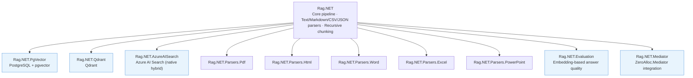

# Rag.NET Documentation

Rag.NET is a modular Retrieval-Augmented Generation (RAG) pipeline library for .NET, built on [Microsoft.Extensions.AI](https://devblogs.microsoft.com/dotnet/introducing-microsoft-extensions-ai-preview/) abstractions. These docs cover every layer from first setup to production-grade extensions.

## Pages

| Page | What it covers |
|------|---------------|
| [Why RAG?](why-rag.md) | What RAG is, the problem it solves, and when Rag.NET is the right tool |
| [Getting Started](getting-started.md) | Dependency injection setup, ingesting a document, and running a Q&A loop |
| [Architecture](architecture.md) | Pipeline internals, data-flow diagram, all interfaces and core models |
| [Ingestion](ingestion.md) | Parsers, `DocumentMetadata`, `IngestionOptions`, progress reporting |
| [Chunking](chunking.md) | `FixedSize`, `Recursive`, and `TokenAware` strategies with trade-off table |
| [Retrieval](retrieval.md) | `RetrievalOptions`, semantic search, hybrid BM25+RRF search, metadata filtering |
| [Post-Retrieval](post-retrieval.md) | Lost-in-the-Middle reordering and redundancy filtering |
| [Vector Stores](vector-stores.md) | pgvector, Qdrant, Azure AI Search; hybrid search support matrix |
| [Evaluation](evaluation.md) | `EmbeddingDistanceEvaluator`, `EvaluationSample`, score interpretation |
| [Observability](observability.md) | `ILogger` structured logging, OpenTelemetry `ActivitySource`, Polly resilience |
| [Extending](extending.md) | Implementing `IDocumentParser`, `IVectorStore`, `IChunkingStrategy` |
| [Mediator](mediator.md) | Dispatching ingest/retrieve/delete commands via `Rag.NET.Mediator` and ZeroAlloc.Mediator |
| [OSS Libraries](oss-libraries.md) | Every open-source dependency used, where it is used, and why |

## Quick links

- Sample application: `samples/Rag.NET.Sample` — interactive console app with Ollama and OpenAI support
- Benchmark results: [benchmarks.md](benchmarks.md)
- Feature roadmap and design notes: `docs/plans/`
- GitHub README: covers the quick-start and package list

## Package layout

| NuGet package | Contents |
|--------------|----------|
| `Rag.NET` | Core pipeline, abstractions, Text/Markdown/CSV/JSON parsers, Recursive chunking |
| `Rag.NET.PgVector` | PostgreSQL + pgvector vector store |
| `Rag.NET.Qdrant` | Qdrant vector store |
| `Rag.NET.AzureAISearch` | Azure AI Search vector store with native hybrid search |
| `Rag.NET.Parsers.Pdf` | PDF parser |
| `Rag.NET.Parsers.Html` | HTML parser (AngleSharp) |
| `Rag.NET.Parsers.Word` | Word `.docx` parser (OpenXml) |
| `Rag.NET.Parsers.Excel` | Excel `.xlsx` parser (OpenXml) |
| `Rag.NET.Parsers.PowerPoint` | PowerPoint `.pptx` parser (OpenXml) |
| `Rag.NET.Evaluation` | Answer-quality evaluation via embedding cosine similarity |
| `Rag.NET.Mediator` | ZeroAlloc.Mediator integration — dispatch ingest/retrieve/delete via `IMediator` |

## Requirements

- .NET 10 or later
- A compatible embedding provider (OpenAI, Azure OpenAI, Ollama, etc.)
- A supported vector store (PostgreSQL+pgvector, Qdrant, or Azure AI Search)
