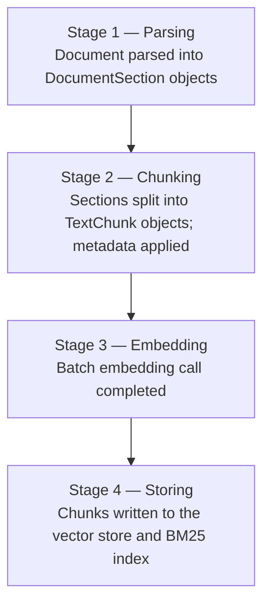

# Ingestion

Ingestion is the process of taking a raw document, converting it to searchable text, splitting it into chunks, generating embeddings, and writing everything to the vector store. Understanding each sub-stage helps you choose the right parser, configure metadata correctly, and track progress in production.

## The four stages

`IngestAsync` progresses through four sequential stages. If you pass an `IProgress<IngestionProgress>`, a callback fires at the end of each stage:



| Stage | `IngestionProgressStage` value | What happened |
|-------|-------------------------------|---------------|
| 1 | `Parsing` | Document parsed into `DocumentSection` objects |
| 2 | `Chunking` | Sections split into `TextChunk` objects; metadata applied |
| 3 | `Embedding` | Batch embedding call completed |
| 4 | `Storing` | Chunks written to the vector store and BM25 index |

## `DocumentMetadata`

Every ingestion call requires a `DocumentMetadata` record:

```csharp
public sealed record DocumentMetadata
{
    public required string DocumentId { get; init; }
    public required string FileName   { get; init; }
    public string? ContentType        { get; init; }
    public IDictionary<string, string> Tags { get; init; }
        = new Dictionary<string, string>(StringComparer.Ordinal);
}
```

| Property | Purpose |
|----------|---------|
| `DocumentId` | Stable identifier for the document. Used to delete or overwrite all its chunks. Must be unique per document across your corpus. |
| `FileName` | Human-readable file name. Written into every chunk's `Metadata["file_name"]`. |
| `ContentType` | MIME type used for parser selection (e.g., `"application/pdf"`). Defaults to `"text/plain"` when `null`. |
| `Tags` | Arbitrary key-value pairs propagated into every chunk's `Metadata`. Use these for [metadata filtering](retrieval.md#metadata-filtering) at query time. |

```csharp
var metadata = new DocumentMetadata
{
    DocumentId  = "policy-hr-001",
    FileName    = "hr-policy.docx",
    ContentType = "application/vnd.openxmlformats-officedocument.wordprocessingml.document",
    Tags = new Dictionary<string, string>
    {
        ["category"] = "hr",
        ["version"]  = "2024-01",
    },
};
```

After ingestion, every `TextChunk.Metadata` for this document will contain:
- `"document_id"` → `"policy-hr-001"`
- `"file_name"` → `"hr-policy.docx"`
- `"category"` → `"hr"`
- `"version"` → `"2024-01"`
- Plus any heading metadata injected by the parser (see below)

## `IngestionOptions`

```csharp
public sealed class IngestionOptions
{
    public bool Overwrite { get; set; }
}
```

When `Overwrite = true`, the pipeline calls `IVectorStore.DeleteByDocumentIdAsync` and removes the document from the BM25 index before storing new chunks. This is the idempotent update pattern:

```csharp
await pipeline.IngestAsync(stream, metadata,
    options: new IngestionOptions { Overwrite = true });
```

Without `Overwrite`, re-ingesting the same `DocumentId` accumulates duplicate chunks. Set it on every refresh operation.

> Concurrent ingestion of the same `DocumentId` is not supported. The BM25 index update and vector store write are not transactional. Serialise ingestion per document at the application layer.

## Parsers

Parsers implement `IDocumentParser`. The pipeline selects the first registered parser whose `CanParse(contentType)` returns `true`.

### Built-in parsers (always available in `Rag.NET` core)

| Content type | Parser | Notes |
|-------------|--------|-------|
| `text/plain` | `TextDocumentParser` | Produces a single `DocumentSection` |
| `text/markdown` | `MarkdownDocumentParser` | Heading-aware: extracts `HeadingLevel` and `Heading` per section |

### Optional parsers (separate packages)

| Content type | Package | Notes |
|-------------|---------|-------|
| `application/pdf` | `Rag.NET.Parsers.Pdf` | |
| `text/html` | `Rag.NET.Parsers.Html` | Heading-aware (AngleSharp) |
| `application/vnd.openxmlformats-officedocument.wordprocessingml.document` | `Rag.NET.Parsers.Word` | OpenXml |
| `application/vnd.openxmlformats-officedocument.spreadsheetml.sheet` | `Rag.NET.Parsers.Excel` | OpenXml |
| `application/vnd.openxmlformats-officedocument.presentationml.presentation` | `Rag.NET.Parsers.PowerPoint` | OpenXml |
| `text/csv` | (core) `CsvDocumentParser` | |
| `application/json` | (core) `JsonDocumentParser` | |

Register additional parsers via `AddParser<T>()` or by calling the package-specific extension method:

```csharp
services.AddRagNet(rag => rag
    .AddPdfParser()
    .AddHtmlParser()
    .AddWordParser()
    .AddExcelParser()
    .AddPowerPointParser());
```

To register your own parser implementation directly:

```csharp
services.AddRagNet(rag => rag
    .AddParser<MyXmlParser>());
```

## `DocumentSection`

Parsers produce a stream of `DocumentSection` records:

```csharp
public sealed record DocumentSection
{
    public required string Text        { get; init; }
    public required string DocumentId  { get; init; }
    public int? HeadingLevel           { get; init; }  // 1–6 (H1–H6), null if no heading
    public string? Heading             { get; init; }  // heading text, null if no heading
    public int? PageNumber             { get; init; }  // null for non-paginated formats
    public int SectionIndex            { get; init; }
}
```

### Heading-aware metadata

When `HeadingLevel` and `Heading` are set (by the Markdown or HTML parser), the pipeline automatically builds a breadcrumb trail and writes three entries into every `TextChunk.Metadata` produced from that section:

| Key | Example value |
|-----|--------------|
| `heading` | `"Section 2"` |
| `heading_level` | `"2"` |
| `heading_breadcrumb` | `"Chapter 1 > Section 2"` |

The breadcrumb is built by concatenating all ancestor headings in order, separated by ` > `. A new heading at level N resets all headings at levels N+1 through 6.

These metadata keys can be used for [metadata filtering](retrieval.md#metadata-filtering).

## Progress reporting

Pass any `IProgress<IngestionProgress>` to receive stage-completion callbacks:

```csharp
public sealed record IngestionProgress
{
    public required IngestionProgressStage Stage { get; init; }
    public required string DocumentId            { get; init; }
    public int? Current                          { get; init; }
    public int? Total                            { get; init; }
    public required string Message               { get; init; }
}
```

```csharp
var progress = new Progress<IngestionProgress>(p =>
    Console.WriteLine($"[{p.Stage}] {p.Message} ({p.Current}/{p.Total})"));

using var stream = File.OpenRead("report.pdf");
var result = await pipeline.IngestAsync(stream, metadata, progress: progress);
```

Example output:

```
[Parsing] Parsing complete (/)
[Chunking] Chunked into 42 chunks (42/42)
[Embedding] Generated 42 embeddings (42/42)
[Storing] Stored 42 chunks (42/42)
```

`Current` and `Total` are `null` for the `Parsing` stage because the total section count is not known until parsing completes.

## Ingestion return value

```csharp
public sealed record IngestionResult
{
    public required string DocumentId  { get; init; }
    public required int ChunksStored   { get; init; }
}
```

`ChunksStored` can be 0 if the document parsed to no content (empty file or all-whitespace input). The pipeline short-circuits before the embedding call in that case.

## Performance notes

See [benchmarks](benchmarks.md) for detailed measurements. Key takeaways:

- Parsing and chunking of a 50 KB document completes in under 400 µs (mocked embedder).
- Real ingestion time is dominated by the embedding API call, typically 50–500 ms per batch.
- Use `Overwrite = true` and a stable `DocumentId` for incremental refreshes to avoid accumulating stale chunks.
