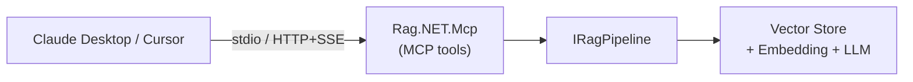

# MCP Server

Rag.NET can be exposed as a [Model Context Protocol](https://modelcontextprotocol.io/) (MCP) server, making it consumable by any MCP-compatible host — Claude Desktop, Cursor, LM Studio, and others — without custom integration code.



## Packages

| Package | Purpose |
|---|---|
| `Rag.NET.Mcp` | MCP tools (`rag_retrieve`, `rag_ask`, `rag_ingest`) — resolves `IRagPipeline` from DI |
| `Rag.NET.Api` | ASP.NET Core REST API exposing `IRagPipeline` as HTTP endpoints |
| `Rag.NET.Api.Client` | `IRagPipeline` implementation that calls `Rag.NET.Api` over HTTP |
| `Rag.NET.Api.Grpc` | gRPC service exposing `IRagPipeline` |
| `Rag.NET.Api.Grpc.Client` | `IRagPipeline` implementation that calls `Rag.NET.Api.Grpc` over gRPC |
| `Rag.NET.Mcp.Tool` | `ragnet-mcp` dotnet global tool — self-contained, no code required |

---

## Deployment patterns

### Pattern A — In-process (recommended)

The MCP server and the RAG pipeline run in the same process. `Rag.NET.Mcp` resolves `IRagPipeline` directly from DI — no extra HTTP hop, no auth between MCP and the pipeline.

```bash
dotnet add package Rag.NET.Mcp
dotnet add package ModelContextProtocol.AspNetCore
```

```csharp
var builder = WebApplication.CreateBuilder(args);

// 1. Register AI services (embedding + chat)
builder.Services.AddEmbeddingGenerator(...);
builder.Services.AddChatClient(...);

// 2. Configure Rag.NET pipeline
builder.Services.AddRagNet(rag => rag
    .UsePgVector("Host=localhost;Database=ragdb;Username=postgres;Password=secret",
                 vectorDimensions: 1536));

// 3. Add MCP server on top — resolves IRagPipeline from the same DI container
builder.Services
    .AddRagNetMcpServer()
    .WithStdioTransport()        // for Claude Desktop (subprocess)
    .WithHttpTransport(5050)     // for multi-client HTTP/SSE
    .WithApiKey("your-secret");  // HTTP transport auth (omit for stdio)

var app = builder.Build();
app.MapMcp("/mcp");
await app.RunAsync();
```

### Pattern B — Shared backend (REST)

Run one Rag.NET REST backend and point multiple MCP server instances at it. Useful when you want a single, centrally-managed knowledge base.

```
Claude Desktop ──┐
Cursor           ├──→ MCP Server (Rag.NET.Mcp + Rag.NET.Api.Client)
LM Studio ───────┘            ↓  X-Api-Key
                     Backend (Rag.NET + Rag.NET.Api)
```

**Backend app:**

```bash
dotnet add package Rag.NET
dotnet add package Rag.NET.Api
```

```csharp
builder.Services.AddRagNet(...);
builder.Services.AddRagNetApi(o => o.ApiKeys = ["key-for-mcp-1", "key-for-mcp-2"]);
app.UseRagNetApiAuthentication();
app.MapRagNetApi();
```

**MCP proxy app:**

```bash
dotnet add package Rag.NET.Mcp
dotnet add package Rag.NET.Api.Client
```

```csharp
builder.Services.AddRagNetApiClient(o =>
{
    o.BaseUrl = "https://rag-backend.internal";
    o.ApiKey  = "key-for-mcp-1";
});
builder.Services
    .AddRagNetMcpServer()
    .WithStdioTransport();
```

### Pattern C — Shared backend (gRPC)

Same as Pattern B but using gRPC for the MCP server → backend hop. Preferred for internal service-to-service communication: strongly typed, lower overhead, and native server-streaming.

```bash
# Backend
dotnet add package Rag.NET.Api.Grpc

# MCP proxy
dotnet add package Rag.NET.Mcp
dotnet add package Rag.NET.Api.Grpc.Client
```

```csharp
// Backend
builder.Services.AddRagNetGrpcApi(o => o.ApiKeys = ["key-for-mcp-1"]);
app.MapRagNetGrpcApi();

// MCP proxy
builder.Services.AddRagNetGrpcClient(o =>
{
    o.BaseUrl = "https://rag-backend.internal:5001";
    o.ApiKey  = "key-for-mcp-1";
});
builder.Services.AddRagNetMcpServer().WithStdioTransport();
```

### Pattern D — dotnet global tool (no code required)

Install and run without writing any code. You supply an `appsettings.json` with your pipeline configuration (embedding provider, vector store, chat client) and the tool starts the MCP server.

```bash
dotnet tool install -g Rag.NET.Mcp.Tool

# stdio (Claude Desktop subprocess)
ragnet-mcp

# HTTP/SSE on port 5050
ragnet-mcp --transport http --port 5050 --api-key your-secret
```

!!! note
    The tool is a host scaffold — `IRagPipeline` is **not** pre-configured. Add your embedding, vector store, and chat client registrations to the generated `Program.cs` before running.

---

## MCP tools

Three tools are exposed to the LLM host:

### `rag_retrieve`

Search the knowledge base and return ranked chunks.

| Parameter | Type | Default | Description |
|---|---|---|---|
| `query` | string | — | The natural-language query |
| `topK` | int | 5 | Maximum number of results |
| `useHybrid` | bool | true | BM25 + vector hybrid search |

Returns a JSON array of `SearchResult` objects with `Chunk.Text`, `Chunk.DocumentId`, `Chunk.ChunkIndex`, `Score`, and `Chunk.Metadata`.

### `rag_ask`

Retrieve relevant chunks and generate a grounded answer.

| Parameter | Type | Default | Description |
|---|---|---|---|
| `query` | string | — | The question |
| `topK` | int | 5 | Chunks to retrieve |
| `useHybrid` | bool | true | Hybrid search |

Returns a JSON object with `Answer` (string) and `Sources` (array of `SearchResult`).

### `rag_ingest`

Add a document to the knowledge base at runtime.

| Parameter | Type | Default | Description |
|---|---|---|---|
| `content` | string | — | Document text (inline) |
| `documentId` | string? | auto | Stable ID for updates/deletes |
| `fileName` | string? | `{id}.txt` | Used to infer content type |
| `contentType` | string? | — | MIME type override |
| `tags` | string[]? | — | Metadata as `key=value` pairs, e.g. `["author=Alice", "year=2024"]` |

Returns `{ "DocumentId": "...", "ChunksStored": N }`.

---

## Claude Desktop configuration

Add Rag.NET as an MCP server in Claude Desktop's config file.

**macOS:** `~/Library/Application Support/Claude/claude_desktop_config.json`
**Windows:** `%APPDATA%\Claude\claude_desktop_config.json`

=== "In-process (stdio)"

    ```json
    {
      "mcpServers": {
        "rag-net": {
          "command": "dotnet",
          "args": ["run", "--project", "/path/to/your/RagMcpHost"],
          "env": {}
        }
      }
    }
    ```

=== "dotnet global tool (stdio)"

    ```json
    {
      "mcpServers": {
        "rag-net": {
          "command": "ragnet-mcp",
          "args": [],
          "env": {
            "RAGNET_MCP_API_KEY": "your-secret"
          }
        }
      }
    }
    ```

=== "HTTP backend"

    ```json
    {
      "mcpServers": {
        "rag-net": {
          "url": "http://localhost:5050/mcp",
          "headers": {
            "X-Api-Key": "your-secret"
          }
        }
      }
    }
    ```

---

## Authentication

| Transport | Mechanism |
|---|---|
| stdio | None — process boundary is the security boundary |
| HTTP/SSE | `X-Api-Key` header; configure `ApiKeys` array for rotation and per-client revocation |
| gRPC | `x-api-key` metadata header; validated by a server-side interceptor |

Multiple keys are supported for rotation without downtime:

```csharp
services.AddRagNetApi(o => o.ApiKeys = ["key-a", "key-b"]);
// Rotate: add "key-c", redeploy, then remove "key-a"
```

---

## REST API endpoints

When using `Rag.NET.Api`, the following endpoints are available:

| Method | Path | Maps to |
|---|---|---|
| `POST` | `/rag/ingest` | `IngestAsync` |
| `POST` | `/rag/retrieve` | `RetrieveAsync` |
| `POST` | `/rag/ask` | `AskAsync` |
| `GET` | `/rag/ask/stream?query=...` | `AskStreamingAsync` (SSE) |
| `DELETE` | `/rag/documents/{id}` | `DeleteAsync` |

The route prefix `/rag` is configurable via `RagApiOptions.RoutePrefix`.
