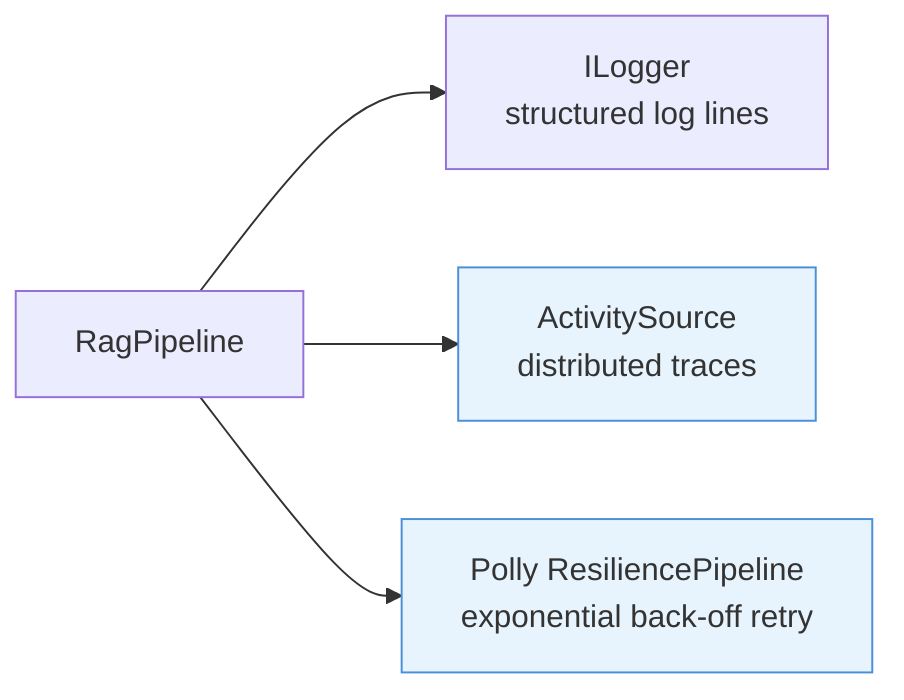

# Observability

Production RAG pipelines need structured logging, distributed traces, and resilience against transient failures in external APIs. Rag.NET integrates with the standard .NET observability stack — `Microsoft.Extensions.Logging`, OpenTelemetry `ActivitySource`, and Polly — so you can wire up your existing infrastructure without additional adapters.

## `ILogger` integration

Logging is distributed across the decorator pipeline. Each component accepts an optional `ILogger` via its constructor and emits structured log messages for its operations. All messages use high-performance source-generated `[LoggerMessage]` methods.

### Log messages

| Component | Level | Method | Message template |
|-----------|-------|--------|-----------------|
| `DocumentIngestor` | `Information` | `IngestStarted` | `Ingesting document {DocumentId} ({ContentType})` |
| `DocumentIngestor` | `Information` | `IngestCompleted` | `Ingested document {DocumentId}: {ChunksStored} chunk(s) stored` |
| `DocumentIngestor` | `Error` | `IngestFailed` | `Failed to ingest document {DocumentId}` (includes exception) |
| `VectorStoreRetriever` | `Debug` | `RetrieveStarted` | `Retrieving chunks (TopK={TopK})` |
| `VectorStoreRetriever` | `Debug` | `RetrieveCompleted` | `Retrieved {ResultCount} chunk(s)` |
| `MultiQueryRetriever` | `Warning` | `QueryExpansionFailed` | `Query expansion failed for '{Query}'` |
| `RerankingRetriever` | `Warning` | — | `Reranking failed, returning unranked results` |
| `HydeRetriever` | `Warning` | `HydeGenerationFailed` | `HyDE generation failed for query '{Query}', falling back to original query embedding` |
| `RedundancyFilterRetriever` | `Warning` | — | `Redundancy filtering failed, returning unfiltered results` |
| `EmbeddingCacheRetriever` | `Debug` | `EmbeddingCacheHit` | `Embedding cache hit for query '{Query}'` |
| `ResultCacheRetriever` | `Debug` | `ResultCacheHit` | `Result cache hit for query '{Query}'` |
| `EmbeddingCacheRetriever` | `Warning` | `EmbeddingCacheFailed` | `Embedding cache operation failed for query '{Query}'` |
| `ResultCacheRetriever` | `Warning` | `ResultCacheFailed` | `Result cache operation failed for query '{Query}'` |
| `ParentDocumentRetriever` | `Debug` | `ParentDocumentRetrieved` | `Parent document retrieved for query '{Query}': {ChildCount} children -> {ParentCount} parents` |
| `ParentDocumentRetriever` | `Warning` | `ParentDocumentFailed` | `Parent document lookup failed for query '{Query}', returning child chunks` |

### Setup

Register any `ILogger` provider. The decorators pick it up automatically:

```csharp
services.AddLogging(logging =>
{
    logging.AddConsole();
    logging.SetMinimumLevel(LogLevel.Debug);
});

services.AddRagNet(rag => rag.UsePgVector(connectionString));
```

With `Microsoft.Extensions.Logging.Console`, a retrieval call produces output similar to:

```
dbug: Rag.NET.Retrieval.VectorStoreRetriever[0]
      Retrieving chunks (TopK=5)
dbug: Rag.NET.Retrieval.VectorStoreRetriever[0]
      Retrieved 5 chunk(s)
```

No additional configuration is required. If no `ILogger` is provided, each component silently uses `NullLogger.Instance`.

## OpenTelemetry `ActivitySource`

The pipeline creates `Activity` spans for the three pipeline operations using an `ActivitySource` named `"Rag.NET"`. The source version is taken from the assembly version at startup.

### Activity names

| Operation | Activity name constant | Value |
|-----------|----------------------|-------|
| `IngestAsync` | `RagActivitySource.IngestActivity` | `"ingest"` |
| `RetrieveAsync` | `RagActivitySource.RetrieveActivity` | `"retrieve"` |
| `AskAsync` / `AskStreamingAsync` | `RagActivitySource.AskActivity` | `"ask"` |

### Setup with OpenTelemetry SDK

```bash
dotnet add package OpenTelemetry.Extensions.Hosting
dotnet add package OpenTelemetry.Exporter.Console   # or your preferred exporter
```

```csharp
using OpenTelemetry;
using OpenTelemetry.Trace;

services.AddOpenTelemetry()
    .WithTracing(tracing => tracing
        .AddSource("Rag.NET")           // subscribe to Rag.NET activities
        .AddConsoleExporter());         // or AddOtlpExporter(), AddZipkinExporter(), etc.
```

With this configuration every `IngestAsync`, `RetrieveAsync`, and `AskAsync` call produces a span that appears in your trace backend. Nest these calls inside your own application spans to get full request traces.

### Setup with Application Insights

```csharp
services.AddApplicationInsightsTelemetry();
// Application Insights auto-collects all ActivitySource spans registered in the process.
// No additional AddSource("Rag.NET") call is required with the Azure Monitor distro.
```

## Polly resilience pipeline

Embedding API calls and vector store writes are remote operations subject to transient failures (rate limits, timeouts, network blips). `RagBuilder.ConfigureResilience` wraps the pipeline with a named [Polly](https://github.com/App-vNext/Polly) `ResiliencePipeline`.

### Default policy

When called without arguments, a retry policy with exponential back-off and jitter is applied:

- Maximum 3 retry attempts
- Base delay: 1 second
- Back-off type: exponential
- Jitter: enabled

```csharp
services.AddRagNet(rag => rag
    .UsePgVector(connectionString)
    .ConfigureResilience());   // uses default exponential back-off retry
```

### Custom policy

Supply a delegate to configure the `ResiliencePipelineBuilder` yourself:

```csharp
using Polly;
using Polly.CircuitBreaker;
using Polly.Retry;

services.AddRagNet(rag => rag
    .UsePgVector(connectionString)
    .ConfigureResilience(builder => builder
        .AddRetry(new RetryStrategyOptions
        {
            MaxRetryAttempts = 5,
            Delay            = TimeSpan.FromMilliseconds(500),
            BackoffType      = DelayBackoffType.Exponential,
            UseJitter        = true,
        })
        .AddCircuitBreaker(new CircuitBreakerStrategyOptions
        {
            FailureRatio          = 0.5,
            SamplingDuration      = TimeSpan.FromSeconds(30),
            MinimumThroughput     = 10,
            BreakDuration         = TimeSpan.FromSeconds(15),
        })));
```

### How the pipeline is resolved

`ConfigureResilience` internally calls `services.AddResiliencePipeline("rag-net", ...)`. During `IRagPipeline` construction, `ServiceCollectionExtensions` resolves `ResiliencePipelineProvider<string>` from DI and retrieves the pipeline named `"rag-net"`. If `ConfigureResilience` was never called, `resiliencePipeline` is `null` and no retry wrapper is applied.

### Which calls are wrapped

The `ResiliencePipeline` instance is available to `RagPipeline` for wrapping embedding and vector store calls. If you need per-call resilience customisation (e.g., different timeouts for ingest vs. retrieval), wrap calls at the `IEmbeddingGenerator` or `IVectorStore` level using the `Microsoft.Extensions.AI` middleware pipeline instead.

## Combining all three



A production-ready observability setup:

```csharp
services.AddLogging(logging => logging
    .AddConsole()
    .SetMinimumLevel(LogLevel.Information));

services.AddOpenTelemetry()
    .WithTracing(tracing => tracing
        .AddSource("Rag.NET")
        .AddOtlpExporter());

services.AddRagNet(rag => rag
    .UsePgVector(connectionString)
    .AddPdfParser()
    .ConfigureResilience());
```

This gives you:
- Structured log lines for every ingestion and retrieval operation
- Distributed traces for `ingest`, `retrieve`, and `ask` spans, exportable to any OTLP-compatible backend (Jaeger, Grafana Tempo, Azure Monitor, etc.)
- Automatic retry with exponential back-off for transient API failures
