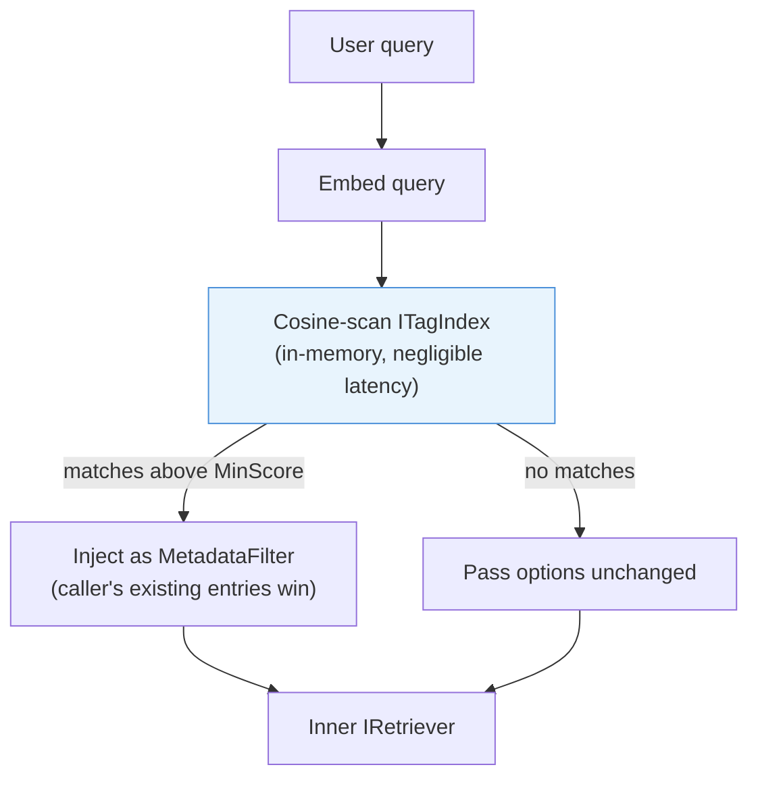

# Tag-Based Retrieval + Multi-Language Code Splitting — Implementation Plan

> **For Claude:** REQUIRED SUB-SKILL: Use superpowers:executing-plans to implement this plan task-by-task.

**Goal:** Add two independent features: (1) `TagRetriever` decorator that automatically injects `MetadataFilter` entries derived from semantic tag matching, and (2) `CodeChunkingStrategy` that splits code files at language-appropriate boundaries using per-language separator tables.

**Architecture:** Tag-Based Retrieval follows the existing `IRetriever` decorator pattern (same as `DeepResearchRetriever`). Tags are embedded at ingest time by a new `TagIngestionBehavior` and stored in `InMemoryTagIndex`. At query time `TagRetriever` cosine-scans the index and merges matched key-value pairs into `RetrievalOptions.MetadataFilter`. Code Splitting follows the existing `IChunkingStrategy` pattern (same as `RecursiveChunkingStrategy`) but parameterises the separator list on the detected language.

**Tech Stack:** `Microsoft.Extensions.AI.IEmbeddingGenerator`, `ZeroAlloc.Inject` (`[Singleton]`, `[Inject(Required = false)]`), `ReaderWriterLockSlim` for thread-safety, `Path.GetExtension` for language detection.

---

## Context you must read before starting

Read these files to understand the patterns you are following:

- [src/Rag.NET/Retrieval/DeepResearchRetriever.cs](src/Rag.NET/Retrieval/DeepResearchRetriever.cs) — decorator pattern for `IRetriever`
- [src/Rag.NET/Ingestion/Behaviors/MetadataBehavior.cs](src/Rag.NET/Ingestion/Behaviors/MetadataBehavior.cs) — how ingestion behaviors look; accesses `ctx.Metadata.Tags`
- [src/Rag.NET/Ingestion/Behaviors/LlmMetadataExtractionBehavior.cs](src/Rag.NET/Ingestion/Behaviors/LlmMetadataExtractionBehavior.cs) — `[Singleton]` + `[Inject(Required = false)]` no-op pattern
- [src/Rag.NET/Search/InMemoryBm25Index.cs](src/Rag.NET/Search/InMemoryBm25Index.cs) — `ReaderWriterLockSlim` thread-safety pattern
- [src/Rag.NET/Chunking/RecursiveChunkingStrategy.cs](src/Rag.NET/Chunking/RecursiveChunkingStrategy.cs) — recursive descent splitting algorithm
- [src/Rag.NET/DependencyInjection/ServiceCollectionExtensions.cs](src/Rag.NET/DependencyInjection/ServiceCollectionExtensions.cs) — `WireDeepResearch` to understand the decorator wiring pattern
- [src/Rag.NET/DependencyInjection/RagBuilder.cs](src/Rag.NET/DependencyInjection/RagBuilder.cs) — `UseDeepResearch` and `UseHyde` for the registration method pattern
- [src/Rag.NET/DependencyInjection/IngestionPipelineBuilder.cs](src/Rag.NET/DependencyInjection/IngestionPipelineBuilder.cs) — default behavior list; you need to insert `TagIngestionBehavior` here
- [src/Rag.NET/Models/Options/RetrievalOptions.cs](src/Rag.NET/Models/Options/RetrievalOptions.cs) — where to add `UseTagRetrieval = true`
- [docs/plans/2026-03-27-tag-retrieval-code-chunking-design.md](docs/plans/2026-03-27-tag-retrieval-code-chunking-design.md) — the approved design

---

## Task 1: `ITagIndex` and `InMemoryTagIndex`

**Files:**
- Create: `src/Rag.NET/Abstractions/ITagIndex.cs`
- Create: `src/Rag.NET/Search/InMemoryTagIndex.cs`
- Create: `tests/Rag.NET.Tests/Search/InMemoryTagIndexTests.cs`

### Step 1: Write the failing tests

```csharp
// tests/Rag.NET.Tests/Search/InMemoryTagIndexTests.cs
using Rag.NET.Abstractions;
using Rag.NET.Search;
using Xunit;

namespace Rag.NET.Tests.Search;

public class InMemoryTagIndexTests
{
    private static ReadOnlyMemory<float> Vec(params float[] v) => v;

    [Fact]
    public void Search_ReturnsMatchesAboveMinScore()
    {
        var index = new InMemoryTagIndex();
        index.Add("dept", "finance", Vec(1f, 0f));
        index.Add("dept", "legal",   Vec(0f, 1f));

        // Query close to "finance" (1,0)
        var results = index.Search(Vec(0.99f, 0.01f), minScore: 0.9);

        Assert.Single(results);
        Assert.Equal("finance", results[0].Value);
        Assert.Equal("dept",    results[0].Key);
    }

    [Fact]
    public void Search_OrderedByScoreDescending()
    {
        var index = new InMemoryTagIndex();
        index.Add("dept", "finance",   Vec(1f, 0f, 0f));
        index.Add("dept", "marketing", Vec(0.9f, 0.1f, 0f));

        var results = index.Search(Vec(1f, 0f, 0f), minScore: 0.0);

        Assert.True(results[0].Score >= results[1].Score);
    }

    [Fact]
    public void Add_Duplicate_SecondIsIgnored()
    {
        var index = new InMemoryTagIndex();
        index.Add("dept", "finance", Vec(1f, 0f));
        index.Add("dept", "finance", Vec(0f, 1f)); // different embedding — ignored

        // Search with vector (1,0) — only first embedding matters
        var results = index.Search(Vec(1f, 0f), minScore: 0.9);
        Assert.Single(results);
    }

    [Fact]
    public void Contains_ReturnsTrueAfterAdd()
    {
        var index = new InMemoryTagIndex();
        Assert.False(index.Contains("dept", "finance"));
        index.Add("dept", "finance", Vec(1f, 0f));
        Assert.True(index.Contains("dept", "finance"));
    }

    [Fact]
    public void Search_EmptyIndex_ReturnsEmpty()
    {
        var index = new InMemoryTagIndex();
        var results = index.Search(Vec(1f, 0f), minScore: 0.5);
        Assert.Empty(results);
    }
}
```

### Step 2: Run tests to verify they fail

```bash
dotnet test tests/Rag.NET.Tests/Rag.NET.Tests.csproj --filter "FullyQualifiedName~InMemoryTagIndex" -q
```

Expected: compile error — `InMemoryTagIndex` and `ITagIndex` do not exist yet.

### Step 3: Create `ITagIndex`

```csharp
// src/Rag.NET/Abstractions/ITagIndex.cs
namespace Rag.NET.Abstractions;

/// <summary>
/// In-memory index of tag value embeddings used by <c>TagRetriever</c> for automatic
/// metadata filter injection. Populated during ingestion by <c>TagIngestionBehavior</c>.
/// </summary>
public interface ITagIndex
{
    /// <summary>Returns true if <paramref name="key"/>+<paramref name="value"/> is already indexed.</summary>
    bool Contains(string key, string value);

    /// <summary>
    /// Stores the embedding for a tag key-value pair. No-op when already present.
    /// Thread-safe.
    /// </summary>
    void Add(string key, string value, ReadOnlyMemory<float> embedding);

    /// <summary>
    /// Returns all indexed (key, value) pairs whose cosine similarity to
    /// <paramref name="queryEmbedding"/> is at least <paramref name="minScore"/>,
    /// ordered by score descending. Thread-safe.
    /// </summary>
    IReadOnlyList<(string Key, string Value, double Score)> Search(
        ReadOnlyMemory<float> queryEmbedding, double minScore);
}
```

### Step 4: Create `InMemoryTagIndex`

```csharp
// src/Rag.NET/Search/InMemoryTagIndex.cs
using Rag.NET.Abstractions;

namespace Rag.NET.Search;

/// <summary>
/// Thread-safe in-memory store of tag value embeddings.
/// Deduplicates by (key, value) — second Add for the same pair is a no-op.
/// </summary>
public sealed class InMemoryTagIndex : ITagIndex
{
    private readonly Dictionary<(string Key, string Value), float[]> _entries = [];
    private readonly ReaderWriterLockSlim _lock = new();

    public bool Contains(string key, string value)
    {
        _lock.EnterReadLock();
        try   { return _entries.ContainsKey((key, value)); }
        finally { _lock.ExitReadLock(); }
    }

    public void Add(string key, string value, ReadOnlyMemory<float> embedding)
    {
        _lock.EnterWriteLock();
        try   { _entries.TryAdd((key, value), embedding.ToArray()); }
        finally { _lock.ExitWriteLock(); }
    }

    public IReadOnlyList<(string Key, string Value, double Score)> Search(
        ReadOnlyMemory<float> queryEmbedding, double minScore)
    {
        _lock.EnterReadLock();
        try
        {
            var results = new List<(string, string, double)>();
            var q = queryEmbedding.Span;
            foreach (var ((key, value), vec) in _entries)
            {
                var score = CosineSimilarity(q, vec);
                if (score >= minScore)
                    results.Add((key, value, score));
            }
            results.Sort((a, b) => b.Item3.CompareTo(a.Item3));
            return results;
        }
        finally { _lock.ExitReadLock(); }
    }

    private static double CosineSimilarity(ReadOnlySpan<float> a, float[] b)
    {
        double dot = 0, normA = 0, normB = 0;
        for (int i = 0; i < a.Length && i < b.Length; i++)
        {
            dot   += a[i] * b[i];
            normA += a[i] * a[i];
            normB += b[i] * b[i];
        }
        return normA == 0 || normB == 0 ? 0 : dot / (Math.Sqrt(normA) * Math.Sqrt(normB));
    }
}
```

### Step 5: Run tests to verify they pass

```bash
dotnet test tests/Rag.NET.Tests/Rag.NET.Tests.csproj --filter "FullyQualifiedName~InMemoryTagIndex" -q
```

Expected: `Passed! - Failed: 0, Passed: 5`

### Step 6: Commit

```bash
git add src/Rag.NET/Abstractions/ITagIndex.cs \
        src/Rag.NET/Search/InMemoryTagIndex.cs \
        tests/Rag.NET.Tests/Search/InMemoryTagIndexTests.cs
git commit -m "feat: add ITagIndex and InMemoryTagIndex"
```

---

## Task 2: `TagIngestionBehavior`

**Files:**
- Create: `src/Rag.NET/Ingestion/Behaviors/TagIngestionBehavior.cs`
- Create: `tests/Rag.NET.Tests/Ingestion/TagIngestionBehaviorTests.cs`
- Modify: `src/Rag.NET/DependencyInjection/IngestionPipelineBuilder.cs`

**Key pattern:** Follows `LlmMetadataExtractionBehavior` exactly — `[Singleton]` class with `[Inject(Required = false)]` properties. When `ITagIndex` is null, the behavior is a no-op. `ctx.Metadata.Tags` contains the document's tags (e.g., `department=finance`). Check `Contains` before embedding to avoid re-embedding tags already in the index.

### Step 1: Write the failing tests

```csharp
// tests/Rag.NET.Tests/Ingestion/TagIngestionBehaviorTests.cs
using Microsoft.Extensions.AI;
using NSubstitute;
using NSubstitute.ExceptionExtensions;
using Rag.NET.Abstractions;
using Rag.NET.Ingestion;
using Rag.NET.Ingestion.Behaviors;
using Rag.NET.Models;
using Xunit;

namespace Rag.NET.Tests.Ingestion;

public class TagIngestionBehaviorTests
{
    private static IngestionContext MakeCtx(Dictionary<string, string>? tags = null) =>
        new()
        {
            Stream           = Stream.Null,
            Metadata         = new DocumentMetadata
            {
                DocumentId = new DocumentId("doc1"),
                FileName   = "doc1.pdf",
                Tags       = tags ?? new Dictionary<string, string>(StringComparer.Ordinal),
            },
            GetNextBm25DocId = () => 0,
        };

    private static IEmbeddingGenerator<string, Embedding<float>> MockEmbedder(float[] vector)
    {
        var e = Substitute.For<IEmbeddingGenerator<string, Embedding<float>>>();
        e.GenerateAsync(Arg.Any<IEnumerable<string>>(), Arg.Any<EmbeddingGenerationOptions?>(), Arg.Any<CancellationToken>())
         .Returns(new GeneratedEmbeddings<Embedding<float>>([new Embedding<float>(vector)]));
        return e;
    }

    private static ValueTask<IngestionResult> NullNext(IngestionContext ctx, CancellationToken _) =>
        ValueTask.FromResult(new IngestionResult { DocumentId = ctx.Metadata.DocumentId, ChunksStored = 0 });

    [Fact]
    public async Task TagsEmbeddedAndStored()
    {
        var ct      = TestContext.Current.CancellationToken;
        var index   = Substitute.For<ITagIndex>();
        var embedder = MockEmbedder([0.5f]);

        var sut = new TagIngestionBehavior { TagIndex = index, Embedder = embedder };
        await sut.HandleAsync(MakeCtx(new() { ["dept"] = "finance" }), ct, NullNext);

        index.Received(1).Add("dept", "finance", Arg.Any<ReadOnlyMemory<float>>());
    }

    [Fact]
    public async Task DuplicateTag_NotEmbeddedAgain()
    {
        var ct      = TestContext.Current.CancellationToken;
        var index   = Substitute.For<ITagIndex>();
        index.Contains("dept", "finance").Returns(true); // already present
        var embedder = Substitute.For<IEmbeddingGenerator<string, Embedding<float>>>();

        var sut = new TagIngestionBehavior { TagIndex = index, Embedder = embedder };
        await sut.HandleAsync(MakeCtx(new() { ["dept"] = "finance" }), ct, NullNext);

        await embedder.DidNotReceive()
            .GenerateAsync(Arg.Any<IEnumerable<string>>(), Arg.Any<EmbeddingGenerationOptions?>(), Arg.Any<CancellationToken>());
    }

    [Fact]
    public async Task NoTagIndex_NoOp()
    {
        var ct      = TestContext.Current.CancellationToken;
        var embedder = Substitute.For<IEmbeddingGenerator<string, Embedding<float>>>();
        var sut = new TagIngestionBehavior { TagIndex = null, Embedder = embedder };

        await sut.HandleAsync(MakeCtx(new() { ["dept"] = "finance" }), ct, NullNext);

        await embedder.DidNotReceive()
            .GenerateAsync(Arg.Any<IEnumerable<string>>(), Arg.Any<EmbeddingGenerationOptions?>(), Arg.Any<CancellationToken>());
    }

    [Fact]
    public async Task EmbeddingFailure_NonFatal_NextStillCalled()
    {
        var ct      = TestContext.Current.CancellationToken;
        var index   = Substitute.For<ITagIndex>();
        var embedder = Substitute.For<IEmbeddingGenerator<string, Embedding<float>>>();
        embedder.GenerateAsync(Arg.Any<IEnumerable<string>>(), Arg.Any<EmbeddingGenerationOptions?>(), Arg.Any<CancellationToken>())
                .ThrowsAsync(new HttpRequestException("down"));

        var nextCalled = false;
        ValueTask<IngestionResult> Next(IngestionContext c, CancellationToken t)
        {
            nextCalled = true;
            return NullNext(c, t);
        }

        var sut = new TagIngestionBehavior { TagIndex = index, Embedder = embedder };
        await sut.HandleAsync(MakeCtx(new() { ["dept"] = "finance" }), ct, Next);

        Assert.True(nextCalled);
        index.DidNotReceive().Add(Arg.Any<string>(), Arg.Any<string>(), Arg.Any<ReadOnlyMemory<float>>());
    }
}
```

### Step 2: Run tests to verify they fail

```bash
dotnet test tests/Rag.NET.Tests/Rag.NET.Tests.csproj --filter "FullyQualifiedName~TagIngestionBehavior" -q
```

Expected: compile error — `TagIngestionBehavior` does not exist.

### Step 3: Create `TagIngestionBehavior`

```csharp
// src/Rag.NET/Ingestion/Behaviors/TagIngestionBehavior.cs
using Microsoft.Extensions.AI;
using Microsoft.Extensions.Logging;
using Rag.NET.Abstractions;
using Rag.NET.Ingestion;
using ZeroAlloc.Inject;

namespace Rag.NET.Ingestion.Behaviors;

/// <summary>
/// Embeds tag values from <see cref="Rag.NET.Models.DocumentMetadata.Tags"/> and stores
/// them in <see cref="ITagIndex"/> for use by <see cref="Rag.NET.Retrieval.TagRetriever"/>.
/// No-op when <see cref="ITagIndex"/> is not registered.
/// </summary>
[Singleton]
public sealed class TagIngestionBehavior : IIngestionBehavior
{
    [Inject(Required = false)] public ITagIndex? TagIndex { get; set; }
    [Inject(Required = false)] public IEmbeddingGenerator<string, Embedding<float>>? Embedder { get; set; }
    [Inject(Required = false)] public ILogger<TagIngestionBehavior>? Logger { get; set; }

    public async ValueTask<IngestionResult> HandleAsync(
        IngestionContext ctx, CancellationToken ct,
        Func<IngestionContext, CancellationToken, ValueTask<IngestionResult>> next)
    {
        if (TagIndex is null || Embedder is null || ctx.Metadata.Tags.Count == 0)
            return await next(ctx, ct).ConfigureAwait(false);

        foreach (var (key, value) in ctx.Metadata.Tags)
        {
            if (TagIndex.Contains(key, value))
                continue;

            try
            {
                var embeddings = await Embedder
                    .GenerateAsync([value], cancellationToken: ct)
                    .ConfigureAwait(false);
                TagIndex.Add(key, value, embeddings[0].Vector);
            }
            catch (OperationCanceledException) { throw; }
            catch (Exception ex)
            {
                Logger?.LogWarning(ex,
                    "Failed to embed tag '{Key}={Value}'; skipping", key, value);
            }
        }

        return await next(ctx, ct).ConfigureAwait(false);
    }
}
```

### Step 4: Insert `TagIngestionBehavior` into the default ingestion pipeline

Open `src/Rag.NET/DependencyInjection/IngestionPipelineBuilder.cs`. Add `typeof(TagIngestionBehavior)` after `typeof(MetadataBehavior)`:

```csharp
private readonly List<Type> _types =
[
    typeof(OverwriteBehavior),
    typeof(ParseBehavior),
    typeof(ChunkingBehavior),
    typeof(LlmMetadataExtractionBehavior),
    typeof(MetadataBehavior),
    typeof(TagIngestionBehavior),          // ← add this line
    typeof(ParentDocumentIngestionBehavior),
    typeof(EmbeddingBehavior),
    typeof(StorageBehavior),
];
```

Also add the using at the top if needed:
```csharp
using Rag.NET.Ingestion.Behaviors;
```

### Step 5: Run tests to verify they pass

```bash
dotnet test tests/Rag.NET.Tests/Rag.NET.Tests.csproj --filter "FullyQualifiedName~TagIngestionBehavior" -q
```

Expected: `Passed! - Failed: 0, Passed: 4`

### Step 6: Run full suite to confirm nothing broke

```bash
dotnet test tests/Rag.NET.Tests/Rag.NET.Tests.csproj --no-build -q
```

Expected: all existing tests still pass.

### Step 7: Commit

```bash
git add src/Rag.NET/Ingestion/Behaviors/TagIngestionBehavior.cs \
        src/Rag.NET/DependencyInjection/IngestionPipelineBuilder.cs \
        tests/Rag.NET.Tests/Ingestion/TagIngestionBehaviorTests.cs
git commit -m "feat: add TagIngestionBehavior"
```

---

## Task 3: `TagRetrievalOptions` and `TagRetriever`

**Files:**
- Create: `src/Rag.NET/Models/Options/TagRetrievalOptions.cs`
- Create: `src/Rag.NET/Retrieval/TagRetriever.cs`
- Modify: `src/Rag.NET/Models/Options/RetrievalOptions.cs` — add `UseTagRetrieval = true`
- Create: `tests/Rag.NET.Tests/Retrieval/TagRetrieverTests.cs`

**Key pattern:** Mirror `DeepResearchRetriever`. In `TryInjectTagFilterAsync`: embed query, search tag index, group by key (take highest score per key), merge into `MetadataFilter` (caller's existing entries win via `TryAdd`). On any failure, log and return original options.

### Step 1: Write the failing tests

```csharp
// tests/Rag.NET.Tests/Retrieval/TagRetrieverTests.cs
using Microsoft.Extensions.AI;
using NSubstitute;
using NSubstitute.ExceptionExtensions;
using Rag.NET.Abstractions;
using Rag.NET.Models;
using Rag.NET.Models.Options;
using Rag.NET.Retrieval;
using Xunit;
using ZeroAlloc.Results;

namespace Rag.NET.Tests.Retrieval;

public class TagRetrieverTests
{
    private static IRetriever PassthroughInner()
    {
        var inner = Substitute.For<IRetriever>();
        inner.RetrieveAsync(Arg.Any<string>(), Arg.Any<RetrievalOptions?>(), Arg.Any<CancellationToken>())
             .Returns(Result<IReadOnlyList<SearchResult>, RagError>.Success([]));
        return inner;
    }

    private static IEmbeddingGenerator<string, Embedding<float>> MockEmbedder(float[] vector)
    {
        var e = Substitute.For<IEmbeddingGenerator<string, Embedding<float>>>();
        e.GenerateAsync(Arg.Any<IEnumerable<string>>(), Arg.Any<EmbeddingGenerationOptions?>(), Arg.Any<CancellationToken>())
         .Returns(new GeneratedEmbeddings<Embedding<float>>([new Embedding<float>(vector)]));
        return e;
    }

    [Fact]
    public async Task MatchFound_InjectedIntoMetadataFilter()
    {
        var ct     = TestContext.Current.CancellationToken;
        var index  = Substitute.For<ITagIndex>();
        index.Search(Arg.Any<ReadOnlyMemory<float>>(), Arg.Any<double>())
             .Returns([(Key: "dept", Value: "finance", Score: 0.95)]);

        RetrievalOptions? captured = null;
        var inner = Substitute.For<IRetriever>();
        inner.RetrieveAsync(Arg.Any<string>(), Arg.Do<RetrievalOptions?>(o => captured = o), ct)
             .Returns(Result<IReadOnlyList<SearchResult>, RagError>.Success([]));

        var sut = new TagRetriever(inner, index, MockEmbedder([0.5f]), new TagRetrievalOptions());
        await sut.RetrieveAsync("budget questions", null, ct);

        Assert.NotNull(captured?.MetadataFilter);
        Assert.Equal("finance", captured!.MetadataFilter!["dept"]);
    }

    [Fact]
    public async Task NoMatches_OptionsPassedUnchanged()
    {
        var ct    = TestContext.Current.CancellationToken;
        var index = Substitute.For<ITagIndex>();
        index.Search(Arg.Any<ReadOnlyMemory<float>>(), Arg.Any<double>()).Returns([]);

        RetrievalOptions? captured = null;
        var inner = Substitute.For<IRetriever>();
        inner.RetrieveAsync(Arg.Any<string>(), Arg.Do<RetrievalOptions?>(o => captured = o), ct)
             .Returns(Result<IReadOnlyList<SearchResult>, RagError>.Success([]));

        var sut = new TagRetriever(inner, index, MockEmbedder([0.5f]), new TagRetrievalOptions());
        await sut.RetrieveAsync("query", null, ct);

        Assert.Null(captured?.MetadataFilter);
    }

    [Fact]
    public async Task ExistingCallerFilter_Preserved_NotOverwritten()
    {
        var ct    = TestContext.Current.CancellationToken;
        var index = Substitute.For<ITagIndex>();
        index.Search(Arg.Any<ReadOnlyMemory<float>>(), Arg.Any<double>())
             .Returns([(Key: "dept", Value: "finance", Score: 0.95)]);

        RetrievalOptions? captured = null;
        var inner = Substitute.For<IRetriever>();
        inner.RetrieveAsync(Arg.Any<string>(), Arg.Do<RetrievalOptions?>(o => captured = o), ct)
             .Returns(Result<IReadOnlyList<SearchResult>, RagError>.Success([]));

        var options = new RetrievalOptions
        {
            MetadataFilter = new Dictionary<string, string> { ["dept"] = "legal" }, // caller set this
        };
        var sut = new TagRetriever(inner, index, MockEmbedder([0.5f]), new TagRetrievalOptions());
        await sut.RetrieveAsync("query", options, ct);

        // Caller's value wins — tag match does NOT overwrite
        Assert.Equal("legal", captured!.MetadataFilter!["dept"]);
    }

    [Fact]
    public async Task EmbeddingFailure_OriginalOptionsPassedThrough()
    {
        var ct      = TestContext.Current.CancellationToken;
        var index   = Substitute.For<ITagIndex>();
        var embedder = Substitute.For<IEmbeddingGenerator<string, Embedding<float>>>();
        embedder.GenerateAsync(Arg.Any<IEnumerable<string>>(), Arg.Any<EmbeddingGenerationOptions?>(), Arg.Any<CancellationToken>())
                .ThrowsAsync(new HttpRequestException("embedder down"));

        RetrievalOptions? captured = null;
        var inner = Substitute.For<IRetriever>();
        inner.RetrieveAsync(Arg.Any<string>(), Arg.Do<RetrievalOptions?>(o => captured = o), ct)
             .Returns(Result<IReadOnlyList<SearchResult>, RagError>.Success([]));

        var sut = new TagRetriever(inner, index, embedder, new TagRetrievalOptions());
        var result = await sut.RetrieveAsync("query", null, ct);

        Assert.True(result.IsSuccess);
        Assert.Null(captured?.MetadataFilter);
    }

    [Fact]
    public async Task UseTagRetrievalFalse_SkipsEmbeddingAndIndex()
    {
        var ct      = TestContext.Current.CancellationToken;
        var index   = Substitute.For<ITagIndex>();
        var embedder = Substitute.For<IEmbeddingGenerator<string, Embedding<float>>>();
        var inner   = PassthroughInner();

        var sut = new TagRetriever(inner, index, embedder, new TagRetrievalOptions());
        await sut.RetrieveAsync("query", new RetrievalOptions { UseTagRetrieval = false }, ct);

        await embedder.DidNotReceive()
            .GenerateAsync(Arg.Any<IEnumerable<string>>(), Arg.Any<EmbeddingGenerationOptions?>(), Arg.Any<CancellationToken>());
        index.DidNotReceive().Search(Arg.Any<ReadOnlyMemory<float>>(), Arg.Any<double>());
    }
}
```

### Step 2: Run tests to verify they fail

```bash
dotnet test tests/Rag.NET.Tests/Rag.NET.Tests.csproj --filter "FullyQualifiedName~TagRetriever" -q
```

Expected: compile error — `TagRetriever`, `TagRetrievalOptions`, `UseTagRetrieval` do not exist.

### Step 3: Create `TagRetrievalOptions`

```csharp
// src/Rag.NET/Models/Options/TagRetrievalOptions.cs
namespace Rag.NET.Models.Options;

/// <summary>Options for <see cref="Rag.NET.Retrieval.TagRetriever"/>.</summary>
public sealed class TagRetrievalOptions
{
    /// <summary>
    /// Maximum number of distinct tag keys to inject as metadata filters.
    /// For each matched key the highest-scoring value is used.
    /// Default: 1.
    /// </summary>
    public int TopK { get; init; } = 1;

    /// <summary>
    /// Minimum cosine similarity for a tag to be injected.
    /// Default: 0.82.
    /// </summary>
    public double MinScore { get; init; } = 0.82;
}
```

### Step 4: Add `UseTagRetrieval` to `RetrievalOptions`

Open `src/Rag.NET/Models/Options/RetrievalOptions.cs` and add after the `UseParentDocument` property:

```csharp
/// <summary>
/// Set to <see langword="false"/> to skip automatic tag filter injection for this call,
/// even when <c>RagBuilder.UseTagRetrieval()</c> is registered.
/// Has no effect when tag retrieval is not registered.
/// </summary>
public bool UseTagRetrieval { get; init; } = true;
```

### Step 5: Create `TagRetriever`

```csharp
// src/Rag.NET/Retrieval/TagRetriever.cs
using Microsoft.Extensions.AI;
using Microsoft.Extensions.Logging;
using Rag.NET.Abstractions;
using Rag.NET.Models;
using Rag.NET.Models.Options;
using ZeroAlloc.Results;

namespace Rag.NET.Retrieval;

/// <summary>
/// <see cref="IRetriever"/> decorator that automatically injects <c>MetadataFilter</c> entries
/// derived from semantic tag matching. Tag embeddings are populated during ingestion by
/// <see cref="Rag.NET.Ingestion.Behaviors.TagIngestionBehavior"/>.
/// </summary>
public sealed class TagRetriever : IRetriever
{
    private readonly IRetriever _inner;
    private readonly ITagIndex _tagIndex;
    private readonly IEmbeddingGenerator<string, Embedding<float>> _embedder;
    private readonly TagRetrievalOptions _options;
    private readonly ILogger<TagRetriever>? _logger;

    public TagRetriever(
        IRetriever inner,
        ITagIndex tagIndex,
        IEmbeddingGenerator<string, Embedding<float>> embedder,
        TagRetrievalOptions options,
        ILogger<TagRetriever>? logger = null)
    {
        _inner   = inner;
        _tagIndex = tagIndex;
        _embedder = embedder;
        _options  = options;
        _logger   = logger;
    }

    public async Task<Result<IReadOnlyList<SearchResult>, RagError>> RetrieveAsync(
        string query,
        RetrievalOptions? options = null,
        CancellationToken cancellationToken = default)
    {
        var effective = options ?? new RetrievalOptions();

        if (!effective.UseTagRetrieval)
            return await _inner.RetrieveAsync(query, effective, cancellationToken).ConfigureAwait(false);

        var merged = await TryInjectTagFilterAsync(query, effective, cancellationToken).ConfigureAwait(false);
        return await _inner.RetrieveAsync(query, merged, cancellationToken).ConfigureAwait(false);
    }

    private async Task<RetrievalOptions> TryInjectTagFilterAsync(
        string query, RetrievalOptions options, CancellationToken cancellationToken)
    {
        try
        {
            var embeddings = await _embedder
                .GenerateAsync([query], cancellationToken: cancellationToken)
                .ConfigureAwait(false);

            var matches = _tagIndex.Search(embeddings[0].Vector, _options.MinScore);
            if (matches.Count == 0)
                return options;

            // Take at most one match per key (highest score — index returns score-desc)
            var injected = new Dictionary<string, string>(StringComparer.Ordinal);
            foreach (var (key, value, _) in matches)
            {
                if (!injected.ContainsKey(key) && injected.Count < _options.TopK)
                    injected[key] = value;
            }

            // Merge into caller's existing MetadataFilter — caller's entries win (TryAdd)
            var filter = options.MetadataFilter is not null
                ? new Dictionary<string, string>(options.MetadataFilter, StringComparer.Ordinal)
                : new Dictionary<string, string>(StringComparer.Ordinal);

            foreach (var (key, value) in injected)
                filter.TryAdd(key, value);

            return options with { MetadataFilter = filter };
        }
        catch (OperationCanceledException) { throw; }
        catch (Exception ex)
        {
            _logger?.LogWarning(ex, "Tag filter injection failed; proceeding without tag filter");
            return options;
        }
    }
}
```

### Step 6: Run tests to verify they pass

```bash
dotnet test tests/Rag.NET.Tests/Rag.NET.Tests.csproj --filter "FullyQualifiedName~TagRetriever" -q
```

Expected: `Passed! - Failed: 0, Passed: 5`

### Step 7: Commit

```bash
git add src/Rag.NET/Models/Options/TagRetrievalOptions.cs \
        src/Rag.NET/Retrieval/TagRetriever.cs \
        src/Rag.NET/Models/Options/RetrievalOptions.cs \
        tests/Rag.NET.Tests/Retrieval/TagRetrieverTests.cs
git commit -m "feat: add TagRetrievalOptions, TagRetriever, UseTagRetrieval option"
```

---

## Task 4: DI Wiring for Tag-Based Retrieval

**Files:**
- Modify: `src/Rag.NET/DependencyInjection/RagBuilder.cs`
- Modify: `src/Rag.NET/DependencyInjection/ServiceCollectionExtensions.cs`
- Create: `tests/Rag.NET.Tests/DependencyInjection/UseTagRetrievalTests.cs`

**Key changes:**
1. `RagBuilder.UseTagRetrieval()` — registers sentinel `TagRetrievalOptions` and `InMemoryTagIndex` as `ITagIndex`
2. `WireDeepResearch` fix — register `DeepResearchRetriever` as its own concrete type (currently it only registers as `IRetriever`)
3. `WireTagRetrieval` — resolves `DeepResearchRetriever` if present (to get correct stacking), otherwise `PipelineRetriever`, then registers `TagRetriever` as `IRetriever`

### Step 1: Write the failing tests

```csharp
// tests/Rag.NET.Tests/DependencyInjection/UseTagRetrievalTests.cs
using Microsoft.Extensions.AI;
using Microsoft.Extensions.DependencyInjection;
using NSubstitute;
using Rag.NET.Abstractions;
using Rag.NET.DependencyInjection;
using Rag.NET.Models.Options;
using Rag.NET.Retrieval;
using Rag.NET.Search;
using Xunit;

namespace Rag.NET.Tests.DependencyInjection;

public class UseTagRetrievalTests
{
    private static IServiceCollection BaseServices()
    {
        var services = new ServiceCollection();
        services.AddSingleton(Substitute.For<IEmbeddingGenerator<string, Embedding<float>>>());
        services.AddSingleton(Substitute.For<IVectorStore>());
        services.AddSingleton(Substitute.For<IChatClient>());
        return services;
    }

    [Fact]
    public void UseTagRetrieval_IRetrieverIsTagRetriever()
    {
        var sp = BaseServices().AddRagNet(rag => rag.UseTagRetrieval()).BuildServiceProvider();
        Assert.IsType<TagRetriever>(sp.GetRequiredService<IRetriever>());
    }

    [Fact]
    public void UseTagRetrieval_ITagIndexIsInMemoryTagIndex()
    {
        var sp = BaseServices().AddRagNet(rag => rag.UseTagRetrieval()).BuildServiceProvider();
        Assert.IsType<InMemoryTagIndex>(sp.GetRequiredService<ITagIndex>());
    }

    [Fact]
    public void UseTagRetrieval_DefaultOptions_TopKIsOne()
    {
        var sp = BaseServices().AddRagNet(rag => rag.UseTagRetrieval()).BuildServiceProvider();
        Assert.Equal(1, sp.GetRequiredService<TagRetrievalOptions>().TopK);
    }

    [Fact]
    public void UseTagRetrieval_CustomOptions_Registered()
    {
        var sp = BaseServices()
            .AddRagNet(rag => rag.UseTagRetrieval(new TagRetrievalOptions { TopK = 3 }))
            .BuildServiceProvider();
        Assert.Equal(3, sp.GetRequiredService<TagRetrievalOptions>().TopK);
    }

    [Fact]
    public void WithoutUseTagRetrieval_IRetrieverIsPipelineRetriever()
    {
        var sp = BaseServices().AddRagNet().BuildServiceProvider();
        Assert.IsType<PipelineRetriever>(sp.GetRequiredService<IRetriever>());
    }

    [Fact]
    public void UseTagRetrieval_And_UseDeepResearch_TagRetrieverWrapsDeepResearch()
    {
        var sp = BaseServices()
            .AddRagNet(rag => rag.UseDeepResearch().UseTagRetrieval())
            .BuildServiceProvider();

        // TagRetriever is the outermost (IRetriever)
        Assert.IsType<TagRetriever>(sp.GetRequiredService<IRetriever>());
        // DeepResearchRetriever is registered as concrete
        Assert.IsType<DeepResearchRetriever>(sp.GetRequiredService<DeepResearchRetriever>());
    }
}
```

### Step 2: Run tests to verify they fail

```bash
dotnet test tests/Rag.NET.Tests/Rag.NET.Tests.csproj --filter "FullyQualifiedName~UseTagRetrieval" -q
```

Expected: compile error or test failures — `UseTagRetrieval` not yet on `RagBuilder`.

### Step 3: Add `UseTagRetrieval` to `RagBuilder`

Open `src/Rag.NET/DependencyInjection/RagBuilder.cs`. Add after `UseDeepResearch`:

```csharp
/// <summary>
/// Registers <see cref="Rag.NET.Retrieval.TagRetriever"/> as a decorator over the existing
/// <see cref="IRetriever"/>. At query time, the decorator embeds the query, cosine-scans
/// the tag index populated during ingestion, and injects matching tag key-value pairs
/// as <see cref="Rag.NET.Models.Options.RetrievalOptions.MetadataFilter"/> entries.
/// Requires <c>IEmbeddingGenerator</c> to be registered.
/// </summary>
/// <remarks>
/// The decorator is wired by <c>AddRagNet</c> after the builder delegate returns.
/// When both <c>UseDeepResearch</c> and <c>UseTagRetrieval</c> are configured,
/// the stacking order is <c>TagRetriever → DeepResearchRetriever → PipelineRetriever</c>.
/// </remarks>
public RagBuilder UseTagRetrieval(TagRetrievalOptions? options = null)
{
    Services.AddSingleton(options ?? new TagRetrievalOptions());
    Services.AddSingleton<ITagIndex, InMemoryTagIndex>();
    return this;
}
```

Add the required using statements at the top of `RagBuilder.cs`:
```csharp
using Rag.NET.Abstractions;
using Rag.NET.Search;
```

### Step 4: Update `ServiceCollectionExtensions.cs`

Open `src/Rag.NET/DependencyInjection/ServiceCollectionExtensions.cs`.

**4a — Fix `WireDeepResearch` to register concrete type:**

Replace the existing `WireDeepResearch` method with:

```csharp
private static void WireDeepResearch(IServiceCollection services)
{
    if (!services.Any(d => d.ServiceType == typeof(DeepResearchOptions)))
        return;

    services.AddSingleton<PipelineRetriever>(sp => new PipelineRetriever
    {
        Pipeline = sp.GetRequiredService<Pipeline<RetrievalContext, IReadOnlyList<SearchResult>>>(),
        Logger   = sp.GetService<ILogger<PipelineRetriever>>(),
    });

    // Register as concrete type so WireTagRetrieval can resolve it for stacking
    services.AddSingleton<DeepResearchRetriever>(sp => new DeepResearchRetriever(
        sp.GetRequiredService<PipelineRetriever>(),
        sp.GetRequiredService<IChatClient>(),
        sp.GetRequiredService<DeepResearchOptions>(),
        sp.GetService<ILogger<DeepResearchRetriever>>()));

    // Replace IRetriever with the decorator (superseded by WireTagRetrieval if both are used)
    services.AddSingleton<IRetriever>(sp => sp.GetRequiredService<DeepResearchRetriever>());
}
```

**4b — Add `WireTagRetrieval` after `WireDeepResearch`:**

```csharp
private static void WireTagRetrieval(IServiceCollection services)
{
    if (!services.Any(d => d.ServiceType == typeof(TagRetrievalOptions)))
        return;

    // Stack on top of DeepResearchRetriever if present, otherwise PipelineRetriever
    services.AddSingleton<TagRetriever>(sp =>
    {
        IRetriever inner = services.Any(d => d.ServiceType == typeof(DeepResearchRetriever))
            ? sp.GetRequiredService<DeepResearchRetriever>()
            : (IRetriever)sp.GetRequiredService<PipelineRetriever>();

        return new TagRetriever(
            inner,
            sp.GetRequiredService<ITagIndex>(),
            sp.GetRequiredService<IEmbeddingGenerator<string, Embedding<float>>>(),
            sp.GetRequiredService<TagRetrievalOptions>(),
            sp.GetService<ILogger<TagRetriever>>());
    });

    services.AddSingleton<IRetriever>(sp => sp.GetRequiredService<TagRetriever>());
}
```

**4c — Call `WireTagRetrieval` in `AddRagNet`:**

In the `AddRagNet` method, after `WireDeepResearch(services)` add:
```csharp
WireTagRetrieval(services);
```

Also add missing using statements if needed:
```csharp
using Rag.NET.Abstractions;
using Rag.NET.Retrieval;
using Rag.NET.Search;
```

### Step 5: Run tests to verify they pass

```bash
dotnet test tests/Rag.NET.Tests/Rag.NET.Tests.csproj --filter "FullyQualifiedName~UseTagRetrieval" -q
```

Expected: `Passed! - Failed: 0, Passed: 6`

### Step 6: Run full suite

```bash
dotnet test tests/Rag.NET.Tests/Rag.NET.Tests.csproj --no-build -q
```

Expected: all tests pass.

### Step 7: Commit

```bash
git add src/Rag.NET/DependencyInjection/RagBuilder.cs \
        src/Rag.NET/DependencyInjection/ServiceCollectionExtensions.cs \
        tests/Rag.NET.Tests/DependencyInjection/UseTagRetrievalTests.cs
git commit -m "feat: wire UseTagRetrieval DI; fix WireDeepResearch concrete type registration"
```

---

## Task 5: `CodeChunkingOptions` and `CodeChunkingStrategy`

**Files:**
- Create: `src/Rag.NET/Models/Options/CodeChunkingOptions.cs`
- Create: `src/Rag.NET/Chunking/CodeChunkingStrategy.cs`
- Create: `tests/Rag.NET.Tests/Chunking/CodeChunkingStrategyTests.cs`

**Key pattern:** Follows `RecursiveChunkingStrategy`. Uses `Path.GetExtension(section.DocumentId.Value)` for language detection. Static `LanguageSeparators` dictionary. Constructor validates explicit `Language` option against known keys. No overlap applied (code doesn't benefit).

### Step 1: Write the failing tests

```csharp
// tests/Rag.NET.Tests/Chunking/CodeChunkingStrategyTests.cs
using Rag.NET.Chunking;
using Rag.NET.Models;
using Rag.NET.Models.Options;
using Xunit;

namespace Rag.NET.Tests.Chunking;

public class CodeChunkingStrategyTests
{
    private static DocumentSection Section(string text, string docId = "file.py") =>
        new() { Text = text, DocumentId = new DocumentId(docId) };

    private static ChunkingOptions Opts(int max = 200) =>
        new() { MaxChunkSize = max, Overlap = 0 };

    [Fact]
    public async Task Python_SplitsAtDefBoundary()
    {
        var ct   = TestContext.Current.CancellationToken;
        var code = "def foo():\n    pass\ndef bar():\n    return 1";
        var sut  = new CodeChunkingStrategy(new CodeChunkingOptions());

        var chunks = await sut.ChunkAsync(Section(code, "script.py"), Opts(50), ct)
                              .ToListAsync(ct);

        Assert.Equal(2, chunks.Count);
        Assert.Contains("def foo", chunks[0].Text);
        Assert.Contains("def bar", chunks[1].Text);
    }

    [Fact]
    public async Task TypeScript_SplitsAtFunctionBoundary()
    {
        var ct   = TestContext.Current.CancellationToken;
        var code = "function greet() {\n  return 'hi';\n}\nfunction farewell() {\n  return 'bye';\n}";
        var sut  = new CodeChunkingStrategy(new CodeChunkingOptions());

        var chunks = await sut.ChunkAsync(Section(code, "index.ts"), Opts(60), ct)
                              .ToListAsync(ct);

        Assert.Equal(2, chunks.Count);
        Assert.Contains("greet", chunks[0].Text);
        Assert.Contains("farewell", chunks[1].Text);
    }

    [Fact]
    public async Task Go_SplitsAtFuncBoundary()
    {
        var ct   = TestContext.Current.CancellationToken;
        var code = "func Hello() {}\nfunc World() {}";
        var sut  = new CodeChunkingStrategy(new CodeChunkingOptions());

        var chunks = await sut.ChunkAsync(Section(code, "main.go"), Opts(30), ct)
                              .ToListAsync(ct);

        Assert.Equal(2, chunks.Count);
    }

    [Fact]
    public async Task UnknownExtension_FallsBackToGenericSeparators()
    {
        var ct   = TestContext.Current.CancellationToken;
        var code = "block one\n\nblock two\n\nblock three";
        var sut  = new CodeChunkingStrategy(new CodeChunkingOptions());

        var chunks = await sut.ChunkAsync(Section(code, "script.xyz"), Opts(20), ct)
                              .ToListAsync(ct);

        Assert.Equal(3, chunks.Count);
    }

    [Fact]
    public async Task ExplicitLanguageOverride_UsedRegardlessOfExtension()
    {
        var ct   = TestContext.Current.CancellationToken;
        // File has .txt extension but Language = "python" is set
        var code = "def foo():\n    pass\ndef bar():\n    return 1";
        var sut  = new CodeChunkingStrategy(new CodeChunkingOptions { Language = "python" });

        var chunks = await sut.ChunkAsync(Section(code, "script.txt"), Opts(50), ct)
                              .ToListAsync(ct);

        // Python separators applied despite .txt extension
        Assert.Equal(2, chunks.Count);
    }

    [Fact]
    public void UnrecognisedLanguage_ThrowsAtConstruction()
    {
        Assert.Throws<ArgumentException>(() =>
            new CodeChunkingStrategy(new CodeChunkingOptions { Language = "brainfuck" }));
    }

    [Fact]
    public async Task EmptySection_YieldsNoChunks()
    {
        var ct  = TestContext.Current.CancellationToken;
        var sut = new CodeChunkingStrategy(new CodeChunkingOptions());
        var chunks = await sut.ChunkAsync(Section(""), Opts(), ct).ToListAsync(ct);
        Assert.Empty(chunks);
    }
}
```

### Step 2: Run tests to verify they fail

```bash
dotnet test tests/Rag.NET.Tests/Rag.NET.Tests.csproj --filter "FullyQualifiedName~CodeChunking" -q
```

Expected: compile error — `CodeChunkingStrategy` does not exist.

### Step 3: Create `CodeChunkingOptions`

```csharp
// src/Rag.NET/Models/Options/CodeChunkingOptions.cs
namespace Rag.NET.Models.Options;

/// <summary>Options for <see cref="Rag.NET.Chunking.CodeChunkingStrategy"/>.</summary>
public sealed class CodeChunkingOptions
{
    /// <summary>
    /// Explicit language name. When <see langword="null"/>, language is auto-detected
    /// from the file extension in <c>DocumentSection.DocumentId.Value</c>.
    /// Valid values: python, javascript, typescript, java, go, rust, ruby, csharp, cpp, php, swift.
    /// Throws <see cref="ArgumentException"/> at construction if set to an unrecognised value.
    /// </summary>
    public string? Language { get; init; }
}
```

### Step 4: Create `CodeChunkingStrategy`

```csharp
// src/Rag.NET/Chunking/CodeChunkingStrategy.cs
using System.Runtime.CompilerServices;
using Rag.NET.Abstractions;
using Rag.NET.Models;
using Rag.NET.Models.Options;

namespace Rag.NET.Chunking;

/// <summary>
/// Splits code files at language-appropriate boundaries (class, function, method) using
/// per-language separator hierarchies. Language is detected from the file extension in
/// <c>DocumentSection.DocumentId.Value</c> or set explicitly via <see cref="CodeChunkingOptions.Language"/>.
/// Unknown extensions fall back to generic code separators (<c>\n\n</c>, <c>\n</c>, space).
/// </summary>
public sealed class CodeChunkingStrategy : IChunkingStrategy
{
    private static readonly Dictionary<string, string[]> LanguageSeparators =
        new(StringComparer.OrdinalIgnoreCase)
        {
            ["python"]     = ["\nclass ", "\ndef ", "\n\tdef ", "\n\n", "\n", " "],
            ["javascript"] = ["\nfunction ", "\nclass ", "\nconst ", "\nlet ", "\n\n", "\n", " "],
            ["typescript"] = ["\nfunction ", "\nclass ", "\ninterface ", "\ntype ", "\nconst ", "\n\n", "\n", " "],
            ["java"]       = ["\npublic class ", "\nprivate ", "\nprotected ", "\npublic ", "\nvoid ", "\n\n", "\n", " "],
            ["go"]         = ["\nfunc ", "\ntype ", "\nvar ", "\nconst ", "\n\n", "\n", " "],
            ["rust"]       = ["\nfn ", "\nimpl ", "\nstruct ", "\nenum ", "\ntrait ", "\n\n", "\n", " "],
            ["ruby"]       = ["\ndef ", "\nclass ", "\nmodule ", "\n\n", "\n", " "],
            ["csharp"]     = ["\npublic class ", "\nprivate ", "\nprotected ", "\npublic ", "\nnamespace ", "\n\n", "\n", " "],
            ["cpp"]        = ["\nvoid ", "\nclass ", "\nstruct ", "\nnamespace ", "\n\n", "\n", " "],
            ["php"]        = ["\nfunction ", "\nclass ", "\n\n", "\n", " "],
            ["swift"]      = ["\nfunc ", "\nclass ", "\nstruct ", "\nextension ", "\n\n", "\n", " "],
        };

    private static readonly string[] GenericCodeSeparators = ["\n\n", "\n", " "];

    private static readonly Dictionary<string, string> ExtensionToLanguage =
        new(StringComparer.OrdinalIgnoreCase)
        {
            [".py"]   = "python",
            [".js"]   = "javascript",  [".mjs"] = "javascript", [".cjs"] = "javascript",
            [".ts"]   = "typescript",  [".tsx"] = "typescript",
            [".java"] = "java",
            [".go"]   = "go",
            [".rs"]   = "rust",
            [".rb"]   = "ruby",
            [".cs"]   = "csharp",
            [".cpp"]  = "cpp", [".cc"] = "cpp", [".cxx"] = "cpp", [".h"] = "cpp", [".hpp"] = "cpp",
            [".php"]  = "php",
            [".swift"] = "swift",
        };

    private readonly CodeChunkingOptions _options;

    public CodeChunkingStrategy(CodeChunkingOptions options)
    {
        if (options.Language is not null && !LanguageSeparators.ContainsKey(options.Language))
            throw new ArgumentException(
                $"Unrecognised language '{options.Language}'. " +
                $"Valid values: {string.Join(", ", LanguageSeparators.Keys)}.",
                nameof(options));
        _options = options;
    }

    public async IAsyncEnumerable<TextChunk> ChunkAsync(
        DocumentSection section,
        ChunkingOptions options,
        [EnumeratorCancellation] CancellationToken cancellationToken = default)
    {
        if (string.IsNullOrEmpty(section.Text))
            yield break;

        var language   = _options.Language ?? DetectLanguage(section);
        var separators = language is not null && LanguageSeparators.TryGetValue(language, out var seps)
            ? seps
            : GenericCodeSeparators;

        var chunkIndex = 0;
        foreach (var text in SplitRecursively(section.Text, options.MaxChunkSize, separators, 0))
        {
            cancellationToken.ThrowIfCancellationRequested();
            yield return new TextChunk
            {
                Text       = text,
                DocumentId = section.DocumentId,
                ChunkIndex = chunkIndex++,
            };
        }

        await Task.CompletedTask.ConfigureAwait(false);
    }

    private static string? DetectLanguage(DocumentSection section)
    {
        var ext = Path.GetExtension(section.DocumentId.Value);
        return !string.IsNullOrEmpty(ext) && ExtensionToLanguage.TryGetValue(ext, out var lang)
            ? lang
            : null;
    }

    private static IEnumerable<string> SplitRecursively(
        string text, int maxSize, string[] separators, int sepIndex)
    {
        var trimmed = text.Trim();
        if (trimmed.Length == 0)
            yield break;

        if (trimmed.Length <= maxSize)
        {
            yield return trimmed;
            yield break;
        }

        if (sepIndex >= separators.Length)
        {
            for (int i = 0; i < trimmed.Length; i += maxSize)
            {
                var seg = trimmed.Substring(i, Math.Min(maxSize, trimmed.Length - i)).Trim();
                if (seg.Length > 0)
                    yield return seg;
            }
            yield break;
        }

        var parts = trimmed.Split(separators[sepIndex]);
        if (parts.Length <= 1)
        {
            foreach (var chunk in SplitRecursively(trimmed, maxSize, separators, sepIndex + 1))
                yield return chunk;
            yield break;
        }

        foreach (var part in parts)
        {
            foreach (var chunk in SplitRecursively(part, maxSize, separators, sepIndex + 1))
                yield return chunk;
        }
    }
}
```

### Step 5: Run tests to verify they pass

```bash
dotnet test tests/Rag.NET.Tests/Rag.NET.Tests.csproj --filter "FullyQualifiedName~CodeChunking" -q
```

Expected: `Passed! - Failed: 0, Passed: 7`

### Step 6: Commit

```bash
git add src/Rag.NET/Models/Options/CodeChunkingOptions.cs \
        src/Rag.NET/Chunking/CodeChunkingStrategy.cs \
        tests/Rag.NET.Tests/Chunking/CodeChunkingStrategyTests.cs
git commit -m "feat: add CodeChunkingOptions and CodeChunkingStrategy"
```

---

## Task 6: DI Wiring for Code Chunking

**Files:**
- Modify: `src/Rag.NET/DependencyInjection/RagBuilder.cs`
- Create: `tests/Rag.NET.Tests/DependencyInjection/UseCodeChunkingTests.cs`

### Step 1: Write the failing tests

```csharp
// tests/Rag.NET.Tests/DependencyInjection/UseCodeChunkingTests.cs
using Microsoft.Extensions.AI;
using Microsoft.Extensions.DependencyInjection;
using NSubstitute;
using Rag.NET.Abstractions;
using Rag.NET.Chunking;
using Rag.NET.DependencyInjection;
using Rag.NET.Models.Options;
using Xunit;

namespace Rag.NET.Tests.DependencyInjection;

public class UseCodeChunkingTests
{
    private static IServiceCollection BaseServices()
    {
        var services = new ServiceCollection();
        services.AddSingleton(Substitute.For<IEmbeddingGenerator<string, Embedding<float>>>());
        services.AddSingleton(Substitute.For<IVectorStore>());
        return services;
    }

    [Fact]
    public void UseCodeChunking_IChunkingStrategyIsCodeChunkingStrategy()
    {
        var sp = BaseServices().AddRagNet(rag => rag.UseCodeChunking()).BuildServiceProvider();
        Assert.IsType<CodeChunkingStrategy>(sp.GetRequiredService<IChunkingStrategy>());
    }

    [Fact]
    public void UseCodeChunking_DefaultOptions_LanguageIsNull()
    {
        var sp = BaseServices().AddRagNet(rag => rag.UseCodeChunking()).BuildServiceProvider();
        Assert.Null(sp.GetRequiredService<CodeChunkingOptions>().Language);
    }

    [Fact]
    public void UseCodeChunking_WithLanguage_OptionsRegistered()
    {
        var sp = BaseServices()
            .AddRagNet(rag => rag.UseCodeChunking(new CodeChunkingOptions { Language = "python" }))
            .BuildServiceProvider();
        Assert.Equal("python", sp.GetRequiredService<CodeChunkingOptions>().Language);
    }

    [Fact]
    public void UseCodeChunking_UnrecognisedLanguage_ThrowsImmediately()
    {
        Assert.Throws<ArgumentException>(() =>
            BaseServices().AddRagNet(rag => rag.UseCodeChunking(new CodeChunkingOptions { Language = "brainfuck" })));
    }
}
```

### Step 2: Run tests to verify they fail

```bash
dotnet test tests/Rag.NET.Tests/Rag.NET.Tests.csproj --filter "FullyQualifiedName~UseCodeChunking" -q
```

Expected: compile error — `UseCodeChunking` not on `RagBuilder`.

### Step 3: Add `UseCodeChunking` to `RagBuilder`

Open `src/Rag.NET/DependencyInjection/RagBuilder.cs`. Add after `UseHierarchicalMerging`:

```csharp
/// <summary>
/// Registers <see cref="Rag.NET.Chunking.CodeChunkingStrategy"/> as <see cref="IChunkingStrategy"/>.
/// Splits code files at language-appropriate boundaries (class, function, method level) using
/// per-language separator hierarchies. Language is auto-detected from the file extension in
/// <c>DocumentSection.DocumentId.Value</c> when <see cref="CodeChunkingOptions.Language"/> is null.
/// </summary>
/// <param name="options">
/// Optional options. Set <see cref="CodeChunkingOptions.Language"/> to override extension detection.
/// Throws <see cref="ArgumentException"/> immediately for unrecognised language values.
/// </param>
public RagBuilder UseCodeChunking(CodeChunkingOptions? options = null)
{
    var opts     = options ?? new CodeChunkingOptions();
    var strategy = new CodeChunkingStrategy(opts); // validates Language immediately
    Services.AddSingleton(opts);
    Services.AddSingleton<IChunkingStrategy>(_ => strategy);
    return this;
}
```

### Step 4: Run tests to verify they pass

```bash
dotnet test tests/Rag.NET.Tests/Rag.NET.Tests.csproj --filter "FullyQualifiedName~UseCodeChunking" -q
```

Expected: `Passed! - Failed: 0, Passed: 4`

### Step 5: Run full suite

```bash
dotnet test tests/Rag.NET.Tests/Rag.NET.Tests.csproj --no-build -q
```

Expected: all tests pass.

### Step 6: Commit

```bash
git add src/Rag.NET/DependencyInjection/RagBuilder.cs \
        tests/Rag.NET.Tests/DependencyInjection/UseCodeChunkingTests.cs
git commit -m "feat: add UseCodeChunking DI registration"
```

---

## Task 7: Update Docs and Feature Backlog

**Files:**
- Modify: `docs/reference/features.md` — mark both features ✅ Done, update priority table
- Modify: `docs/guide/retrieval.md` — add Tag-Based Retrieval section (after Deep Research section)
- Modify: `docs/guide/chunking.md` — add Code Chunking row to strategy comparison table and a new section

### Step 1: Update `features.md`

In the **Tag-Based Retrieval Filtering** section, add:
```markdown
**Status:** ✅ Done
```

In the **Multi-Language Code Splitting** section, add:
```markdown
**Status:** ✅ Done
```

In the priority table, change:
```markdown
| [ ] | Multi-Language Code Splitting | Medium | None (regex) |
| [ ] | Tag-Based Retrieval | Medium | Hybrid search |
```
to:
```markdown
| [x] | Multi-Language Code Splitting | Medium | None (regex) |
| [x] | Tag-Based Retrieval | Medium | Hybrid search |
```

### Step 2: Add Tag-Based Retrieval section to `retrieval.md`

Add after the Deep Research Loop section and before the Parent-Document Retrieval section:

````markdown
## Tag-Based Retrieval

Tag-based retrieval automatically narrows the search space by injecting `MetadataFilter` entries derived from semantic tag matching. At ingest time, `TagIngestionBehavior` embeds each unique tag value from `DocumentMetadata.Tags` and stores it in an in-memory index. At query time, `TagRetriever` embeds the query, cosine-scans the tag index, and merges the best-matching tags into the `MetadataFilter` before the vector search runs.

**Why it differs from `MetadataFilter`:** `MetadataFilter` requires the caller to know which tag to filter on. Tag-based retrieval discovers it automatically — a query about "budget targets" can automatically resolve to `department=finance` without the caller knowing about that tag value.

### Enabling

```csharp
services.AddRagNet(b => b
    .UseTagRetrieval());
```

With custom options:

```csharp
services.AddRagNet(b => b
    .UseTagRetrieval(new TagRetrievalOptions
    {
        TopK     = 2,     // inject up to 2 tag keys
        MinScore = 0.85,  // stricter similarity threshold
    }));
```

| Option | Default | Description |
|--------|---------|-------------|
| `TopK` | `1` | Maximum number of distinct tag keys to inject |
| `MinScore` | `0.82` | Minimum cosine similarity for a tag to be injected |

### How it works

Tags are populated at ingest time — pass tags on `DocumentMetadata`:

```csharp
await pipeline.IngestAsync(stream, new DocumentMetadata
{
    DocumentId = new DocumentId("report-q4"),
    FileName   = "report-q4.pdf",
    Tags       = new Dictionary<string, string>
    {
        ["department"] = "finance",
        ["year"]       = "2024",
    },
});
```

`TagIngestionBehavior` embeds each unique `(key, value)` pair once. The same tag value appearing in 1000 documents is embedded only once.

At query time:



At most one tag value is injected per key — the highest-scoring match wins. When `TagRetriever` and `DeepResearchRetriever` are both registered, the stacking order is `TagRetriever → DeepResearchRetriever → PipelineRetriever`.

### Disabling per call

```csharp
var results = await pipeline.RetrieveAsync("query", new RetrievalOptions
{
    UseTagRetrieval = false,
});
```
````

### Step 3: Add Code Chunking to `chunking.md`

**3a** — Add a row to the strategy comparison table:

```markdown
| `CodeChunkingStrategy` | Characters | Language-specific (class/func/method) | Optional | No | No | ~50 µs | Code files (Python, JS/TS, Go, Rust, C#, …) |
```

**3b** — Add a new section at the end of the chunking strategies list:

````markdown
## `CodeChunkingStrategy`

Splits code files at language-appropriate boundaries using per-language separator hierarchies. Each language tries to split at the highest semantic boundary first (class → function → method) before falling back to paragraph and line breaks.

```csharp
services.AddRagNet(rag => rag
    .UseCodeChunking());             // auto-detect language from file extension
```

With explicit language override:

```csharp
services.AddRagNet(rag => rag
    .UseCodeChunking(new CodeChunkingOptions { Language = "python" }));
```

**Supported languages and extensions:**

| Language | Extensions |
|---|---|
| `python` | `.py` |
| `javascript` | `.js`, `.mjs`, `.cjs` |
| `typescript` | `.ts`, `.tsx` |
| `java` | `.java` |
| `go` | `.go` |
| `rust` | `.rs` |
| `ruby` | `.rb` |
| `csharp` | `.cs` |
| `cpp` | `.cpp`, `.cc`, `.cxx`, `.h`, `.hpp` |
| `php` | `.php` |
| `swift` | `.swift` |

Unknown extensions fall back to generic code separators (`\n\n` → `\n` → space).

**Caveats:**
- Uses heuristic string matching — it is not a parser. A `\ndef ` separator will split at any string starting with that pattern, including comments or strings containing `def `.
- Overlap is typically 0 for code. Set `ChunkingOptions.Overlap = 0` explicitly (default is 50 characters).
- For C# specifically, the Roslyn-based chunker (`Rag.NET.Parsers.CSharp`) produces semantically richer chunks with namespace, type, and member metadata.
````

### Step 4: Commit

```bash
git add docs/reference/features.md \
        docs/guide/retrieval.md \
        docs/guide/chunking.md
git commit -m "docs: document Tag-Based Retrieval and Multi-Language Code Splitting"
```
