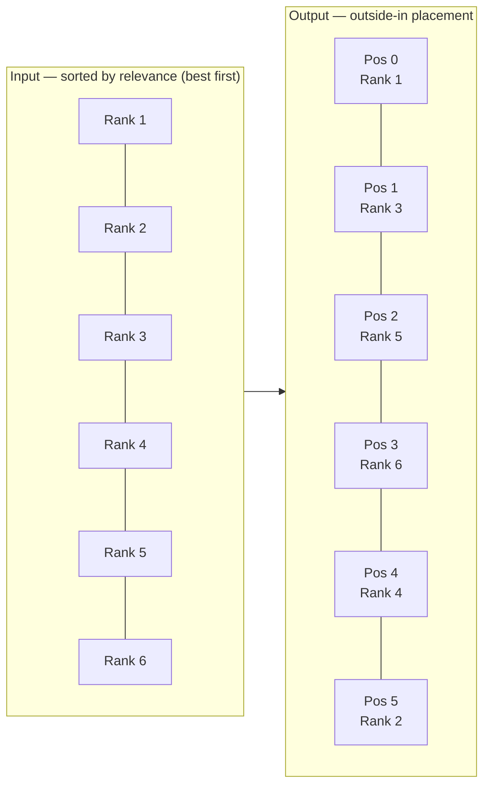
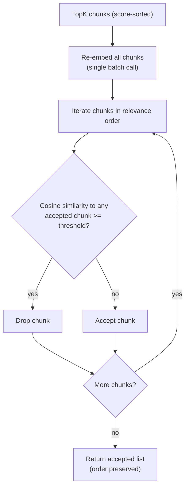
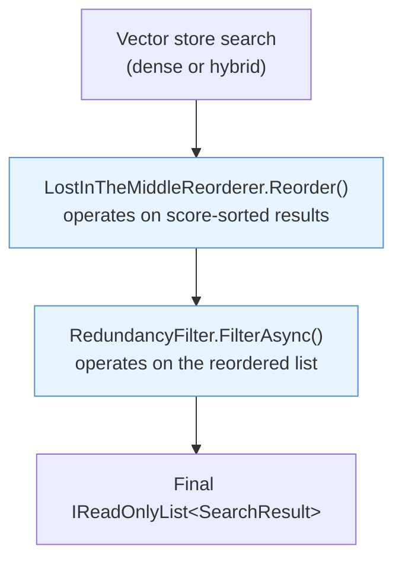

# Post-Retrieval

After the vector store returns a ranked list of chunks, two optional post-processors can improve the quality of what the LLM receives. Both are disabled by default and enabled per-call via flags on `RetrievalOptions` or `RagOptions`. They run in a fixed order: Lost-in-the-Middle reordering first, then redundancy filtering.

## Lost-in-the-Middle reordering

LLMs attend unevenly to their context window. Research by Liu et al. (2023, ["Lost in the Middle"](https://arxiv.org/abs/2307.03172)) found that models consistently perform better when the most relevant information appears at the beginning or end of the context, not in the middle. When `UseLostInTheMiddleReordering = true`, Rag.NET reorders the retrieved chunks so that the highest-scoring ones are placed at the extremes of the list.

### How it works

The reorderer expects a list sorted by descending relevance (best first — which is the default output of `RetrieveAsync`). It interleaves chunks from the sorted list into a new order using an outside-in pattern:

```
Input (rank 1 = best):  [1, 2, 3, 4, 5, 6]
Output (positions):      [1, 3, 5, 6, 4, 2]
```



Even-indexed input items (0, 2, 4, ...) fill from the left; odd-indexed items (1, 3, 5, ...) fill from the right. The result places rank-1 at position 0, rank-3 at position 1, rank-5 at position 2, rank-6 at position 3, rank-4 at position 4, rank-2 at position 5.

The `Score` values on the returned `SearchResult` objects are unchanged. Only the list ordering is modified.

### Usage

```csharp
// On RetrieveAsync
var results = await pipeline.RetrieveAsync("query", new RetrievalOptions
{
    TopK                         = 10,
    UseLostInTheMiddleReordering = true,
});

// On AskAsync / AskStreamingAsync
var response = await pipeline.AskAsync("question", new RagOptions
{
    TopK                         = 10,
    UseLostInTheMiddleReordering = true,
});
```

### When to use it

Enable it when `TopK >= 5` and the LLM is receiving a long context window of retrieved passages. For very small `TopK` values (2–3), the benefit is minimal. It has no computational cost beyond an array allocation — there is no additional API call.

### API reference

```csharp
public static class LostInTheMiddleReorderer
{
    public static IReadOnlyList<SearchResult> Reorder(IReadOnlyList<SearchResult> results);
}
```

Input must be sorted in descending relevance order. Unsorted input produces meaningless output with no error.

## Redundancy filter

Redundant retrieved chunks waste context window space. When multiple chunks contain near-identical content (e.g., the same paragraph duplicated across documents, or overlapping chunks from the same source), sending all of them to the LLM dilutes the effective context. The redundancy filter removes near-duplicates before the context is assembled.

### How it works



1. All `TopK` retrieved chunk texts are re-embedded in a single batch call to `IEmbeddingGenerator`.
2. The filter iterates through the chunks in order (by relevance score, descending). Each chunk is accepted if its cosine similarity to every previously accepted chunk is below `RedundancyThreshold`.
3. The accepted list is returned. Order is preserved.

This is a greedy maximal independent set algorithm: earlier (higher-scoring) chunks take priority. A chunk is dropped only if it is similar to an already-accepted chunk, not if it is similar to another dropped chunk.

### Usage

```csharp
var results = await pipeline.RetrieveAsync("query", new RetrievalOptions
{
    TopK                = 10,
    UseRedundancyFilter = true,
    RedundancyThreshold = 0.95f,   // default — drop chunks with >95% cosine similarity
});

// Also on AskAsync / AskStreamingAsync
var response = await pipeline.AskAsync("question", new RagOptions
{
    TopK                = 10,
    UseRedundancyFilter = true,
    RedundancyThreshold = 0.90f,   // lower = more aggressive deduplication
});
```

### Threshold guidance

| Threshold | Effect |
|-----------|--------|
| `0.99` | Only removes near-exact copies |
| `0.95` (default) | Removes chunks with virtually identical content; safe for most corpora |
| `0.90` | Removes substantially similar chunks; useful for corpora with heavy reformatting or paraphrasing |
| `0.85` | Aggressive; can drop genuinely different chunks that discuss the same concept |

### Cost

The re-embedding call dominates the cost. For a batch of 10 chunks, expect 10–50 ms depending on your embedding provider. The cosine similarity loop is O(accepted × candidates) — quadratic in `TopK` — but is CPU-only and typically under 1 ms for `TopK <= 20`.

See [benchmarks](benchmarks.md#redundancy-filter) for measured values.

### API reference

```csharp
public static class RedundancyFilter
{
    public static async Task<IReadOnlyList<SearchResult>> FilterAsync(
        IReadOnlyList<SearchResult> results,
        IEmbeddingGenerator<string, Embedding<float>> embedder,
        float threshold,
        CancellationToken cancellationToken = default);
}
```

`FilterAsync` is called internally by `RagPipeline.RetrieveAsync`. You can call it directly if you are composing your own retrieval pipeline outside of `IRagPipeline`.

## Execution order

When both options are enabled on the same call, the order is:



1. Vector store search (dense, or hybrid)
2. `LostInTheMiddleReorderer.Reorder()` — operates on score-sorted results
3. `RedundancyFilter.FilterAsync()` — operates on the reordered list

The reorderer runs before the redundancy filter so that the filter preserves the outside-in positional intent when it removes chunks.
