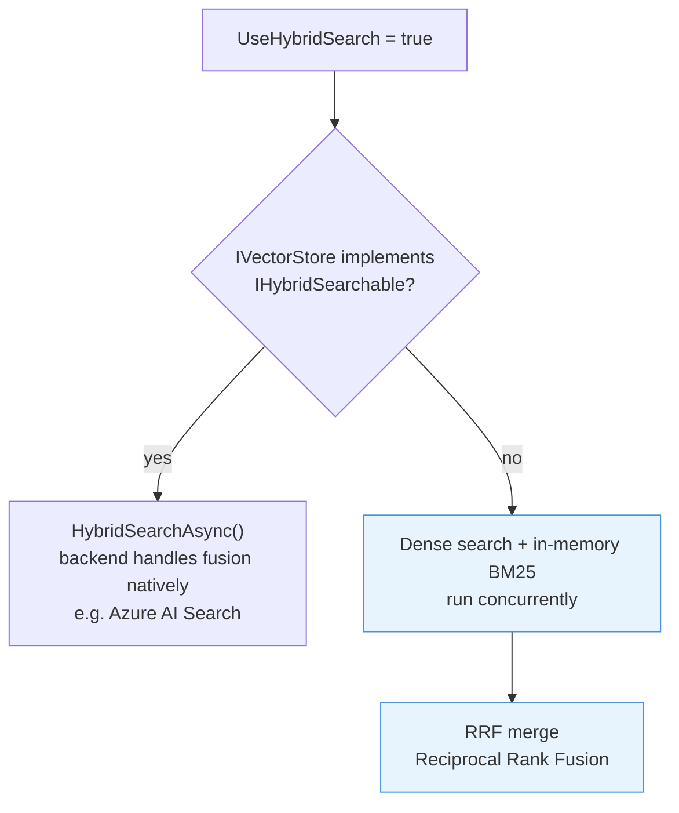
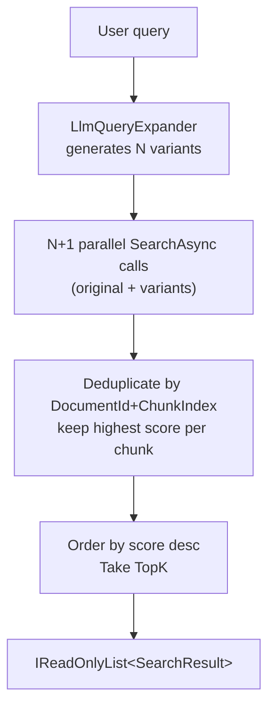
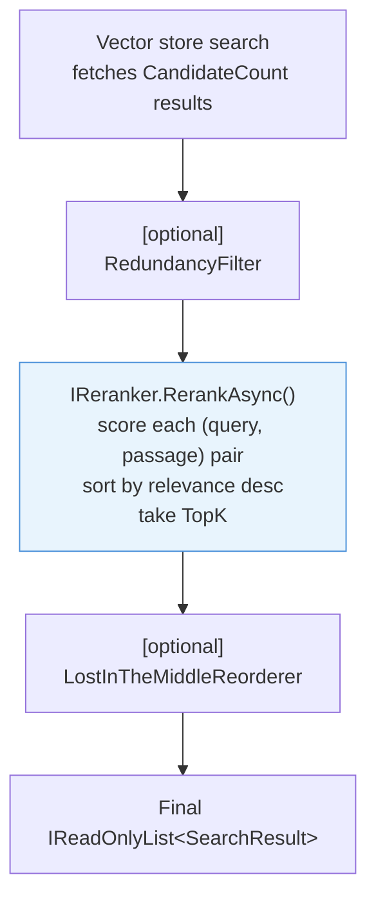

# Retrieval

Retrieval is the step that determines answer quality more than any other. A well-configured retrieval layer surfaces the right chunks for a given query; a poorly configured one buries them. This page covers `RetrievalOptions`, semantic search, hybrid BM25+vector search, multi-query retrieval, metadata filtering, and the `RagOptions` properties that mirror these settings for `AskAsync`.

## `RetrievalOptions`

```csharp
public sealed class RetrievalOptions
{
    public int TopK                          { get; set; } = 5;
    public double MinScore                   { get; set; } = 0.0;
    public IDictionary<string, string>? MetadataFilter { get; set; }
    public bool UseHybridSearch              { get; set; }
    public bool UseLostInTheMiddleReordering { get; set; }
    public bool UseRedundancyFilter          { get; set; }
    public float RedundancyThreshold         { get; set; } = 0.95f;
    public bool UseMultiQuery                { get; set; } = true;
    public bool UseReranking                 { get; set; } = true;
    public int? CandidateCount               { get; set; }
}
```

All properties are optional. Call `RetrieveAsync` with no options to get five results using pure semantic search with no score floor.

```csharp
// Minimal — pure semantic, top 5
var results = await pipeline.RetrieveAsync("What are the Q4 targets?");

// Full options
var results = await pipeline.RetrieveAsync("What are the Q4 targets?", new RetrievalOptions
{
    TopK                          = 10,
    MinScore                      = 0.6,
    UseHybridSearch               = true,
    UseLostInTheMiddleReordering  = true,
    UseRedundancyFilter           = true,
    RedundancyThreshold           = 0.92f,
    UseMultiQuery                 = true,
    UseReranking                  = true,
    CandidateCount                = 20,
    MetadataFilter = new Dictionary<string, string>
    {
        ["department"] = "finance",
    },
});
```

## `SearchResult`

`RetrieveAsync` returns `IReadOnlyList<SearchResult>`, ordered by relevance (descending) unless Lost-in-the-Middle reordering is enabled:

```csharp
public sealed record SearchResult
{
    public required TextChunk Chunk { get; init; }
    public required double Score    { get; init; }
}
```

`Score` semantics depend on the search mode:
- **Semantic (pure dense):** cosine similarity in `[0, 1]` (pgvector: `1 - cosine_distance`).
- **Hybrid via `IHybridSearchable`:** the score comes from the backend (Azure AI Search uses its own BM25+vector fusion score; values are not bounded to `[0, 1]`).
- **Hybrid via in-memory BM25 fallback:** Reciprocal Rank Fusion score, typically in `(0, 0.05]`.

## Semantic search

The default mode. The query is embedded using `IEmbeddingGenerator`, and the resulting vector is passed to `IVectorStore.SearchAsync`. The store performs ANN (Approximate Nearest Neighbor) search and returns the `TopK` closest chunks whose cosine similarity is at least `MinScore`.

```csharp
var results = await pipeline.RetrieveAsync("explain the refund policy", new RetrievalOptions
{
    TopK     = 8,
    MinScore = 0.65,
});
```

`MinScore = 0.0` (the default) returns all results up to `TopK` regardless of score. Raise it to filter out weakly relevant chunks. Values around `0.6–0.75` work well for typical prose with OpenAI embeddings.

## Hybrid search (BM25 + vector)

Set `UseHybridSearch = true` to combine keyword relevance (BM25) with semantic similarity. This improves recall for queries containing rare proper nouns, model numbers, or other terms that have low semantic signal in the embedding space.

```csharp
var results = await pipeline.RetrieveAsync("ISO 27001 compliance checklist", new RetrievalOptions
{
    TopK            = 10,
    UseHybridSearch = true,
});
```

### How the hybrid path is selected

The pipeline inspects the registered `IVectorStore` at retrieval time:



| Condition | Behaviour |
|-----------|-----------|
| `IVectorStore` also implements `IHybridSearchable` | Calls `HybridSearchAsync` — the backend handles fusion natively |
| `IVectorStore` does not implement `IHybridSearchable` | Dense search and in-memory BM25 run concurrently; results merged via Reciprocal Rank Fusion |

Azure AI Search implements `IHybridSearchable` and performs server-side BM25+vector fusion. pgvector and Qdrant do not; they fall back to the in-memory BM25 index maintained by `RagPipeline`.

### In-memory BM25 index

`RagPipeline` maintains a thread-safe `InMemoryBm25Index` using BM25 parameters k1=1.5, b=0.75 (Lucene defaults). Every chunk stored via `IngestAsync` is indexed automatically. The index is process-local and not persisted — it is rebuilt each time the application starts. For stores that need persistent keyword search without native hybrid support, use Azure AI Search.

### Reciprocal Rank Fusion (RRF)

When using the BM25 fallback, results from the dense and BM25 retrievers are merged with RRF:

```
score(d) = Σ  1 / (k + rank_i)    where k = 60
```

Each document's RRF score is the sum of its reciprocal ranks across both result lists. Documents appearing in both lists score higher than documents appearing in only one. The top `TopK` results by RRF score are returned.

RRF scores are not cosine similarities. `MinScore` filtering is applied by the dense retriever before merging; the final RRF scores are not filtered by `MinScore`.

See [benchmarks](benchmarks.md#hybrid-search-bm25-fallback) for throughput data on the BM25+RRF path.

## Multi-query retrieval

Multi-query retrieval expands a single query into several alternative phrasings, runs all of them in parallel against the vector store, then deduplicates and merges the results. It is particularly effective when the user's phrasing differs from how information is expressed in the documents.

### Enabling

Register `UseMultiQueryRetrieval()` on the builder. An `IChatClient` must already be registered — it is used to generate the variants.

```csharp
services.AddRagNet(b => b
    .UseMultiQueryRetrieval());
```

Configure the number of variants and the prompt template:

```csharp
services.AddRagNet(b => b
    .UseMultiQueryRetrieval(o =>
    {
        o.VariantCount = 5;
        o.PromptTemplate =
            "Generate {count} different phrasings of the following question.\n" +
            "Return only the rephrased questions, one per line, with no numbering.\n\n" +
            "Question: {query}";
    }));
```

`{count}` and `{query}` are required placeholders in the template.

### How it works



The original query is always included in the fan-out. If the expander fails (network error, timeout), the pipeline logs a warning and falls back to single-query retrieval automatically.

### Disabling per call

When an expander is registered, multi-query is active by default. Opt out for a specific call:

```csharp
var results = await pipeline.RetrieveAsync("exact phrase lookup", new RetrievalOptions
{
    UseMultiQuery = false,
});
```

## Cross-encoder reranking

Cross-encoder reranking rescores search results by running each (query, passage) pair through a cross-encoder model. Unlike bi-encoders (used for embedding), cross-encoders jointly attend to both inputs, producing significantly more accurate relevance scores at the cost of per-pair inference.

### Enabling

Register a reranker on the builder. The core package provides `UseReranking<T>()` for custom implementations. The `Rag.NET.Reranking.Onnx` package provides a local ONNX model implementation:

```csharp
// Option 1: ONNX cross-encoder (local model)
services.AddRagNet(b => b
    .UseOnnxReranking(o =>
    {
        o.ModelPath = "models/ms-marco-MiniLM-L-6-v2.onnx";
        o.MaxLength = 512;
    }));

// Option 2: Custom implementation (e.g., Cohere, Jina)
services.AddRagNet(b => b
    .UseReranking<MyCohereReranker>());
```

### How it works

When a reranker is registered, the pipeline over-fetches candidates from the vector store (`CandidateCount`, defaulting to `TopK × 3`), then the reranker rescores and trims to `TopK`:



If the reranker fails (network error, model issue), the pipeline logs a warning and returns results in their original vector-search order.

### Disabling per call

When a reranker is registered, it is active by default. Opt out for a specific call:

```csharp
var results = await pipeline.RetrieveAsync("exact phrase lookup", new RetrievalOptions
{
    UseReranking = false,
});
```

### Over-fetch control

Set `CandidateCount` to control how many candidates the vector store returns before reranking:

```csharp
var results = await pipeline.RetrieveAsync("query", new RetrievalOptions
{
    TopK           = 5,       // final result count
    CandidateCount = 30,      // fetch 30 candidates, rerank, return top 5
});
```

When `CandidateCount` is not set, it defaults to `TopK × 3`. When no reranker is registered, `CandidateCount` is ignored.

### Recommended models

| Model | Languages | Size | Use case |
|-------|-----------|------|----------|
| `ms-marco-MiniLM-L-6-v2` | English | ~80 MB | Fast, good accuracy for English-only corpora |
| `bge-reranker-v2-m3` | 100+ | ~568 MB | Multilingual, strong accuracy |

Download ONNX models from [Hugging Face](https://huggingface.co) and point `ModelPath` to the `.onnx` file.

## Metadata filtering

`MetadataFilter` is a dictionary of key-value pairs that must all match a chunk's `Metadata` for the chunk to be returned. This is an AND filter — all entries must match.

```csharp
var results = await pipeline.RetrieveAsync("capital expenditure targets", new RetrievalOptions
{
    TopK           = 5,
    MetadataFilter = new Dictionary<string, string>
    {
        ["department"] = "finance",
        ["year"]       = "2024",
    },
});
```

Metadata keys come from two sources:

1. **`DocumentMetadata.Tags`** — set at ingestion time on the `DocumentMetadata` object.
2. **Heading breadcrumbs** — injected automatically by the Markdown and HTML parsers.

Available heading metadata keys:

| Key | Example |
|-----|---------|
| `heading` | `"Section 2"` |
| `heading_level` | `"2"` |
| `heading_breadcrumb` | `"Chapter 1 > Section 2"` |

```csharp
// Filter to chunks from a specific Markdown section
var results = await pipeline.RetrieveAsync("query", new RetrievalOptions
{
    MetadataFilter = new Dictionary<string, string>
    {
        ["heading_breadcrumb"] = "Chapter 1 > Section 2",
    },
});
```

The metadata filter implementation varies by vector store:

- **pgvector:** JSONB containment operator (`@>`) on the `metadata` column.
- **Qdrant:** Must-match conditions on `meta_{key}` payload fields.
- **Azure AI Search:** `search.ismatch` filter clauses on the serialised `metadata` field.

## Using retrieval options with `AskAsync`

`RagOptions` mirrors all `RetrievalOptions` properties and adds chat-specific settings:

```csharp
public sealed class RagOptions
{
    public int TopK                          { get; set; } = 5;
    public double MinScore                   { get; set; } = 0.0;
    public bool UseHybridSearch              { get; set; }
    public bool UseLostInTheMiddleReordering { get; set; }
    public bool UseRedundancyFilter          { get; set; }
    public float RedundancyThreshold         { get; set; } = 0.95f;
    public IDictionary<string, string>? MetadataFilter  { get; set; }
    public string? SystemPrompt              { get; set; }
    public float? Temperature                { get; set; }
    public IList<ChatMessage>? ConversationHistory { get; set; }
}
```

> **Note:** `RagOptions` does not expose `UseMultiQuery`, `UseReranking`, or `CandidateCount`. To control these per call, use `RetrieveAsync` directly.

The retrieval-related properties are forwarded verbatim to an internal `RetrievalOptions` before the chat call:

```csharp
var response = await pipeline.AskAsync("What is our refund policy?", new RagOptions
{
    TopK            = 10,
    MinScore        = 0.6,
    UseHybridSearch = true,
    SystemPrompt    = "You are a customer support assistant. Answer based on the provided context only.",
    Temperature     = 0.2f,
});
```

### Conversation history

Pass prior turns to maintain a multi-turn conversation. Messages are inserted between the system prompt and the final user+context message:

```csharp
using Microsoft.Extensions.AI;

var history = new List<ChatMessage>
{
    new(ChatRole.User,      "What is RAG?"),
    new(ChatRole.Assistant, "RAG stands for Retrieval-Augmented Generation..."),
};

var response = await pipeline.AskAsync("Can you give an example?", new RagOptions
{
    ConversationHistory = history,
});
```

## Post-retrieval processing

After the vector/BM25 search, three optional post-processors can further improve quality:

- **Redundancy filtering** — see [Post-Retrieval](post-retrieval.md#redundancy-filter)
- **Cross-encoder reranking** — see [Cross-encoder reranking](#cross-encoder-reranking) above
- **Lost-in-the-Middle reordering** — see [Post-Retrieval](post-retrieval.md#lost-in-the-middle-reordering)

They run in the order listed above (redundancy → reranking → reordering) and are enabled per-call via flags on `RetrievalOptions` or `RagOptions`.
